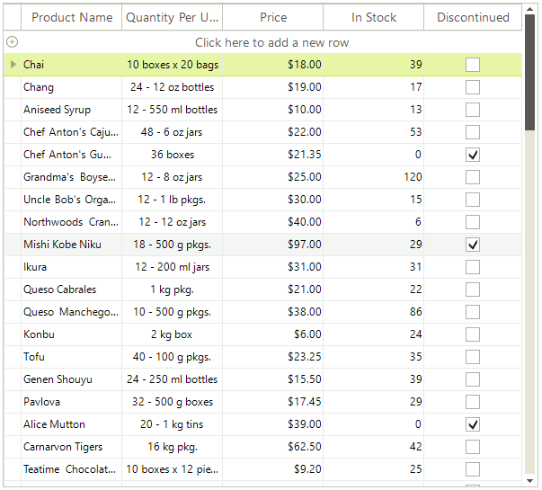

# Table View

## 

This is the default view definition. The data is presented like a table and you can reorder, hide and pin columns. This is a typical table view: 

You need not set this view manually and the view does not contain any properties to configure.
		
