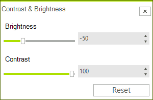
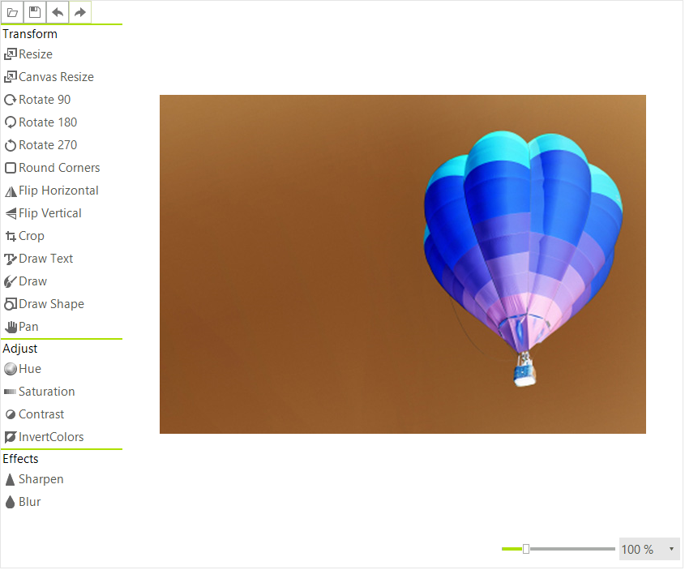

# Adjustments

RadImageEditor supports the following image adjustments.

* Hue
* Saturation
* Contrast
* Invert Colors 


# Hue adjustment

The Hue can be adjusted with the respective dialog, the values can be from 0 to 360.


This can be done in the code behind as well.

{{source=..\SamplesCS\ImageEditor\ImageEditorFeatures.cs region=Hue}} 
{{source=..\SamplesVB\ImageEditor\ImageEditorFeatures.vb region=Hue}}
````C#
radImageEditor1.ImageEditorElement.SetHue(200);

````
````VB.NET
radImageEditor1.ImageEditorElement.SetHue(200)

````


{{endregion}}

# Saturation adjustment

The Hue can be adjusted with the respective dialog the values can be from -100 to 100.


To do this programmatically use the SetSaturation method.

{{source=..\SamplesCS\ImageEditor\ImageEditorFeatures.cs region=Sat}} 
{{source=..\SamplesVB\ImageEditor\ImageEditorFeatures.vb region=Sat}}
````C#
radImageEditor1.ImageEditorElement.SetSaturation(-50);

````
````VB.NET
radImageEditor1.ImageEditorElement.SetSaturation(-50)

````


{{endregion}}

# Contrast and Brightness adjustment

The Contrast and Brightness can be adjusted with the respective dialog the values can be from -100 to 100.




{{source=..\SamplesCS\ImageEditor\ImageEditorFeatures.cs region=Contrast}} 
{{source=..\SamplesVB\ImageEditor\ImageEditorFeatures.vb region=Contrast}}

````C#
radImageEditor1.ImageEditorElement.SetContrastAndBrightness(100, 10);

````
````VB.NET
radImageEditor1.ImageEditorElement.SetContrastAndBrightness(100, 10)

````

{{endregion}}

# Invert Colors

The Invert Color button just inverts the colors in the image pixel by pixel.
 


This action can be performed in code with the following method.

{{source=..\SamplesCS\ImageEditor\ImageEditorFeatures.cs region=Invert}} 
{{source=..\SamplesVB\ImageEditor\ImageEditorFeatures.vb region=Invert}}
````C#
radImageEditor1.ImageEditorElement.InvertColors();

````
````VB.NET
radImageEditor1.ImageEditorElement.InvertColors()

````


{{endregion}}

# See Also