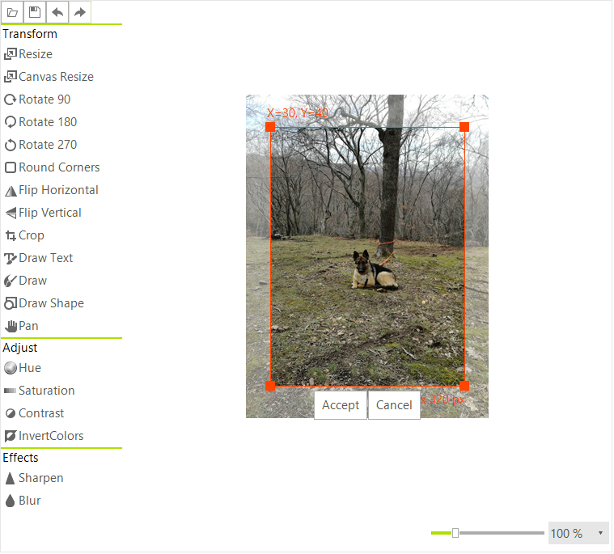

# Crop via the UI

When pressing the crop button a red border will appear on the image. You can adjust the size and then pressing __Accept__ will confirm the operation.



# Crop Programmatically

To perform a Crop operation use the __Crop__ method. You need to pass a rectangle to it.

#### Crop Programmatically

{{source=..\SamplesCS\ImageEditor\ImageEditorFeatures.cs region=Crop}} 
{{source=..\SamplesVB\ImageEditor\ImageEditorFeatures.vb region=Crop}}
````C#
radImageEditor1.ImageEditorElement.Crop(new Rectangle(0, 0, 20, 20));
radImageEditor1.ImageEditorElement.SaveState();

````
````VB.NET
radImageEditor1.ImageEditorElement.Crop(New Rectangle(0, 0, 20, 20))
radImageEditor1.ImageEditorElement.SaveState()

````


{{endregion}}

# See Also

* [Getting Started]()
* [Structure]()
* [Properties and Events]()