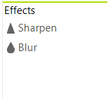

# Effects

Currently, RadImageEditor supports the following effects.

* [Sharpen](#sharpen)
* [Blur](#blur)



# Sharpen

Once you click the Sharpen button the sharpen dialog will appear and you will be able to apply the effect.


This can be performed programmatically as well. The following snippet shows how you can apply the Sharpen effect.

{{source=..\SamplesCS\ImageEditor\ImageEditorFeatures.cs region=Sharp}} 
{{source=..\SamplesVB\ImageEditor\ImageEditorFeatures.vb region=Sharp}}
````C#
radImageEditor1.ImageEditorElement.Sharpen(100);

````
````VB.NET
radImageEditor1.ImageEditorElement.Sharpen(100)

````

{{endregion}}

# Blur

Once you click the Blur button the sharpen dialog will appear and you will be able to apply the effect.


This can be performed programmatically as well. The following snippet shows how you can apply the Blur effect.

{{source=..\SamplesCS\ImageEditor\ImageEditorFeatures.cs region=Blur}} 
{{source=..\SamplesVB\ImageEditor\ImageEditorFeatures.vb region=Blur}}
````C#
radImageEditor1.ImageEditorElement.Blur(100);

````
````VB.NET
radImageEditor1.ImageEditorElement.Blur(100)

````

{{endregion}}

# See Also

* [Getting Started]()
* [Structure]()
* [Properties and Events]()