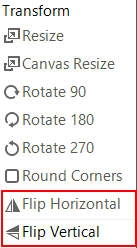

# Flip via the UI

You can use the rotate buttons to directly rotate the image. No dialog is shown in this case.



# Flip Programmatically

The following spinet shows how you can access and use the __RotateFlip__ method.

#### Flip programmatically

{{source=..\SamplesCS\ImageEditor\ImageEditorFeatures.cs region=Flip}} 
{{source=..\SamplesVB\ImageEditor\ImageEditorFeatures.vb region=Flip}}
````C#
radImageEditor1.ImageEditorElement.RotateFlip(RotateFlipType.RotateNoneFlipX);

````
````VB.NET
radImageEditor1.ImageEditorElement.RotateFlip(RotateFlipType.RotateNoneFlipX)

```` 


{{endregion}}

# See Also

* [Getting Started]()
* [Structure]()
* [Properties and Events]()