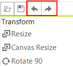

# History

__RadImageEditor__ has a history stack, which records each command that is executed on the image currently loaded in the control. This is convenient, as it allows past actions to be reversed and re-applied whenever needed.

Undo/Redo commands can be executed from the UI.



You can use the methods as well.

{{source=..\SamplesCS\ImageEditor\ImageEditorFeatures.cs region=UndoRedo}} 
{{source=..\SamplesVB\ImageEditor\ImageEditorFeatures.vb region=UndoRedo}}
````C#
radImageEditor1.ImageEditorElement.Undo();
//or
radImageEditor1.ImageEditorElement.Redo();

````
````VB.NET
radImageEditor1.ImageEditorElement.Undo()
'or
radImageEditor1.ImageEditorElement.Redo()

````


{{endregion}}


# See Also