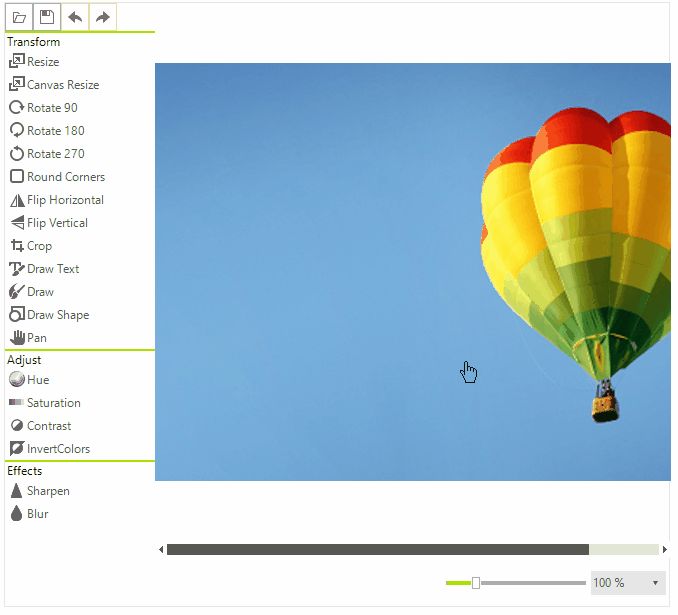

# Pan
The PanTool is one of the tools that come out-of-the-box with __RadImageEditor__ and enables you to pan the image using the mouse.

When panning the cursor will became a hand and you will be able to pan by holding the left mouse button. 

## See Also  

* [Getting Started]()
* [Structure]()
* [Properties and Events]()
