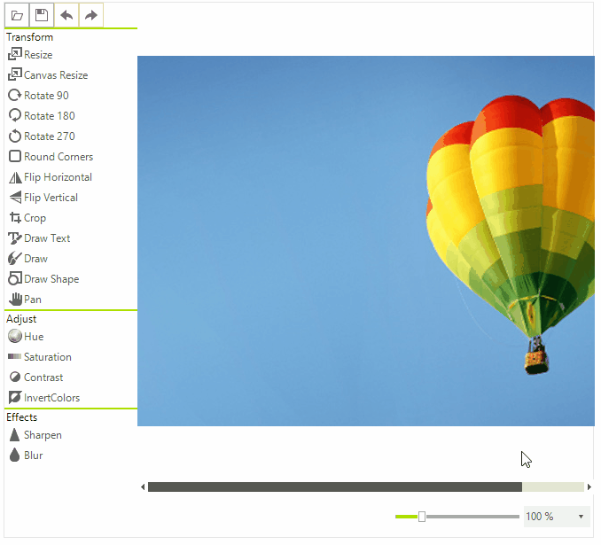

# Zoom

The Zoom tool allows you to set zoom to the image. You can use the track bar or select specific value from the drop-down list. 

# See Also

* [Getting Started]()
* [Structure]()
* [Properties and Events]()