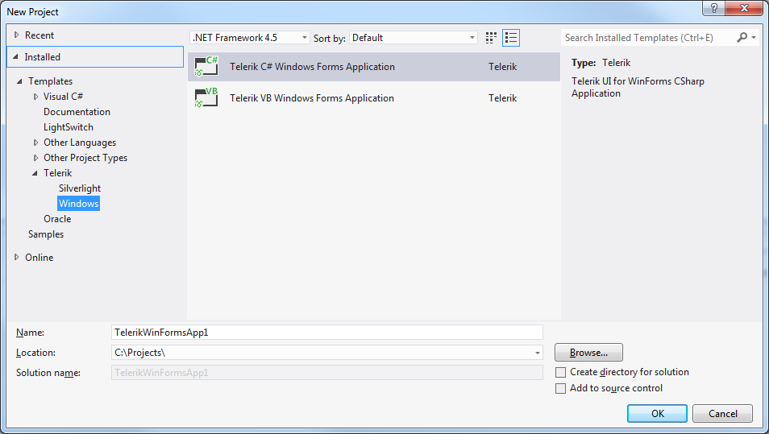
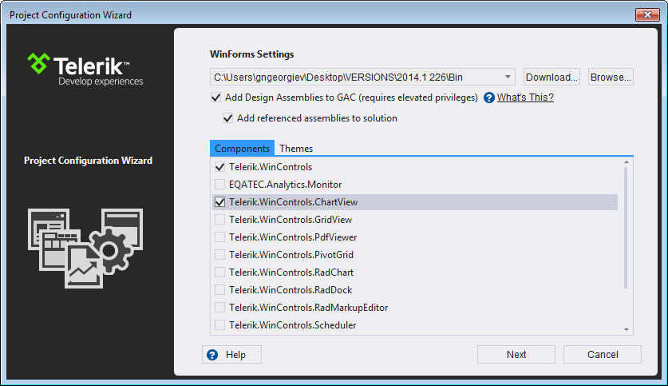

# Creation and configuration wizard

## 

With the new Visual Studio Extensions for WinForms you can quickly create an application pre-configured to use Telerik UI for WinForms. The quickest way to have such a project is using the Visual Studio New Project dialog. Under the Telerik node there is a new node – Windows, where two project templates exist: 

For convenience the same project templates could be found under the __Visual C# -> Windows__  and __Visual Basic -> Windows__ nodes.
        

After you click the __OK__ button, you get the Project Configuration Wizard, provided by the Telerik UI for WinForms Visual Studio Extensions. The wizard detects all the installed distributions of Telerik UI for WinForms and lists them in a combo box. You can select a distribution which you want to be applied to your project. You can select what type of project to be created from the Choose project type combo box: Standard, Word-Inspired or Outlook-Inspired. 

You can choose to Integrate Telerik Analytics in your project and set the Analytics product key on project creation. Selecting Standard project type will give you the choice to select which assemblies to refer into the project. You can access the Project Configuration Wizard through the Telerik menu when you need to configure your Telerik WinForms application or you need to convert an existing WinForms application to a Telerik WinForms application. These depend on the active project in the Visual Studio Solution Explorer:
        

Specify which assemblies your project would use (Only when Standard project type is selected). When selecting a UI for WinForms assembly all dependent controls are selected automatically and vice-versa.
        

__Configure Telerik WinForms Application__

__Convert to Telerik WinForms Application__

Both the menus have their context menu counterparts accessed by right clicking on the project you want to convert or configure.
        

When the Project Configuration Wizard is opened it allows you to select which Telerik UI for WinForms assemblies you would like to use and whether you want to copy the referenced assemblies to your solution folder. 

In addition to the detected versions you can:
        

* Navigate to a folder you’ve manually downloaded and extracted a hotfix by clicking the  __Browse__ button.
            

* Download the latest versions available on our website using the __Download__ button.
            

>The __Add referenced assemblies to solution__ option is not available when using GAC based distributions.
>

By using the list of the WinForms Components below you can specify which of the Telerik UI for WinForms assemblies your project would use. When selecting an assembly all dependent controls are selected automatically and vice-versa. You can specify the themes you would like to use in your application as well. The dependencies get handled automatically. When you click the Finish button your project gets the respective assembly references added. Any references you have unselected get removed. Assemblies copied to your solution folder will automatically get added to source control when using Microsoft Team Foundation Server.
        
