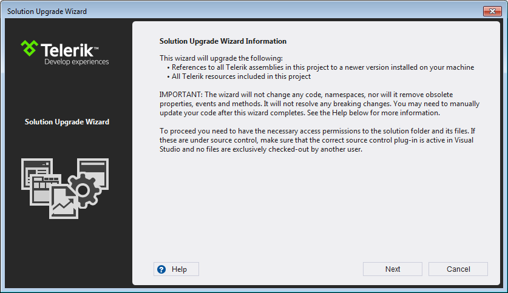

# Upgrade wizard

## 

An important feature in the Visual Studio Extensions is Project Upgrade Wizard.

The Upgrade Wizard (started by using the *Telerik > UI for WinForms > Upgrade Wizard* menu item) 
          is used to change the version of Telerik UI for WinForms your projects use. On the first screen of the wizard is described what will be upgraded:
        

In addition to the pure assembly reference change, the upgrade wizard provides several important features:
        

* Check if a new version of Telerik UI for WinForms is available on the Telerik website.
            

* Download of a newly discovered version.
            

* Visual Studio toolbox update.
            

* Projects backup.
            

On the next step the wizard lists all projects from the solution, which use Telerik UI for WinForms.
          You can choose which projects will be updated (it is recommended to upgrade all projects to the chosen version),
          the version which they will be upgraded to and whether or not all binaries should get copied to your solution folder
          (useful when utilizing a build server or working on a project collaboratively):
        

>The __Add referenced assemblies to solution__ option is not available when using GAC based distributions.
          

The next screen allows you to update the Visual Studio Toolbox with the newly selected controls,
          so that you avoid accidental reference change during a control drag and drop:
        

The last step suggests creating a backup of your projects:

>

* The Telerik UI for WinForms distribution selection screen lists all the versions
                that can be detected automatically. These are versions, installed by using the Windows
                Installer MSI package, versions, downloaded by the Upgrade Wizard and versions,
                available in the GAC. Hotfixes, downloaded manually cannot be detected.
              

* You can use the Browse button to navigate to the folder of a manually downloaded distribution.
              

* You can use the Download button to access the
                [Latest Version Acquirer tool]()
                and download the latest available version on our website
              

* The distribution, downloaded by the Upgrade Wizard contains only the "hotfix" files,
                e.g. the barebone files, needed for a project to run correctly. It does not contain the
                documentation or the Live Examples.
              

* A Visual Studio restart will be required in order to update your toolbox. If the automatic
                restart fails, a restart should be initiated manually in order to complete the toolbox upgrade.
              
