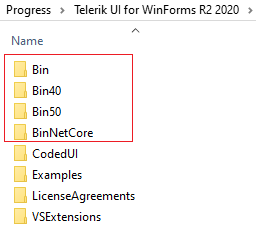
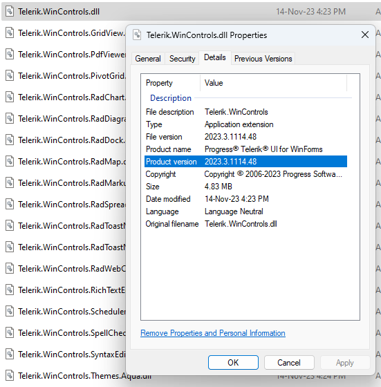
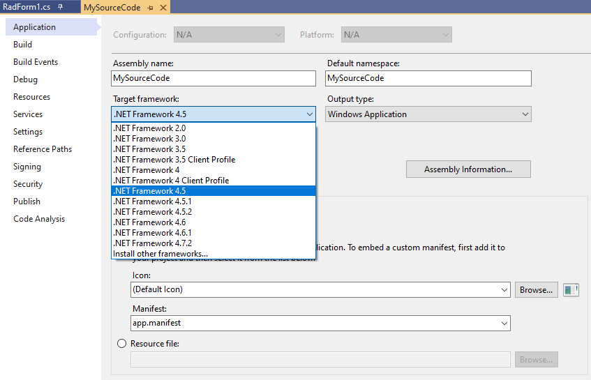

# Assembly Version 

After installing the Telerik UI for WinForms suite, you will notice the following assemblies versions in the installation folder:

We do provide several builds of our assemblies - one for **.NET 2.0**, one for **.NET 4.0** or higher, one for **.NET Core** (Since **R1 2020** .NET Core 3.1 is also supported), one for **.NET 5.0** (Since **R2 2020** .NET Core 5 is also supported) and one for **.NET 6** (Since **R2 2021** .NET 6 is also supported). The suffix (**.20**, **.40**, etc.) indicates the assembly version. Right-click over the .dll file and select *Properties*. Then, navigate to the *Details* tab:

You should pick up this version of the assemblies to refer in your project that corresponds to the .NET Framework that you are using in your project and that is available on your computer. 

 
 