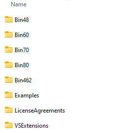

# Assembly Version 

After installing the Telerik UI for WinForms suite, you will find different assemblies versions within the installation folder (there are separate sub folders available for each .Net version). For example, the installation folder will contain the following assembly versions when the 2023.3.1114 Telerik version is installed:

>note Each Bin folder contains all Telerik assemblies built against the respective .Net version. 

### Check assembly version

To check the assembly version, right-click with mouse on the .dll file and select *Properties*. Then, navigate to the *Details tab*, where you will find the assembly version information:

