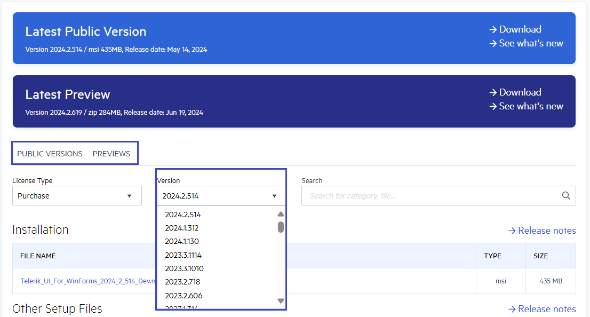

# Download Product Files

When you purchase a UI for WinForms license, you can download the following files:

* Standalone installers

* Latest internal builds

* Assemblies and themes only

* Previous versions

* Source code

* Documentation files

Тo download these files:

1. Log into [your account](https://www.telerik.com/account/).

1. Click the __Downloads__ tab:

	

1. Select the __UI for WinForms__ product tile:

	

1. Select what to download: an MSI installer file, DLLs and themes, PDB files, NuGet Packages, documentation files, or Source code:

	

1. From the __Version__ drop down, you can select an older version to download:

	

	>important If you are looking for a specific version, but it isn't listed, contact our sales team, and they will enable the version for download: [sales@telerik.com](mailto:sales@telerik.com)

## See Also

* [How to Attach the Telerik Source Code to Your Project]() 
* [How to Upgrade Trial to Licensed Version]()
