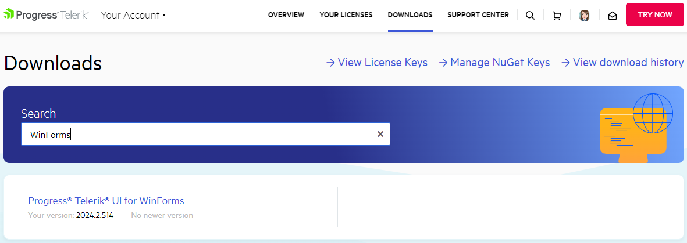
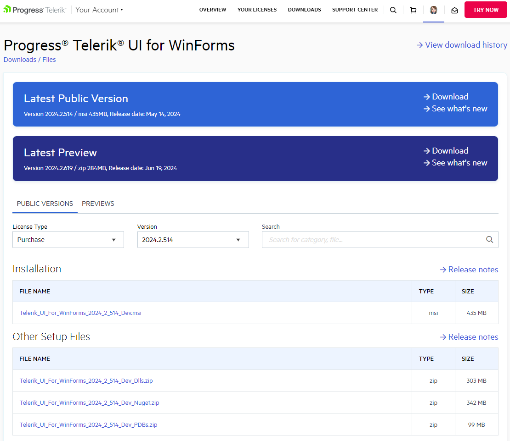

# Download Product Files

When you purchase a Telerik UI for WinForms license, you can download the following files:

* Standalone MSI installer

* Latest Public version

* Latest Preview version

* Assemblies available as a NuGet package

* Previous versions

* Source code

* Documentation files

Тo download these files follow the steps below:

1. Log into [your account](https://www.telerik.com/account/).

1. Click the __Downloads__ tab and select the __Telerik UI for WinForms__ product:

	

1. Select an item you want to download: an MSI installer file, DLLs and themes, PDB files, NuGet Packages, documentation files, or Source code:

	

1. You can choose between official __Public versions__ or [Preview Releases]() version by clicking on these tabs. From the __Version__ list, you can also select which specific version to download:

	

	>important If you are looking for a specific version, but it isn't listed in the Version list, please contact our sales team: [sales@telerik.com](mailto:sales@telerik.com). They will make the required version available for download.

## See Also

* [How to Attach the Telerik Source Code to Your Project]() 
* [How to Upgrade Trial to Licensed Version]()
* [Preview Releases]()

