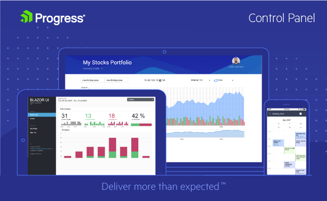
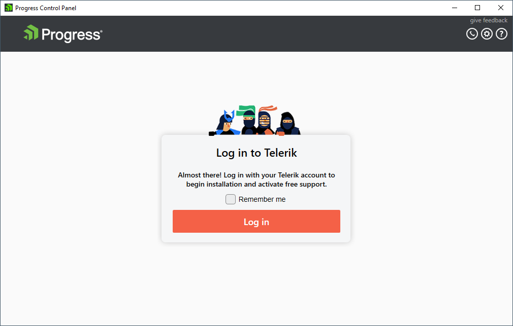
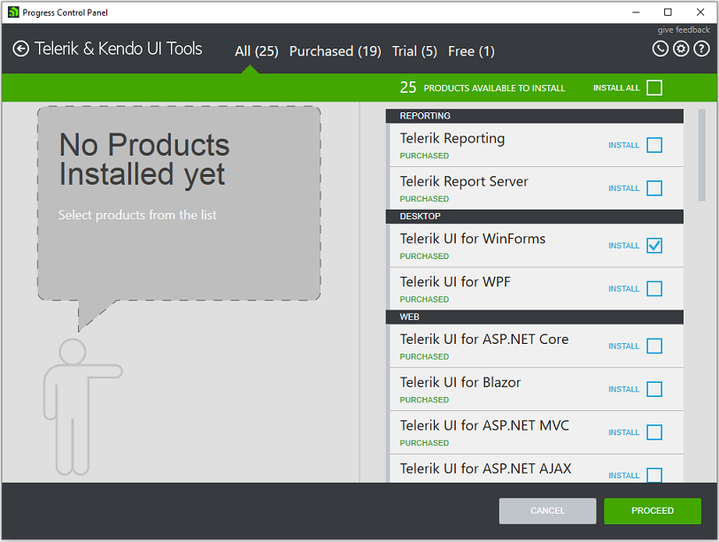
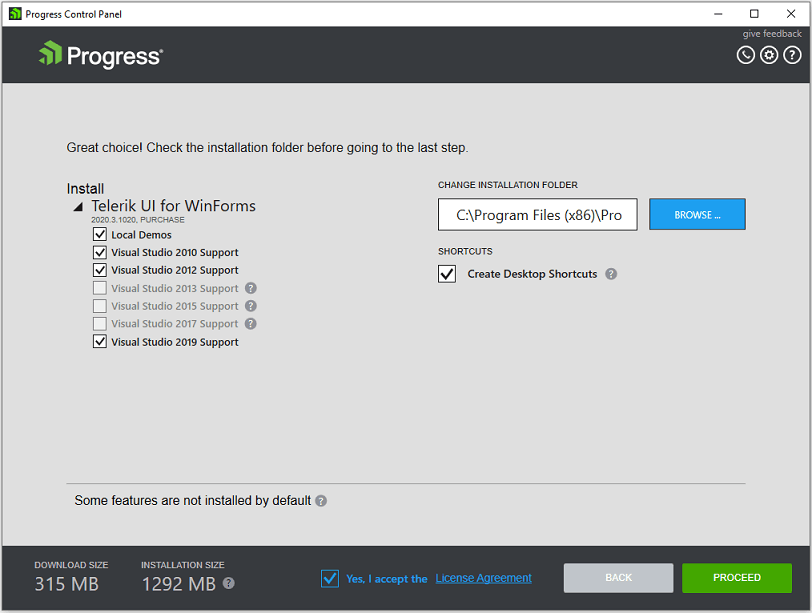
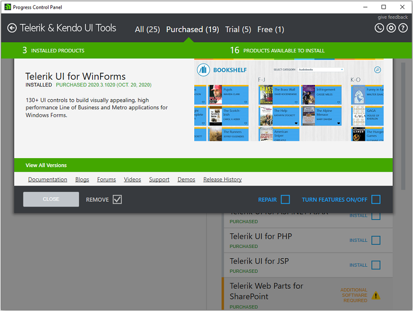
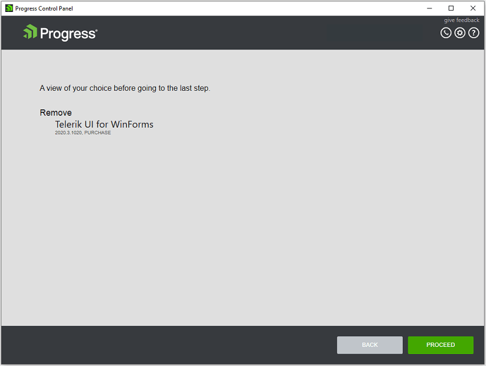
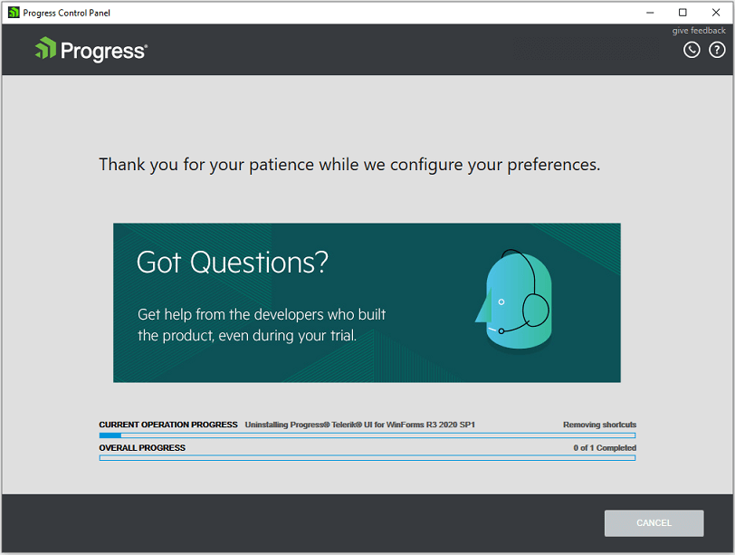

## Installing from Progress Control Panel

The Telerik UI for WinForms controls can also be installed via the Progress Control Panel.

## Download and Log-in

To start, download the Progress Control Panel from the following [page](https://www.telerik.com/download-trial-file/v2/control-panel) and run the downloaded .exe file. You will soon be presented with the login screen where you need to provide your Telerik account credentials to sign in.

>caption Figure 1: The Progress Control Panel Login Screen

## Select Products to Install

Afterwards, you will be presented with a screen containing sections for All products, Purchased products, Trial products, and Free products. These sections each have a split screen view - the left contains installed products that can be updated and the right contains products that can be installed.

You can continue by selecting the Telerik UI for WinForms suite. Once you click the check box, the option to proceed or cancel will be displayed.

>caption Figure 2: The Progress Control Panel List of Available Products
 

## Configure Installation

Once you click `Proceed`, you will then be given the opportunity to review your choice and make changes to the installation folder. When you're ready to proceed, accept the license agreements and click `Proceed` once more. If you forgot something or checked the wrong box, click `Back` and correct your selection.

>caption Figure 3: The Progress Control Panel Installation Configuration Page

When you click `Proceed`, the Progress Control Panel will download the necessary files for installation and then install them to the location you selected.

## Next Steps

After the installation is complete, you will be returned to the main screen to install or update more products.

>caption Figure 4: The Progress Control Panel with Telerik UI for WinForms Installed

You can now start creating your first [Telerik UI for WinForms project]().

## Removing from Progress Control Panel

Once you have installed the Telerik UI for WinForms suite in the Progress Control Panel, you can click on it and check the **Remove** option:

>caption Figure 5: Removing the Telerik UI for WinForms installation from the Progress Control Panel

**Close** the window and proceed further:

