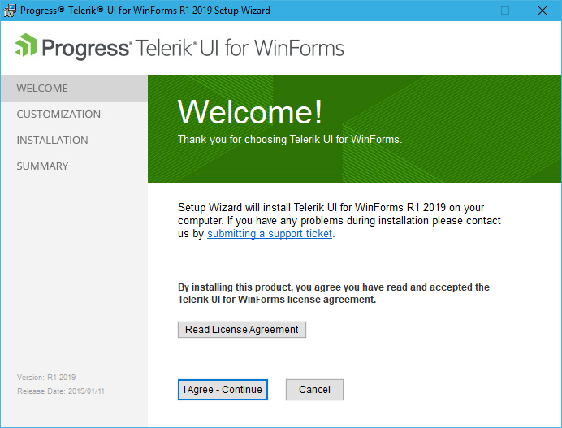
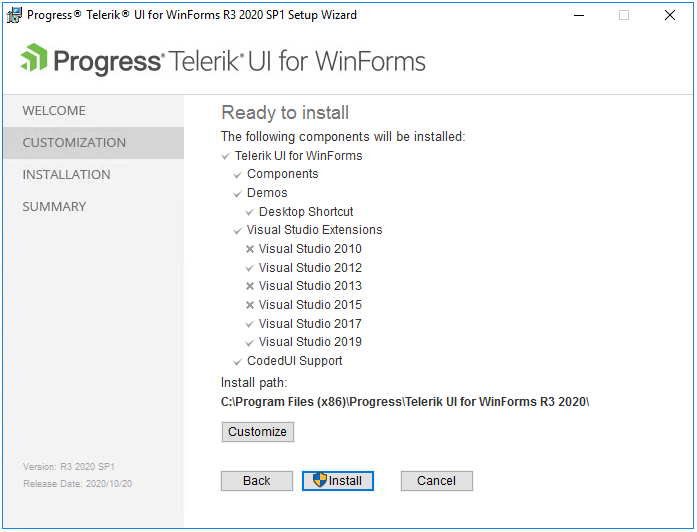
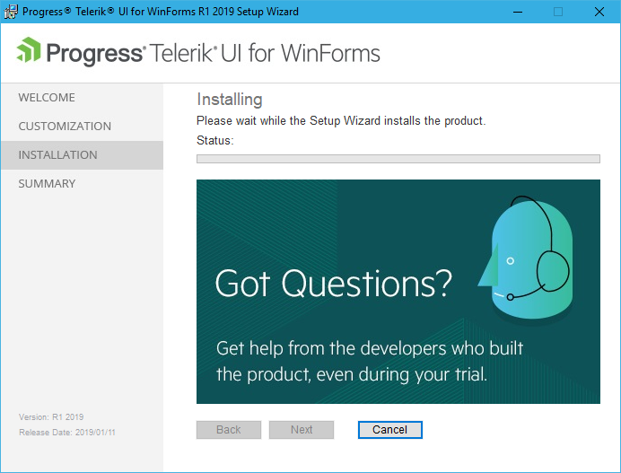
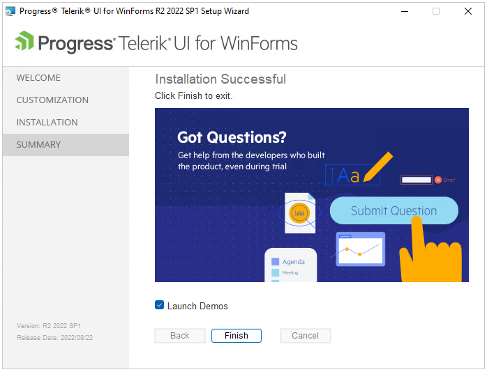

# Installing On Your Computer

The Telerik WinForms setup performs the following actions during the installation process:

* Copies the needed files and assemblies on your machine

* Installs all Telerik WinForms assemblies in the Global Assembly Cache (GAC)

* Creates native images for all Telerik UI for WinForms assemblies            

* Checks the Visual Studio version(s) installed on the machine. We currently support Visual Studio 2005\*, 2008\*, 2010, 2012, 2013, 2015, 2017, 2019 and 2022 installations.

>note **R3 2018 SP1 (2018.3.1016)** is the latest version where the installer handles VS 2005 and VS 2008. After this version, Telerik integration is installed on newer versions of Visual Studio.

* Installs/adds all Telerik WinForms controls in the toolbox of Visual Studio

* Installs Telerik UI for WinForms Visual Studio templates

* Installs [Telerik UI for WinForms Visual Studio Extensions](http://www.telerik.com/products/winforms/visual-studio-extensions.aspx) add-on
            

* Installs Telerik UI for WinForms Examples

* Installs Telerik UI for WinForms Coded UI support for Visual Studio 2010 and 2012

You can download the setup from your account (including older versions): [Download product files]()

Please follow the steps below to install Telerik UI for WinForms from the .msi file:

1\. Close all running instances of Visual Studio.

2\. Run the Telerik UI for WinForms setup as __Administrator__ (right-click on the installer and select Run As Administrator).           

3\. The installer will display the Welcome screen. Click __Next__ to continue.You can use the __Read License Agreement__ button to display the license agreement. Review the License Agreement carefully as it contains important information about the tools, the source code, and support. Click __OK__ afterwards, or use the __Print__ button to print the agreement. Once you are done, select the __I agree - Continue__ in order to continue.          
        

4\. In this step the installer checks the Visual Studio and .NET versions that are installed on the machine in order to prepare the files for installation.
            

5\. You can use the __Customize__ button to choose which features will be installed and the installation path.                
            

6\. Once done with the installation customization click the __Install__ to start the installation process.           

7\. The installer will install the controls and display its progress as it does so. You may click __Cancel__ to reverse the process while this screen is displayed.                    
            

8\. The installer will display the completion screen when the controls are installed. Select the __Launch Examples__ check box to launch the examples when the installer is closed. Click __Finish__ to complete the installation. 

