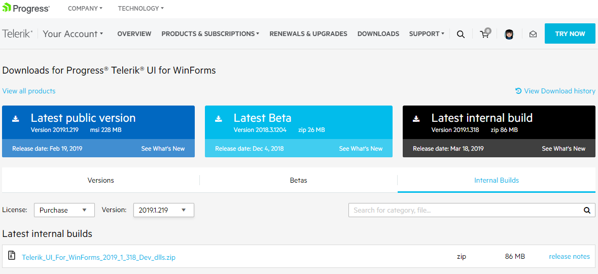
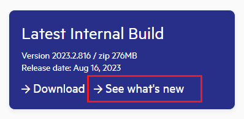
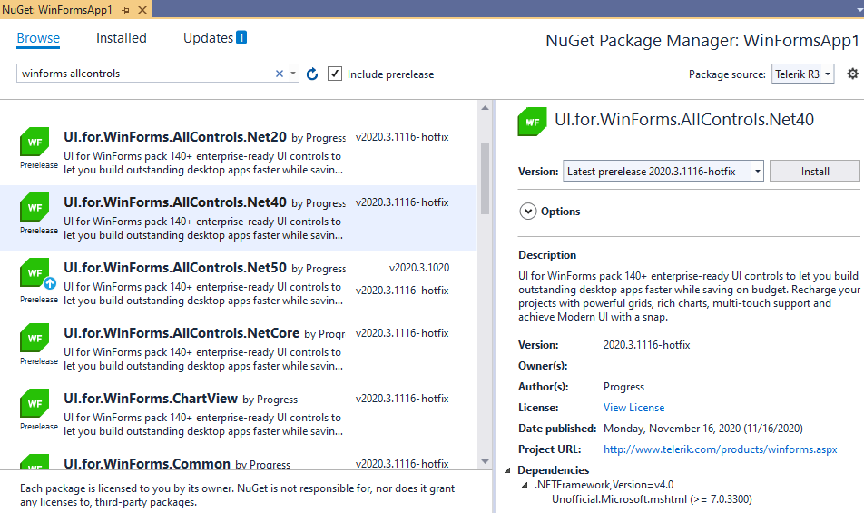

# Latest Internal Builds

Our website gives you access to our latest internal builds in [your account](https://www.telerik.com/account/). These are the distributions built automatically from our source repository and include all latest fixes (*new features are usually not included*). 

Click **See what's new** for detailed list of the included fixes:

 

Regular builds are an integral part of our development process and based on the continuous quality assurance and feedback, we strive to produce the most stable releases possible. If you have experienced any problem with the current official distributions there is a possibility that the issue has already been addressed in the latest internal build. 

Once you download the LIB version, it is necessary to [update the assemblies in your project]().

>important IMPORTANT NOTE: The Latest Internal Builds are intended to be used for development purposes only and they are not recommended for production purposes as these distributions have not gone through the complete QA process.

## Installing LIB from NuGet

Latest Internal Builds are available for [installing as a NuGet package]() as well:  

>caution Don't forget to check the **Include prerelease** option next to the search box.

# See Also

* [Download Product Files]()
* [Updating Assemblies in a Project]()