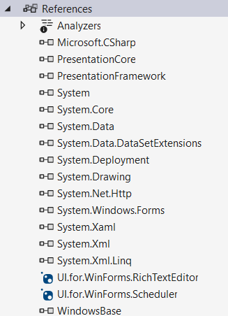

# Migrate Telerik Assemblies to NuGet

The following topic will show you how to migrate Telerik UI for WinForms assemblies to NuGet. But before that let see the benefits of using NuGets instead of assemblies.

## Using NuGet 

Using NuGet instead of manually referencing assemblies in Telerik UI for WinForms (or any .NET project) provides several advantages:

### Simplified Dependency Management

NuGet automatically downloads the correct version of Telerik assemblies along with their dependencies (e.g., Telerik.UI.for.WinForms.Common when you install GridView). This means you won’t need to manually reference each required assembly for the controls you use.

### Version Control & Updates

With NuGet, updating Telerik to a new version is as simple as running the Update-Package command or clicking in Visual Studio’s NuGet Manager. Manual assembly updates require replacing .DLL files and updating all projects that reference them, which is a time-consuming operation that can easily lead to version mismatches.

### Framework Targeting

Telerik’s NuGet packages include builds for different target frameworks (e.g., .NET Framework 4.8, .NET 8, .NET 9). NuGet automatically selects the correct assemblies for your project. With manual references, you risk mixing incompatible versions, such as referencing a .NET Framework DLL in a .NET 8 project.

### Consistency Across Projects

n multi-project solutions, NuGet ensures all projects use the same assembly version. With manual references, it’s easy for one project to end up with a different version, potentially causing runtime issues.

## Migrate Manually Referenced Assemblies to NuGet

Next, we’ll walk through how to replace your manually referenced assemblies with NuGet packages, step by step. To demonstrate this, let’s assume we have a project with a **RadGridView** control placed on a form to display our data.

For this project, we also need a scheduling mechanism and a document reader. Here, we can use the **RadScheduler** and **RadRichTextEditor** controls. These three controls from the Telerik UI for WinForms suite require the following assemblies:

* __Telerik.Licensing.Runtime__
* __Telerik.WinControls__
* __Telerik.WinControls.GridView__
* __Telerik.WinControls.RichTextEditor__
* __Telerik.WinControls.Scheduler__
* __Telerik.WinControls.UI__
* __Telerik.Windows.Documents.Core__
* __TelerikCommon__

The above assemblies can be replaced with the following NuGets:

* __UI.for.WinForms.GridView__
* __UI.for.WinForms.RichTextEditor__
* __UI.for.WinForms.Scheduler__

The NuGets will installed the same number assemblies as you have done it manually. All referenced NuGet packages and their version is stored in the **packages.config** file. 

The final step will be to migrate to PackageReference. The PackageReference is flexible and lightweight. When used it will remove the **packages.config** file from your project and move the NuGet package information in the **csproj** project file. To migrate the **packages.config** file, you will need to choose the **Migate packages.config to PackageReference...** option from the context menu.

In our example, __UI.for.WinForms.Scheduler__ have a dependency to the RadGridView NuGet. The __UI.for.WinForms.GridView__ will be collapsed. Now when you expand the Reference node in Visual Studio, you can see the Package References:

## See Also

* [Download Product Files]()
* [How to Upgrade a Telerik UI for WinForms Project]()