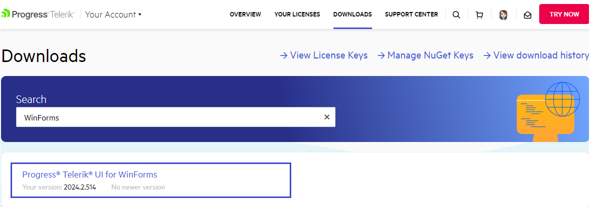
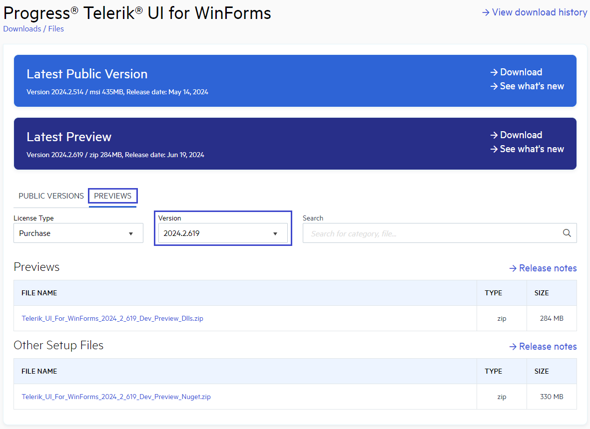

# Preview Release

The Preview is a minor release of the **Telerik UI for WinForms** assemblies, that is uploaded between the major releases. The major releases are Q1, Q2, Q3 and Q4. Unlike the scheduled major releases, the Preview versions are released on demand which means their frequency can vary from none to several versions between two major releases. This approach allows more flexibility as the users can test the latest bug fixes and improvements, and provide feedback before the major release is officially launched.

## Downloading the Preview Release

The Preview is __available as a NuGet__ package. Alternatively, you can __download the Preview assemblies__ from [your telerik.com account](https://www.telerik.com/account/). To download these files follow the steps below:
 
1. From your Telerik account, go to the **Downloads** tab and choose Telerik UI for WinForms product [download page](https://www.telerik.com/account/downloads/product-download?product=RCWF).

    

1. This will navigate you to a Telerik UI for WinForms page showing **Latest Public Version** and **Latest Preview**.

1. To get a specific version of the Preview, click on the Preview tab on the download page. Then select a version from the **Version** list. To start downloading click on the file name or use the **Download** button.

    

## See Also

* [Installing On Your Computer]() 
* [Updating Assemblies in a Project]()

