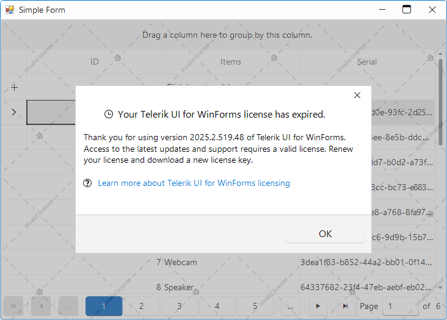

# Trial License

This article explains the Trial license for Telerik UI for WinForms, its features, limitations, and how it differs from the commercial developer license.

## What is a Trial License

**Trial license** is a free evaluation version of **Telerik UI for WinForms** that allows developers to test the complete functionality of the product before making a purchase decision. This license provides access to all controls and features available in the commercial version for evaluation purposes. If you are new to Telerik UI for WinForms, sign up for a [free trial](https://www.telerik.com/try/ui-for-WinForms).

>note The trial validation period is 30 days from the license activation date.

### License Types

Telerik UI for WinForms offers two main license types:

- **Developer License** - Commercial license for production use without restrictions or trial indicators
- **Trial License** - Free evaluation license with time limitations and trial indicators

Both licenses are applied through license keys installed on the developer's machine. For information on installing license keys, refer to the [Set Up Your Telerik UI for WinForms License Key]() documentation.

## Trial License Features

Trial license provides comprehensive access to evaluate Telerik UI for WinForms before purchasing. During the evaluation period, developers can explore all product capabilities and build complete applications to assess the product's suitability for their projects. Trial license also provides:

- **Full functionality access** - All Telerik UI for WinForms controls and features
- **Complete feature set** - Identical capabilities to the commercial version
- **30-day evaluation period** - Sufficient time for thorough product evaluation
- **No code limitations** - Full development and testing capabilities
- **Access to technical support service** - Trial users are allowed to submit tickets from their Telerik account

### During Active Trial Period

During the active trial period, a popup message appears on application startup indicating that the application is using a trial version of Telerik UI for WinForms and also show the expiration days. All functionality during trial period remains fully accessible without restrictions.

### After Trial Period Expiration

Once the trial period expires, the following trial indicators are displayed:
- A trial message appears in the application
- A watermark overlay is displayed over the UI controls

## Upgrading your Trial License to Commercial License

To remove all trial limitations and enable production deployment, purchase and upgrade your trial license to a commercial Developer license. The commercial license eliminates all trial indicators and provides full rights for distribution and deployment of applications using Telerik UI for WinForms.

>important To upgrade your trial licence, please check [Updating Your License Key](https://docs.telerik.com/devtools/winforms/licensing/license-key#updating-your-license-key)

## See Also

* [Assemblies Version]()
* [Available NuGet Packages]()
