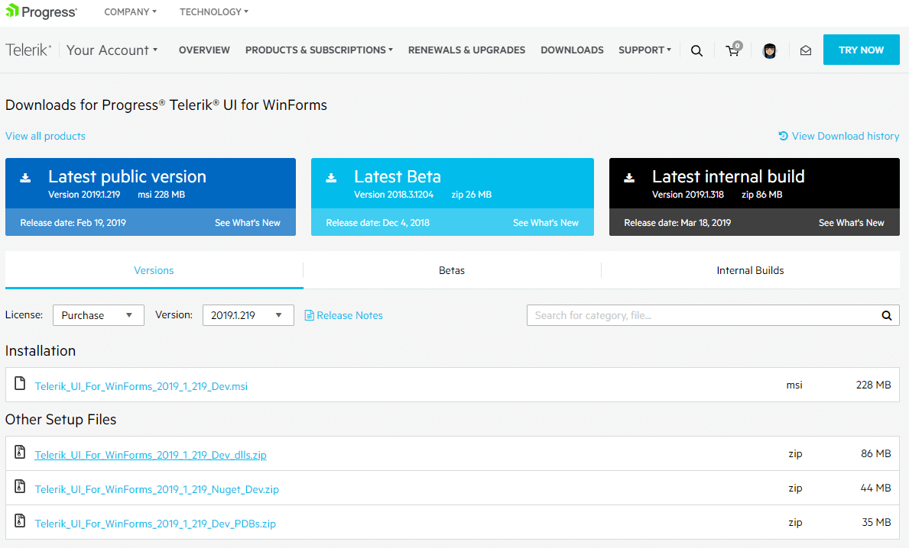
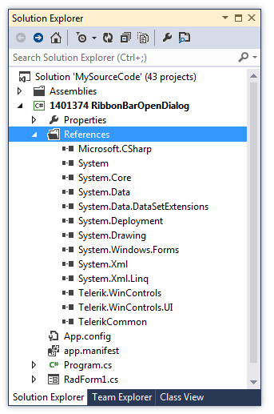
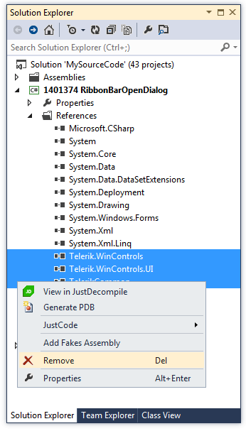
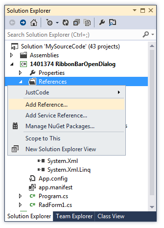
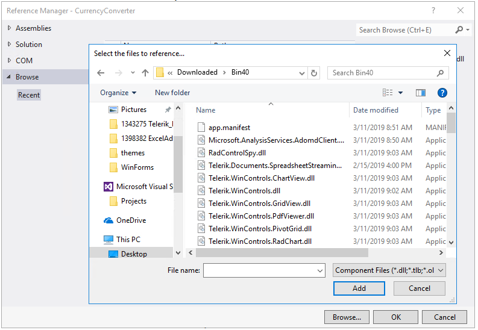

# Updating Assemblies in a Project

The following topic will show you how to use a specific version of the Telerik UI for WinForms suite in your project. 

When you [download a .zip containing all binaries]() for a specific version from your account, you need to replace the already existing assemblies in your project. Follow the steps:

1. Unzip the downloaded archive.
2. Select your project in Visual Studio >> Solution Explorer and expand the *References* section.

	

3. Select the already added Telerik assemblies and delete them:

	

4. Right-click over *References* and select *Add reference...*

	

5. Navigate to the unzipped folder and select the necessary references:

	

Now, you are ready to build and run your project with the downloaded version from your account.

# See Also

* [Download Product Files]()
* [How to Upgrade a Telerik UI for WinForms Project]()
* [How to Upgrade Trial to Licensed Version]()