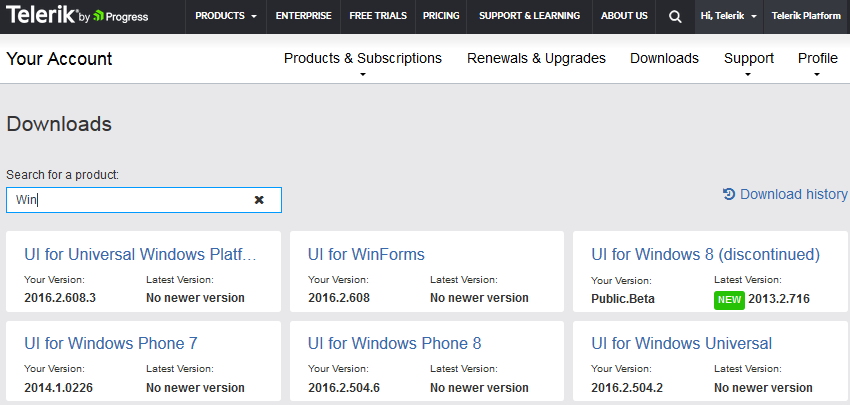
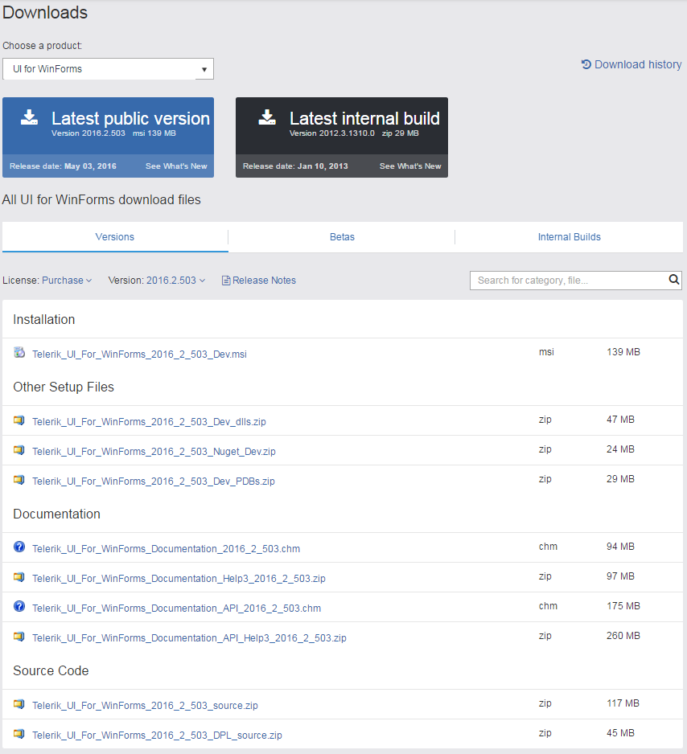
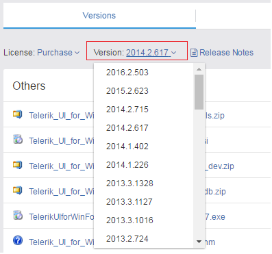

# Download Product Files

When you are a licensed developer you are allowed to download the following files:

* Old versions

* Standalone installation 

* Assemblies and themes only

* Latest Internal builds

* Documentation files

* Source code

## 

In order to download these you need to take the following steps:

1. Log in to your account.

1. Click on the __Downloads__ tab:

	

1. Select the __UI for WinForms__ product from the drop down:

	

1. This page allows you to download the Automatic Installation msi file, DLLs and themes, PDB files, NuGet Packages, documentation files, and Source code.

	

1. From the __Version__ drop down, you can select an older version to download: 

	

	>important Please note that if you do not see the desired version you can contact our sales team and they will enable the version for download: [sales@telerik.com](mailto:sales@telerik.co)

