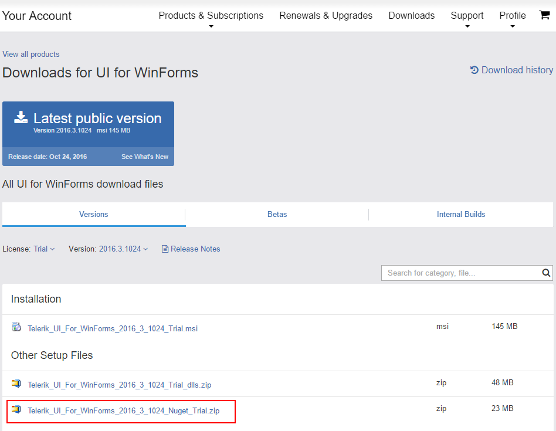

# Install using NuGet Packages

This article describes how you can install the WinForms suite using a NuGet package. There are two ways for getting the NuGet packages:

* [Manually download the packages](#manually-download-nuget-packages)
* [Get the packages from the Telerik NuGet server](#download-from-the-nuget-server)

## Manually Download NuGet Packages

First you need to log in using your licensed account. This way you will be able to download the packages:

>note The following article shows where you can find the downloads section [Download Product Files]({%Slug winforms/installation-deployment-and-distribution/download-product-files})

Then you need to add packages to Visual Studio. Open the NuGet manager and then click the options button:

Add new package source. The __Source__ should point to the folder with the NuGets:

The final step is to select and install the desired packages. Please note that there are two versions, one for .NET 2.0 to 3.5 and one for 2.0 or newer. 

## Download from the NuGet server

You need to add the Telerik package server (https://nuget.telerik.com/nuget) to the package sources in visual studio. First open the __Options__ window: 

Add new source and add the server to the Source field:

When the __Package Source__ is selected you will be prompted for a user name and a password. Use the credentials for your Telerik Account:

After this you can just select and install the desired NuGet packages.

# See Also

[Installing On Your Computer]()