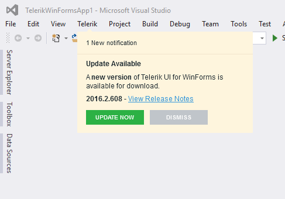
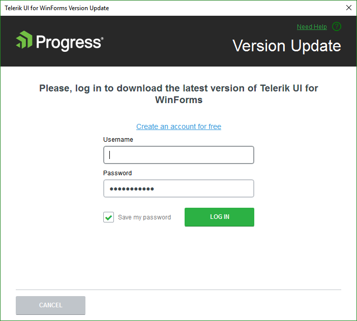
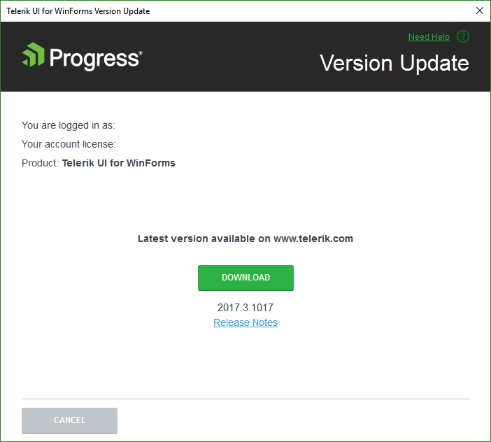
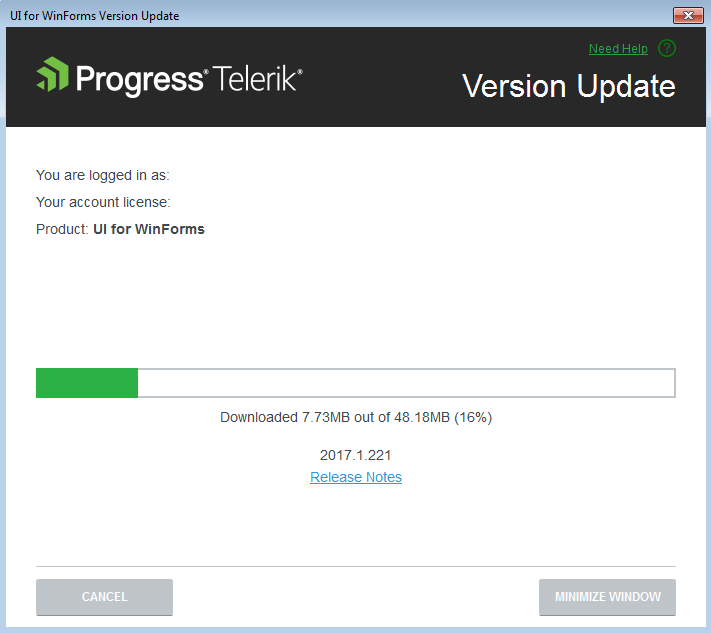
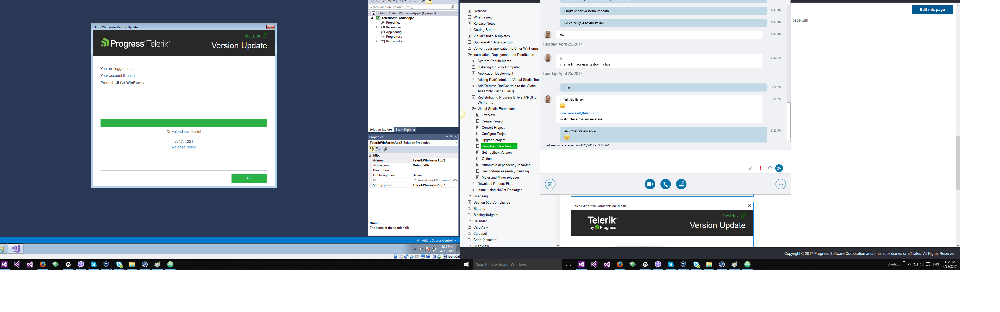

# Download New Version

With the Telerik Visual Studio Extensions you keep your projects in an up-to-date state. The __Latest Version Acquirer__ tool automatically retrieves the freshest Progress&reg; Telerik&reg; UI for WinForms distribution, available on the Telerik website. Running the [Upgrade Wizard]() as a next step makes the task of latest Progress&reg; Telerik&reg; UI for WinForms package utilization extremely easy.

When a solution containing an UI for WinForms project is loaded in Visual Studio, the Telerik WinForms VSExtension checks the Telerik website for a new version of Progress&reg; Telerik&reg; UI for WinForms. A dialog gets displayed when a new version is available:

>note If you've disabled the notifications, you can use the [Options Dialog]() to activate them again.
>

Clicking the __Update Now__ button starts the Latest Version Acquirer tool, prompting for your Telerik credentials and the type of license you own in its first page. If you do not have a [www.telerik.com](http://www.telerik.com) account, you can create one through the __Register__ link.

You can use the __Save my password__ checkbox to save having to enter your Telerik credentials multiple times. The persistence is done in a secure manner and credentials are saved in a per-user context. This way other users on the machine that do not have access to your user data from downloading through your account.

If your subscription has expired, you could either proceed with downloading a trial distribution  or you could renew it and initiate the download again.

You can check the additional information about the release by clicking the __Release Notes__ link. This will start a browser, navigated to a page with the release notes related to the specific version.

Once the download succeeds, the latest version of the Progress&reg; Telerik&reg; UI for WinForms will be available for use in the [Upgrade Wizard]() and the [New Project Wizard]().

>tip The Download buttons of the [Upgrade Wizard]() and the [New Project Wizard]() launch the Latest Version Acquirer tool too.
>

>note The Latest Version Acquirer tool actually downloads the hotfix zip files, containing the latest Telerik binaries and any resources vital for the Telerik WinForms project creation. These get unpacked to the %appdata%\Telerik\Updates folder.
>If you find the list of packages offered too long and you don't need the older versions, you can close Visual Studio and use Windows Explorer to delete these distributions.
>
