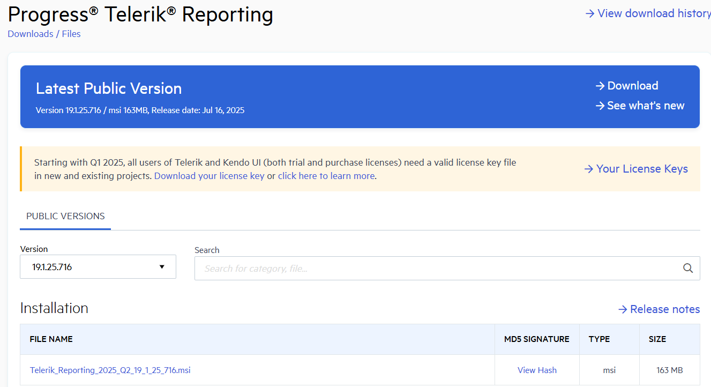
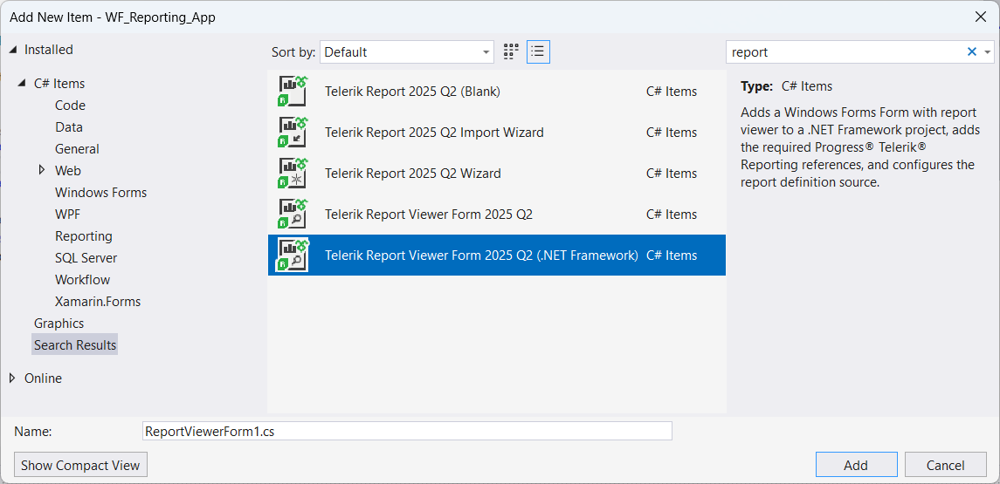
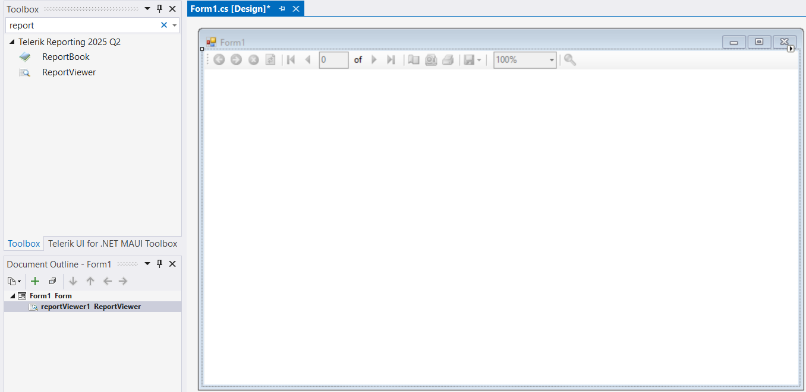
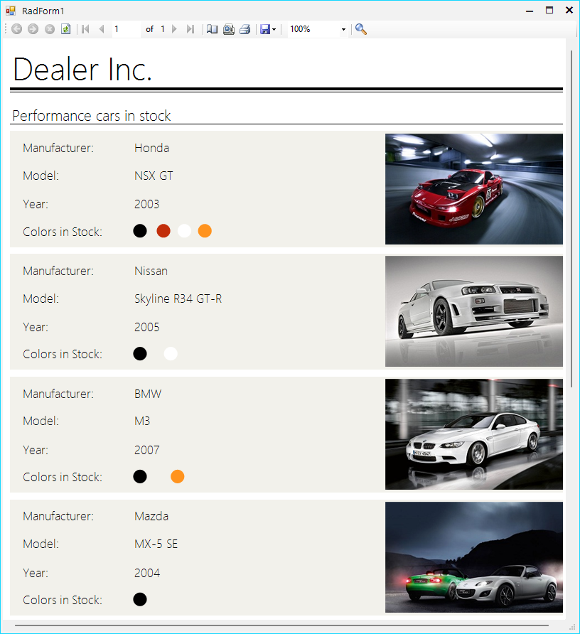

# Telerik Reporting for WinForms

[Telerik Reporting](https://docs.telerik.com/reporting/introduction) is a .NET-based reporting solution that enables developers to design, view, and export interactive, data-driven reports across web, desktop, and cloud platforms. It supports a wide range of data sources and includes a rich set of components for building visually complex reports, such as tables, charts, graphs, and barcodes.

Typical use cases include generating invoices, financial summaries, dashboards, and analytical reports. With built-in export options to formats like PDF, Excel, and Word, Telerik Reporting streamlines business reporting and enhances data presentation in enterprise applications.

The platform provides UI components called Report Viewers, which allow you to display and interact with reports directly within your application. These viewers are available for various technologies, including Angular, HTML5/JavaScript, WPF, ASP.NET, and WinForms.

## Telerik ReportViewer for WinForms

In this article, we’ll demonstrate how to add a Report Viewer to a WinForms application.
To get started, you first need to install Telerik Reporting on your machine. The Installation Approaches for [Telerik Reporting](https://docs.telerik.com/reporting/getting-started/installation/installation-approaches) article outlines several ways to install the product.

In this scenario, we'll use the Telerik Reporting MSI installer to install the necessary libraries. You can download the MSI from your [Telerik Account](https://www.telerik.com/account/downloads/product-download?product=REPORTING).

 

Once the installation is successful, you can add the Telerik ReportViewer to your WinForms project Form using one of the approaches below, depending on your requirements.

### Add ReportViewer Form

The item template is available in the __Add New Item__ dialog box under the Windows Form category.

 

* Build the project and check that the project is using a compatible .NET version.
* Open the Add New Report Viewer dialog to choose a report definition for the report viewer.
* If missing add the required Telerik Reporting references:

	* Telerik.Reporting
	* Telerik.ReportViewer.WinForms

* Add a Form with Windows Form Report Viewer.
* Setup the viewer's [connection](https://docs.telerik.com/reporting/embedding-reports/display-reports-in-applications/how-to-construct-a-string-to-connect-to-report-engine) depending on selected __engine type__.
* Show a summary log that list all of the made changes.

If the selected engine is of remote type (__REST Service__ or __Report Server__), the item template will:

* Add a reference to *Telerik.Reporting.Services.HttpClient* to the current project.
* Add a reference to *System.Net.Http* and *System.Net.Http.Formatting* via NuGet package to the current project.

If the selected engine is __REST Service__ additionally it will do the following:

* Create a new web project that will host the REST service.
* Register the provided REST service URL into IIS Express virtual directories list.
* Register all the needed NuGet packages for the REST service.

	>In some cases the solution must be rebuilt in order to restore the NuGet packages and start the REST service project correctly.

If the application needs to be declared as DPI-aware, an additional element must be added to the application manifest file, as explained in [Declaring the application as DPI-aware](https://docs.telerik.com/reporting/embedding-reports/display-reports-in-applications/windows-forms-application/overview#declaring-the-application-as-dpi-aware).

### Add ReportViewer to Windows Form Design Time

You can add the Telerik ReportViewer to the Windows Forms by drag-droping it from the Visual Studio Toolbox.

 

* Add a reference to the class library that contains your reports in the WinForms application.
* Set the ReportSource property of the ReportViewer. For more information, see [How to Set ReportSource for Report Viewers](https://docs.telerik.com/reporting/embedding-reports/display-reports-in-applications/how-to-set-reportsource-for-report-viewers).
* To run the report, call ReportViewer.RefreshReport() in your application code.

````C#

private void Form1_Load(object sender, EventArgs e)
{
    var typeReportSource = new Telerik.Reporting.TypeReportSource();
    typeReportSource.TypeName = "Telerik.Reporting.Examples.CSharp.ListBoundReport, CSharp.ReportLibrary";
    this.reportViewer1.ReportSource = typeReportSource;
    reportViewer1.RefreshReport();
}

````



## See Also

* [Getting Started with Telerik Reporting Libraries](https://docs.telerik.com/reporting/getting-started/about-telerik-reporting)

* [Installation Approaches for Telerik Reporting](https://docs.telerik.com/reporting/getting-started/installation/installation-approaches)

* [Telerik Reporting Licensing](https://docs.telerik.com/reporting/licensing/setting-up-your-telerik-reporting-license-key)
