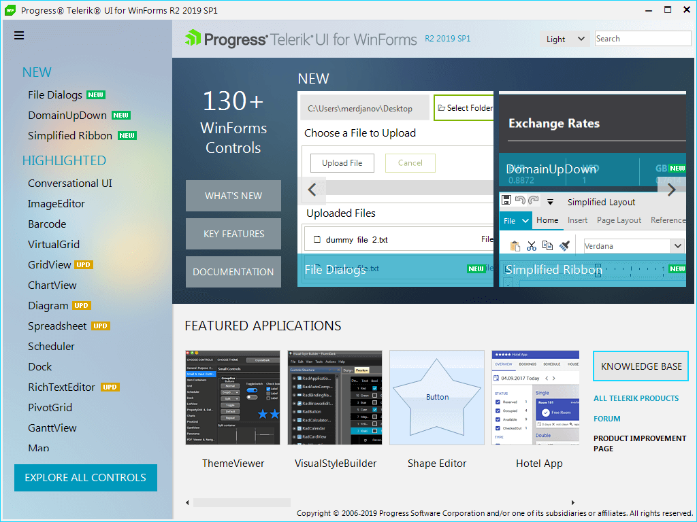

# Overview

## Performance you demand, UI you can't believe

Telerik UI for WinForms includes over 95 UI controls that you can use to easily build unique and visually stunning Line of Business applications. Boasting a well-designed architecture and CAB support, Telerik UI for WinForms controls are perfectly suited for your Enterprise desktop development.

  

<table>
<tr>
<td>
<a href="/menus/application-menu-overview">ApplicationMenu</a> 

BreadCrumb

<a href="/gauges/bulletgraph-overview">BulletGraph</a> 
</td>

<td>
</td>
</tr>
</table>

<table><tr><td>
[ApplicationMenu]()

BreadCrumb

[BulletGraph]()

[Calendar]()

[Carousel]()

[ChartView]()

[CheckedListBox]()

[CommandBar]()

[DropDownList]()

[ContextMenu + ContextMenuManager]()

[Diagram]()

[Dock]()

[GridView]()

[ListControl]()

[ListView]()

[LinearGauge]()

[Menu]()

[MultiColumnComboBox]()

[PageView]()

[Panorama]()

[PivotGrid]()

[PivotFieldList]()

[PropertyGrid]()

[RangeSelector]()

[RibbonBar]()

[Rotator]()

[Scheduler]()

[TreeView]()

Track and Status Controls

* [ProgressBar]()

* [HScrollBar]()

* [VScrollBar]()

* [TrackBar]()

* [WaitingBar]()

* [Rating]()

Forms, Dialogs, VS templates

* [ColorDialog]()

* [Form + VS template]()

* [MessageBox]()

* [ShapedForm + VS template]()

* [StatusStrip]()

* [TitleBar]()

* [RibbonForm + VS template]()

</td><td>

[Telerik Presentation Framework]()

[Shortcuts]()

ScreenTips

ToolTips

Tools included

* [ControlSpy]()

* [Visual Style Builder]()

* [Shape Editor]()

* Project Upgrade Utility

* [Element Hierarchy Editor]()

Editors

* [AutoCompleteBox]()

* [BrowseEditor]()

* [CalculatorDropDown]()

* [ColorBox]()

* [DateTimePicker]()

* [MaskedEditBox]()

* [SpinEditor]()

* [TextBox]()

[RichTextBox]()

[SpellChecker]()

Panels and Labels

* [GroupBox]()

* [Separator]()

* [Panel]()

* [Label]()

* [ScrollablePanel]()

Themes

* [ThemeManager]()

* AquaTheme

* BreezeTheme

* DesertTheme

* HighContrastBlackTheme

* Office2007BlackTheme

* Office2007SilverTheme

* Office2010BlackTheme

* Office2010SilverTheme

* Office2010BlueTheme

* TelerikMetroBlueTheme

* TelerikMetroTheme

* Windows7Theme

* [Theme Color Blending](94E87FA5-B031-4A64-9A62-4A71EE30B572)</td></tr></table>

<table><th><tr><td>

RELATED VIDEOS</td><td></td></tr></th><tr><td>

[Why choose Telerik UI for WinForms](http://tv.telerik.com/watch/winforms/radcontrols-for-winforms-product-video-q3-2010)

See how you can easily build unique and visually stunning Line of Business Windows Forms applications with Telerik UI for WinForms. Boasting a well-designed architecture and CAB support,
                Telerik UI for WinForms are perfectly suited for your Enterprise desktop development.
              </td><td></td></tr></table>
<table><th><tr><td>

Revision Date</td><td>

07/02/2014</td></tr></th><tr><td></td><td></td></tr></table>
