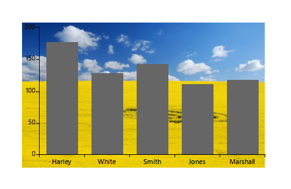

## Environment
|Product Version|Product|Author|
|----|----|----|
|2021.1.122|RadChartView for WinForms|[Desislava Yordanova](https://www.telerik.com/blogs/author/desislava-yordanova)|

## Description

A common requirement is to apply an image as a background for the plot area in **RadChartView**. 

## Solution

To render an image at a particular place, e.g. on the plot area, it is possible to override the default drawing of the [CartesiaGrid]() and draw the necessary image instead by utilizing the [CartesianRenderer]().
 


 
````C#
public RadForm1()
{
    InitializeComponent();

    this.radChartView1.CreateRenderer += RadChartView_CreateRenderer;
    Telerik.WinControls.UI.BarSeries barSeries = new Telerik.WinControls.UI.BarSeries("Performance", "RepresentativeName");
    barSeries.DataPoints.Add(new CategoricalDataPoint(177, "Harley"));
    barSeries.DataPoints.Add(new CategoricalDataPoint(128, "White"));
    barSeries.DataPoints.Add(new CategoricalDataPoint(143, "Smith"));
    barSeries.DataPoints.Add(new CategoricalDataPoint(111, "Jones"));
    barSeries.DataPoints.Add(new CategoricalDataPoint(118, "Marshall"));
    this.radChartView1.Series.Add(barSeries);


    var area = this.radChartView1.GetArea<CartesianArea>();
    CartesianGrid grid = area.GetGrid<CartesianGrid>();
    this.radChartView1.ShowGrid = true;
    grid.DrawVerticalFills = true;
    grid.DrawVerticalStripes = true;
    this.radChartView1.Tag = Properties.Resources.nature;
}
private void RadChartView_CreateRenderer(object sender, ChartViewCreateRendererEventArgs e)
{
    e.Renderer = new CustomRenderer(e.Area as CartesianArea);
}

public class CustomCartesianGridDrawPart : CartesianGridDrawPart
{
    public CustomCartesianGridDrawPart(CartesianGrid grid, IChartRenderer renderer) : base(grid, renderer)
    {
    }
    public override void Draw()
    {
        CartesianRenderer renderer = (CartesianRenderer)this.Renderer;
        Graphics graphics = renderer.Graphics;
        RectangleF plotArea = RectangleF.Empty;
        CartesianGrid grid = renderer.Area.Grid as CartesianGrid;

        RadRect rect = grid.Area.AreaModel.LayoutSlot;
        ChartWrapper wrapper = renderer.Area.Owner.Owner as ChartWrapper;
        RadChartView myChart = wrapper.ElementTree.Control as RadChartView;
        Image img = myChart.Tag as Image;
        graphics.DrawImage(img, new Rectangle((int)rect.X, (int)rect.Y, (int)rect.Width, (int)rect.Height));
    }
}

public class CustomRenderer : CartesianRenderer
{
    public CustomRenderer(CartesianArea area) : base(area)
    {
    }

    protected override void InitializeGrid()
    {
        if (this.Area.Grid is CartesianGrid)
            this.DrawParts.Add(new CustomCartesianGridDrawPart(this.Area.Grid as CartesianGrid, this));
    }
}


````
````VB.NET
Sub New()
    InitializeComponent()

    AddHandler Me.RadChartView1.CreateRenderer, AddressOf RadChartView_CreateRenderer
    Dim barSeries As New Telerik.WinControls.UI.BarSeries("Performance", "RepresentativeName")
    barSeries.DataPoints.Add(New CategoricalDataPoint(177, "Harley"))
    barSeries.DataPoints.Add(New CategoricalDataPoint(128, "White"))
    barSeries.DataPoints.Add(New CategoricalDataPoint(143, "Smith"))
    barSeries.DataPoints.Add(New CategoricalDataPoint(111, "Jones"))
    barSeries.DataPoints.Add(New CategoricalDataPoint(118, "Marshall"))
    Me.RadChartView1.Series.Add(barSeries)


    Dim area = Me.RadChartView1.GetArea(Of CartesianArea)()
    Dim grid As CartesianGrid = area.GetGrid(Of CartesianGrid)()
    Me.RadChartView1.ShowGrid = True
    grid.DrawVerticalFills = True
    grid.DrawVerticalStripes = True
    Me.RadChartView1.Tag = My.Resources.nature
End Sub

Private Sub RadChartView_CreateRenderer(sender As Object, e As ChartViewCreateRendererEventArgs)
    e.Renderer = New CustomRenderer(e.Area)
End Sub

Public Class CustomCartesianGridDrawPart
    Inherits CartesianGridDrawPart

    Public Sub New(grid As CartesianGrid, renderer As IChartRenderer)
        MyBase.New(grid, renderer)

    End Sub
    Public Overrides Sub Draw()
        Dim renderer As CartesianRenderer = CType(Me.Renderer, CartesianRenderer)
        Dim graphics As Graphics = renderer.Graphics
        Dim plotArea As RectangleF = RectangleF.Empty
        Dim grid As CartesianGrid = TryCast(renderer.Area.Grid, CartesianGrid)

        Dim rect As RadRect = grid.Area.AreaModel.LayoutSlot
        Dim wrapper As ChartWrapper = TryCast(renderer.Area.Owner.Owner, ChartWrapper)
        Dim myChart As RadChartView = TryCast(wrapper.ElementTree.Control, RadChartView)
        Dim img As Image = TryCast(myChart.Tag, Image)
        graphics.DrawImage(img, New Rectangle(rect.X, rect.Y, rect.Width, rect.Height))
    End Sub
End Class

Public Class CustomRenderer
    Inherits CartesianRenderer
    Public Sub New(area As CartesianArea)
        MyBase.New(area)

    End Sub

    Protected Overrides Sub InitializeGrid()

        If TypeOf Me.Area.Grid Is CartesianGrid Then

            Me.DrawParts.Add(New CustomCartesianGridDrawPart(Me.Area.Grid, Me))
        End If

    End Sub
End Class


````

# See Also

* [CartesiaGrid]() 
* [CartesianRenderer]()

