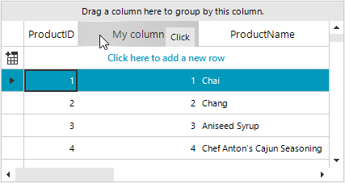

## Environment
 
|Product Version|Product|Author|
|----|----|----|
|2019.3.1022|RadGridView for WinForms|[Desislava Yordanova](https://www.telerik.com/blogs/author/desislava-yordanova)|
 
## Description

This tutorial demonstrates how to add a button element in the header cell for a certain column.

 


## Solution 

In order to add a button in the header cell, it is suitable to create a custom column which uses a custom **GridHeaderCellElement**. A tutorial for creating custom cells is available in the following help article: [Creating custom cells]()
 

````C#
public RadForm1()
{
    InitializeComponent(); 

    MyGridViewDecimalColumn myColumn = new MyGridViewDecimalColumn();
    myColumn.FieldName = "ProductID";
    myColumn.HeaderText = "My column";
    myColumn.MinWidth = 150;
    this.radGridView1.Columns.Add(myColumn);
}

public class MyGridViewDecimalColumn : GridViewDecimalColumn
{
    public override Type GetCellType(GridViewRowInfo row)
    {
        if (row is GridViewTableHeaderRowInfo)
        {
            return typeof(MyGridHeaderCellElement);
        }
        return base.GetCellType(row);
    }
}

public class MyGridHeaderCellElement : GridHeaderCellElement
{ 
    public MyGridHeaderCellElement(GridViewColumn column, GridRowElement row) : base(column, row)
    {
    }

    protected override Type ThemeEffectiveType
    {
        get
        {
            return typeof(GridHeaderCellElement);
        }
    }

    RadButtonElement btn = new RadButtonElement();

    protected override void CreateChildElements()
    {
        base.CreateChildElements();
       
        btn.Text = "Click";
        btn.Click += btn_Click;
        this.Children.Add(btn);
    }

    private void btn_Click(object sender, EventArgs e)
    {
        RadMessageBox.Show("Clicked");
    }

    public override bool IsCompatible(GridViewColumn data, object context)
    {
        return data is MyGridViewDecimalColumn && context is GridTableHeaderRowElement;
    }

    protected override SizeF MeasureOverride(SizeF availableSize)
    {
        SizeF s = base.MeasureOverride(availableSize);
        btn.Measure(availableSize);
        return s;
    }

    protected override SizeF ArrangeOverride(SizeF finalSize)
    {
        SizeF s = base.ArrangeOverride(finalSize);
        RectangleF clientRect = GetClientRectangle(finalSize);
        btn.Arrange(new RectangleF(clientRect.X + clientRect.Width - btn.DesiredSize.Width - 5,
            clientRect.Y + btn.DesiredSize.Height / 3, btn.DesiredSize.Width, btn.DesiredSize.Height));
  
        return s;
    }
}

        
````
````VB.NET

Public Sub New()
    InitializeComponent()
    Dim myColumn As MyGridViewDecimalColumn = New MyGridViewDecimalColumn()
    myColumn.FieldName = "ProductID"
    myColumn.HeaderText = "My column"
    myColumn.MinWidth = 150
    Me.RadGridView1.Columns.Add(myColumn)
End Sub

Public Class MyGridViewDecimalColumn
    Inherits GridViewDecimalColumn

    Public Overrides Function GetCellType(ByVal row As GridViewRowInfo) As Type
        If TypeOf row Is GridViewTableHeaderRowInfo Then
            Return GetType(MyGridHeaderCellElement)
        End If

        Return MyBase.GetCellType(row)
    End Function
End Class

Public Class MyGridHeaderCellElement
    Inherits GridHeaderCellElement

    Public Sub New(ByVal column As GridViewColumn, ByVal row As GridRowElement)
        MyBase.New(column, row)
    End Sub

    Protected Overrides ReadOnly Property ThemeEffectiveType As Type
        Get
            Return GetType(GridHeaderCellElement)
        End Get
    End Property

    Private btn As RadButtonElement

    Protected Overrides Sub CreateChildElements()
        MyBase.CreateChildElements()
        btn = New RadButtonElement()
        btn.Text = "Click"
        AddHandler btn.Click, AddressOf btn_Click
        Me.Children.Add(btn)
    End Sub

    Private Sub btn_Click(ByVal sender As Object, ByVal e As EventArgs)
        RadMessageBox.Show("Clicked")
    End Sub

    Public Overrides Function IsCompatible(ByVal data As GridViewColumn, ByVal context As Object) As Boolean
        Return TypeOf data Is MyGridViewDecimalColumn AndAlso TypeOf context Is GridTableHeaderRowElement
    End Function

    Protected Overrides Function MeasureOverride(ByVal availableSize As SizeF) As SizeF
        Dim s As SizeF = MyBase.MeasureOverride(availableSize)
        btn.Measure(availableSize)
        Return s
    End Function

    Protected Overrides Function ArrangeOverride(ByVal finalSize As SizeF) As SizeF
        Dim s As SizeF = MyBase.ArrangeOverride(finalSize)
        Dim clientRect As RectangleF = GetClientRectangle(finalSize)
        btn.Arrange(New RectangleF(clientRect.X + clientRect.Width - btn.DesiredSize.Width - 5, _
                                   clientRect.Y + btn.DesiredSize.Height / 3, btn.DesiredSize.Width, btn.DesiredSize.Height))
        Return s
    End Function
End Class


```` 


    
   
  
    
 
