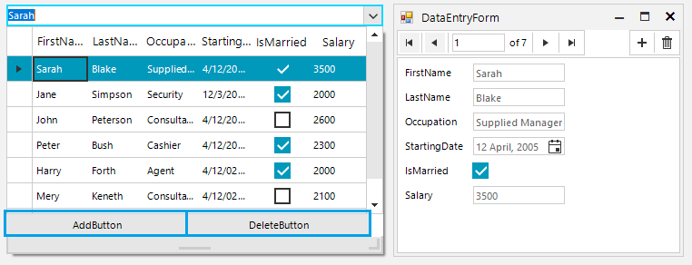

## Environment
 
|Product Version|Product|Author|
|----|----|----|
|2021.2.511|RadMultiColumnComboBox for WinForms|[Nadya Karaivanova](https://www.telerik.com/blogs/author/nadya-karaivanova)|

## Description

This example demonstrates how to customize the pop up in **RadMultiColumnComboBox** by adding custom buttons for add/delete records. The add functionality is presented through [RadDataEntry](https://docs.telerik.com/devtools/winforms/controls/dataentry/dataentry) which provides an easy way to display and edit arbitrary business objects in a form layout.

## Solution

A complete solution in C# and VB.NET is available in our SDK repository [here](https://github.com/telerik/winforms-sdk/tree/master/MultiColumnComboBox/Add-custom-buttons-in-popup).

