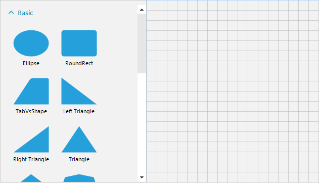

## Environment
|Product Version|Product|Author|
|----|----|----|
|2021.1.223|RadDiagram for WinForms|[Desislava Yordanova](https://www.telerik.com/blogs/author/desislava-yordanova)|

## Description

[RadDiagramToolbox]() introduces a set of shapes that can be dragged to a **RadDiagram**. This tutorial aims to show a sample approach how to add a custom item along with the default items in the diagram toolbox.

 

## Solution

Since **RadDiagramToolbox** is a derivative of [RadListView]() we can benefit its API. We need to add a custom **DiagramListViewDataItem** to the **RadDiagramToolbox** with a specific shape, e.g. cloud. Then, whenever the end-user drags the item from the toolbox and drop it onto the diagram, a shape with the respective shape will be created as it is demonstrated in the above gif file. 

#### Create a custom item with cloud shape
 
````C#
public RadForm1()
{
    InitializeComponent();
     
    DiagramListViewDataItem item = new DiagramListViewDataItem();
    item.Key = "Cloud"; 
    item.Shape = new CloudShape(); 
    item.Group = radDiagramToolbox1.Groups[0];
    this.radDiagramToolbox1.Items.Add(item);
}

public class CloudShape : ElementShape
{ 
    private string CloudRelativePoints = "0.98,0.508;0.966,0.481;0.941,0.451;0.913,0.446;0.917,0.442;0.92,0.438;0.924,0.434;0.935," +
                                         "0.421;0.944,0.406;0.952,0.39;0.967,0.358;0.974,0.323;0.972,0.287;0.969,0.217;0.932,0.149;0.868,0.13;0.852,0.126;0.835,0.125;0.818," +
                                         "0.128;0.806,0.13;0.791,0.134;0.782,0.142;0.782,0.131;0.777,0.12;0.773,0.11;0.768,0.096;0.761,0.082;0.752,0.07;0.735,0.044;0.712,0.024;" +
                                         "0.685,0.012;0.631,-0.013;0.57,0.002;0.526,0.044;0.505,0.065;0.489,0.09;0.482,0.12;0.476,0.11;0.47,0.1;0.461,0.091;0.45,0.079;0.437,0.069;" +
                                         "0.423,0.06;0.397,0.044;0.367,0.035;0.336,0.037;0.275,0.04;0.219,0.083;0.2,0.149;0.195,0.166;0.193,0.185;0.195,0.203;0.195,0.212;0.196,0.223;" +
                                         "0.199,0.232;0.199,0.232;0.198,0.232;0.198,0.232;0.191,0.227;0.184,0.225;0.176,0.222;0.163,0.218;0.148,0.214;0.134,0.215;0.104,0.218;0.08,0.237;" +
                                         "0.062,0.263;0.03,0.309;0.024,0.374;0.046,0.427;0.053,0.445;0.066,0.464;0.083,0.473;0.062,0.481;0.044,0.499;0.031,0.519;0.011,0.548;-0.001,0.585;" +
                                         "0,0.622;0.001,0.658;0.015,0.692;0.04,0.715;0.051,0.726;0.065,0.735;0.08,0.739;0.09,0.742;0.105,0.745;0.116,0.74;0.084,0.791;0.125,0.868;0.169,0.91;" +
                                         "0.224,0.96;0.303,0.954;0.363,0.921;0.388,0.907;0.414,0.888;0.43,0.862;0.451,0.926;0.511,0.976;0.55,0.988;0.631,1.013;0.695,0.998;0.749,0.952;0.782," +
                                         "0.924;0.81,0.869;0.806,0.789;0.814,0.791;0.822,0.792;0.83,0.792;0.847,0.792;0.864,0.789;0.879,0.784;0.911,0.773;0.94,0.753;0.961,0.725;1.005,0.665;" +
                                         "1.012,0.576;0.979,0.508;";

    private PointF PointFromString(string s)
    {
        var pointStrings = s.Split(",".ToCharArray(), StringSplitOptions.RemoveEmptyEntries);
        float x = float.Parse(pointStrings[0]);
        float y = float.Parse(pointStrings[1]);
        return new PointF(x, y);
    }

    public override GraphicsPath CreatePath(Rectangle bounds)
    { 
        string[] pointStrings = CloudRelativePoints.Split(new char[] { ';' }, StringSplitOptions.RemoveEmptyEntries).ToArray();
        System.Collections.Generic.IEnumerable<PointF> points = pointStrings.Select(x => this.PointFromString(x));
        List<PointF> adjustedPoints = points.Select(p => new PointF((float)(p.X * bounds.Width), (float)(p.Y * bounds.Height))).ToList(); 
        GraphicsPath path = new GraphicsPath(FillMode.Winding);
        path.StartFigure();  
        for (int i = 1; i < adjustedPoints.Count; i += 3)
        { 
            path.AddBezier(adjustedPoints[i - 1], adjustedPoints[i], adjustedPoints[i + 1], adjustedPoints[i + 2]); 
        }
        path.CloseFigure(); 
        return path;
    }
} 

````
````VB.NET
Sub New()
    InitializeComponent()

    Dim item As DiagramListViewDataItem = New DiagramListViewDataItem()
    item.Key = "Cloud"
    item.Shape = New CloudShape()
    item.Group = RadDiagramToolbox1.Groups(0)
    Me.RadDiagramToolbox1.Items.Add(item)
End Sub

Public Class CloudShape
    Inherits ElementShape

    Private CloudRelativePoints As String = "0.98,0.508;0.966,0.481;0.941,0.451;0.913,0.446;0.917,0.442;0.92,0.438;0.924,0.434;0.935," _
    & "0.421;0.944,0.406;0.952,0.39;0.967,0.358;0.974,0.323;0.972,0.287;0.969,0.217;0.932,0.149;0.868,0.13;0.852,0.126;0.835,0.125;0.818," _
    & "0.128;0.806,0.13;0.791,0.134;0.782,0.142;0.782,0.131;0.777,0.12;0.773,0.11;0.768,0.096;0.761,0.082;0.752,0.07;0.735,0.044;0.712,0.024;" _
    & "0.685,0.012;0.631,-0.013;0.57,0.002;0.526,0.044;0.505,0.065;0.489,0.09;0.482,0.12;0.476,0.11;0.47,0.1;0.461,0.091;0.45,0.079;0.437,0.069;" _
    & "0.423,0.06;0.397,0.044;0.367,0.035;0.336,0.037;0.275,0.04;0.219,0.083;0.2,0.149;0.195,0.166;0.193,0.185;0.195,0.203;0.195,0.212;0.196,0.223;" _
    & "0.199,0.232;0.199,0.232;0.198,0.232;0.198,0.232;0.191,0.227;0.184,0.225;0.176,0.222;0.163,0.218;0.148,0.214;0.134,0.215;0.104,0.218;0.08,0.237;" _
    & "0.062,0.263;0.03,0.309;0.024,0.374;0.046,0.427;0.053,0.445;0.066,0.464;0.083,0.473;0.062,0.481;0.044,0.499;0.031,0.519;0.011,0.548;-0.001,0.585;" _
    & "0,0.622;0.001,0.658;0.015,0.692;0.04,0.715;0.051,0.726;0.065,0.735;0.08,0.739;0.09,0.742;0.105,0.745;0.116,0.74;0.084,0.791;0.125,0.868;0.169,0.91;" _
    & "0.224,0.96;0.303,0.954;0.363,0.921;0.388,0.907;0.414,0.888;0.43,0.862;0.451,0.926;0.511,0.976;0.55,0.988;0.631,1.013;0.695,0.998;0.749,0.952;0.782," _
    & "0.924;0.81,0.869;0.806,0.789;0.814,0.791;0.822,0.792;0.83,0.792;0.847,0.792;0.864,0.789;0.879,0.784;0.911,0.773;0.94,0.753;0.961,0.725;1.005,0.665;" _
    & "1.012,0.576;0.979,0.508;"

    Private Function PointFromString(ByVal s As String) As PointF
        Dim pointStrings = s.Split(",".ToCharArray(), StringSplitOptions.RemoveEmptyEntries)
        Dim x As Single = Single.Parse(pointStrings(0))
        Dim y As Single = Single.Parse(pointStrings(1))
        Return New PointF(x, y)
    End Function

    Public Overrides Function CreatePath(ByVal bounds As Rectangle) As GraphicsPath
        Dim pointStrings As String() = CloudRelativePoints.Split(New Char() {";"c}, StringSplitOptions.RemoveEmptyEntries).ToArray()
        Dim points As System.Collections.Generic.IEnumerable(Of PointF) = pointStrings.[Select](Function(x) Me.PointFromString(x))
        Dim adjustedPoints As List(Of PointF) = points.[Select](Function(p) New PointF(CSng((p.X * bounds.Width)), CSng((p.Y * bounds.Height)))).ToList()
        Dim path As GraphicsPath = New GraphicsPath(FillMode.Winding)
        path.StartFigure()

        For i As Integer = 1 To adjustedPoints.Count - 1 Step 3
            path.AddBezier(adjustedPoints(i - 1), adjustedPoints(i), adjustedPoints(i + 1), adjustedPoints(i + 2))
        Next

        path.CloseFigure()
        Return path
    End Function
End Class


````

