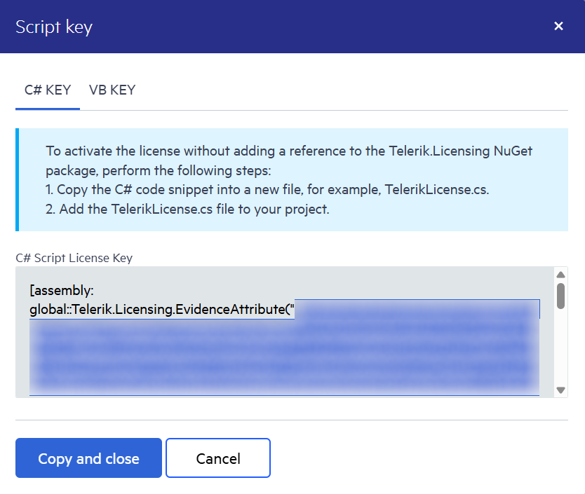

## Environment

| Product | Version
| ---- | ---- |
| Telerik UI for WinForms | 2025 Q1 or later |

## Description

I work in an OpenEdge environment and need to activate my Telerik UI for WinForms license key. My projects, however, do not use NuGet packages. How can I activate the Telerik UI for WinForms without using the `Telerik.Licensing` package?

## Solution

The following tutorial will demonstrate how to set up your license key in the OpenEdge environment.

1. Go to the [Setting Up Your Telerik UI for WinForms License Key](https://docs.telerik.com/devtools/winforms/licensing/license-key#downloading-the-license-key) and follow the first two sections of the article.
	1. Downloading the License Key
	1. Activating the Telerik UI for WinForms Components
	
1. Go to the [License Keys page](https://www.telerik.com/account/your-licenses/license-keys) in your Telerik account.

1. On the Telerik UI for WinForms row, click the **View key** link in the **SCRIPT KEY** column. Copy only the string in the first Telerik.Licensing.EvidenceAttribute("key"). 

	

1. Now we need to register the copied license key above.

````C#

CONSTRUCTOR PUBLIC Form1 (  ):        
	// ActivePerpetual script key	
	Telerik.Licensing.TelerikLicensing:Register("Your License Key").
	
	InitializeComponent().

	THIS-OBJECT:ComponentsCollection:Add(THIS-OBJECT:components).
	CATCH e AS Progress.Lang.Error:
		UNDO, THROW e.
	END CATCH.

END CONSTRUCTOR.

````
	>important The license key needs to be registered before initializing our controls. In the above scenario, the license key is registered before the InitializeComponent() method is executed.

1. Add a reference to the `Telerik.Licensing.Runtime.dll`.

>Do not publish the script license key snippet in publicly accessible repositories. This is your personal license key.


## See Also

* [Setting Up Your License Key]()
* [License Activation Errors and Warnings]()
* [Frequently Asked Questions about Your Telerik UI for WinForms License Key]()
* [Adding the License Key to CI Services]()
