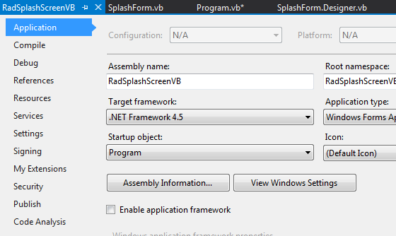

|Date Posted|Product|Author|
|----|----|----|
|08/27/2013 |Telerik UI for WinForms|Georgi Georgiev| 
 
   
## Problem 
   
 You have a big application which takes long time to load initially and you want to display proper indication to your end users of the ongoing process.   
   
## Solution  
   
    
 
Create a splash screen which will be shown to your users while the heavy work is done behind the scenes.  

First of all we will need a simple **ShapedForm **which will play the role of our SplashScreen.  All we need to do is add a PictureBox which will hold our Logo:  
   
````C#
public partial class SplashForm : ShapedForm
{
    public SplashForm()
    {
        InitializeComponent();
 
        PictureBox spashPictureBox = new PictureBox();
        spashPictureBox.Image = Resources.telerik_logo_RGB_photoshop;
        spashPictureBox.SizeMode = PictureBoxSizeMode.StretchImage;
        spashPictureBox.Dock = DockStyle.Fill;
        this.Controls.Add(spashPictureBox);
 
        this.StartPosition = FormStartPosition.CenterScreen;
    }
}

````
````VB.NET
Public Class SplashForm
    Public Sub New()
 
        InitializeComponent()
 
        Dim spashPictureBox As New PictureBox()
 
        spashPictureBox.Image = My.Resources.telerik_logo_RGB_photoshop
        spashPictureBox.SizeMode = PictureBoxSizeMode.StretchImage
        spashPictureBox.Dock = DockStyle.Fill
        Me.Controls.Add(spashPictureBox)
 
        Me.StartPosition = FormStartPosition.CenterScreen
    End Sub
End Class

````

Then, we will need our **MainForm **which will do the heavy lifting. In this simulation we will just sleep the main thread for **2000** milliseconds which seems like a normal case scenario:  
   
````C#
public partial class MainForm : RadForm
{
    public MainForm()
    {
        InitializeComponent();
 
        Thread.Sleep(2000);
    }
}

````
````VB.NET
Public Class MainForm
    Public Sub New()
 
        InitializeComponent()
 
        Thread.Sleep(500)
    End Sub
End Class

````   

The main logic will be happening in our **Program.cs**/**Program.vb** file, this is where our forms will be created and disposed. First of all we will need to run the **SplashForm **on a separate thread, this will enable it to run independently of the main thread which is supposed to be busy handling the heavy operations. This way UI operations such as animations will not be interrupted because the UI thread will not be blocked.  After running the thread with the **SplashForm**, we can create the **MainForm** and subscribe to its **Load** event, where we consider the loading is completed and we will close the **SplashForm** and let our application run normally:  
   
````C#
static class Program
{
   public static SplashForm splashForm = null;
 
    /// <summary>
    /// The main entry point for the application.
    /// </summary>
    [STAThread]
    static void Main()
    {
        Application.EnableVisualStyles();
        Application.SetCompatibleTextRenderingDefault(false);
 
        //show splash
        Thread splashThread = new Thread(new ThreadStart(
            delegate
            {
                splashForm = new SplashForm();
                Application.Run(splashForm);
            }
            ));
 
        splashThread.SetApartmentState(ApartmentState.STA);
        splashThread.Start();
 
        //run form - time taking operation
        MainForm mainForm = new MainForm();
        mainForm.Load += new EventHandler(mainForm_Load);
        Application.Run(mainForm);
    }
 
    static void mainForm_Load(object sender, EventArgs e)
    {
        //close splash
        if (splashForm == null)
        {
            return;
        }
 
        splashForm.Invoke(new Action(splashForm.Close));
        splashForm.Dispose();
        splashForm = null;
    }
}

````

For VisualBasic you will have to create a new Module named Program, go to your project settings -> Application -> Uncheck “Enable application framework” -> from the dropdown above (“Startup objects”) choose Program:

   


````VB.NET
Module Program
 
    Public splashForm As SplashForm = Nothing
 
    Public Sub Main()
 
        Application.EnableVisualStyles()
        Application.SetCompatibleTextRenderingDefault(False)
 
        Dim splashThread As New Thread(
        New ThreadStart(Sub()
                            SplashForm = New SplashForm()
                            Application.Run(SplashForm)
                        End Sub))
 
        splashThread.SetApartmentState(ApartmentState.STA)
        splashThread.Start()
 
        Dim mainForm As MainForm = New MainForm()
        AddHandler mainForm.Load, AddressOf mainForm_Load
 
        Application.Run(mainForm)
 
    End Sub
 
    Private Sub mainForm_Load(sender As Object, e As EventArgs)
        'close splash
        If splashForm Is Nothing Then
            Return
        End If
 
        splashForm.Invoke(Sub() splashForm.Close())
        splashForm.Dispose()
        splashForm = Nothing
    End Sub
 
End Module

````   

>note A complete solution in C# and VB.NET can be found [here](https://github.com/telerik/winforms-sdk/tree/master/SplashScreen).
