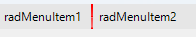

## Environment

|Product Version|Product|Author|
|----|----|----|
|2024.4.1113|RadListView for WinForms|[Dinko Krastev](https://www.telerik.com/blogs/author/dinko-krastev)|

## Description

In the following example, we will demonstrate how you can add a vertical separator in the RadMenu control.



## Solution

To add a vertical separator to a RadMenu, use the `RadMenuSeparatorItem` class. You can customize the separator's orientation. The following code snippet demonstrates how to insert a vertical separator item between RadMenuItems upon form load. Ensure to adjust the index in the `Items.Insert` method according to where you want to place the separator in your menu.

````C#
private void Form1_Load(object sender, EventArgs e)
{
    var menuSeparatorItem = new Telerik.WinControls.UI.RadMenuSeparatorItem();

    menuSeparatorItem.Name = "myPanel_Menu_Sep1";
    menuSeparatorItem.SeparatorOrientation = Telerik.WinControls.SepOrientation.Vertical;
    menuSeparatorItem.BackColor = Color.Red;
    menuSeparatorItem.ShouldPaint = true;
    menuSeparatorItem.TextVisibility = Telerik.WinControls.ElementVisibility.Visible;
    radMenu1.Items.Insert(1, menuSeparatorItem);
}
````

This approach allows you to dynamically add a vertical separator to your RadMenu, enhancing the menu's visual structure and organization.

## See Also

- [RadMenu Overview](https://docs.telerik.com/devtools/winforms/controls/menu/radmenu/overview)
- [RadMenuSeparatorItem Class](https://docs.telerik.com/devtools/winforms/api/telerik.wincontrols.ui.radmenuseparatoritem)
