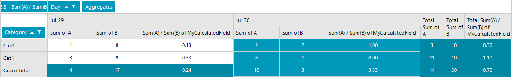

## Environment
 
|Product Version|Product|Author|
|----|----|----|
|2020.2.616|RadPivotGrid for WinForms|[Desislava Yordanova](https://www.telerik.com/blogs/author/desislava-yordanova)|
 
## Description

A common formula for finding the weighted average is the sum of all the variables multiplied by its weight, then divided by the sum of the weights. 
For simplicity of the calculations, this article will introduce an approach how to add a field in RadPivotGrid that calculates **Sum(A)/Sum(B)** considering that **A** and **B** are numeric columns in the DataSource. 
 


 

## Solution 

The default options in the **AggregateFunctions** enumeration allows you to define min, max, average, etc. Usually, custom aggregations are used to specify your own logic how exactly the aggregate value is calculated. The following help article demonstrates how to define a custom function which is not available in the built-in functions: [Custom Aggregation](). 

The **AccumulateOverride** method is expected to accumulate the values, e.g. to sum the values. The **AccumulateOverride** in the aggregate class will be called asynchronously for each of the values extracted from the data source. Then, the **MergeOverride** method is responsible for merging the accumulated value with the values for any child aggregates they present should be.  

To achieve a custom aggregate for **Sum(A)/Sum(B)**, we will need an empty [Calculated Field]()  in order to have access to the entire DataRow in the **AccumulateOverride** method of the custom **AggregateValue** which is necessary to achieve the desired result.
 

````C#
DataTable dt = new DataTable();
Random rand = new Random();
public RadForm1()
{
    InitializeComponent(); 
   
    dt.Columns.Add("A", typeof(int));
    dt.Columns.Add("B", typeof(int));
    dt.Columns.Add("Date", typeof(DateTime));
    dt.Columns.Add("Category", typeof(string));

    for (int i = 1; i < 3; i++)
    {
        dt.Rows.Add(rand.Next(1, 10), rand.Next(1, 10), DateTime.Now.AddDays(-i), "Cat0");
        dt.Rows.Add(rand.Next(1, 10), rand.Next(1, 10), DateTime.Now.AddDays(-i), "Cat1");
    }

    LocalDataSourceProvider dataProvider = new LocalDataSourceProvider();
    this.radPivotGrid1.DataProvider = dataProvider;
    using (radPivotGrid1.PivotGridElement.DeferRefresh())
    {
        MyCalculatedField calculatedField = new MyCalculatedField();
        calculatedField.Name = "MyCalculatedField";
        dataProvider.CalculatedFields.Add(calculatedField);
    }

    dataProvider.BeginInit();

    dataProvider.RowGroupDescriptions.Add(new PropertyGroupDescription()
    {
        PropertyName = "Category"
    });
    dataProvider.ColumnGroupDescriptions.Add(new DateTimeGroupDescription()
    {
        PropertyName = "Date", Step = DateTimeStep.Day, GroupComparer = new GroupNameComparer()
    });
    dataProvider.AggregateDescriptions.Add(new PropertyAggregateDescription()
    {
        PropertyName = "A", AggregateFunction = AggregateFunctions.Sum
    });
    dataProvider.AggregateDescriptions.Add(new PropertyAggregateDescription()
    {
        PropertyName = "B", AggregateFunction = AggregateFunctions.Sum
    });
    dataProvider.AggregateDescriptions.Add(new PropertyAggregateDescription()
    {
        PropertyName = "MyCalculatedField", AggregateFunction = new MyAggregateFunction(), StringFormat="N2"
    });
  
    dataProvider.EndInit();
    dataProvider.ItemsSource = dt;
}

public class MyCalculatedField : CalculatedField
{
    public MyCalculatedField()
    {
        this.Name = "MyCalculatedField";
    }

    protected override IEnumerable<RequiredField> RequiredFields()
    {
        return null;
    }

    protected override AggregateValue CalculateValue(IAggregateValues aggregateValues)
    {
        return null;
    }
}

public class MyAggregateValue : AggregateValue
{
    private decimal sumA;
    private decimal sumB;

    protected override object GetValueOverride()
    {
        decimal result = 0;
        if (this.sumB != 0)
        {
            result = this.sumA / this.sumB;
        }

        return result;
    }

    protected override void AccumulateOverride(object value)
    {
        DataRow item = value as DataRow;
        decimal valueA = Convert.ToDecimal(item["A"], System.Globalization.CultureInfo.InvariantCulture);
        decimal valueB = Convert.ToDecimal(item["B"], System.Globalization.CultureInfo.InvariantCulture);

        this.sumA += valueA;
        this.sumB += valueB;
    }

    protected override void MergeOverride(AggregateValue childAggregate)
    {
        MyAggregateValue myChildAggregate = childAggregate as MyAggregateValue;
        if (myChildAggregate != null)
        {
            this.sumA += myChildAggregate.sumA;
            this.sumB += myChildAggregate.sumB;
        }
    }
}

public class MyAggregateFunction : NumericFormatAggregateFunction
{
    public override string DisplayName
    {
        get
        {
            return this.ToString();
        }
    }

    protected override AggregateValue CreateAggregate(IAggregateContext context)
    {
        return new MyAggregateValue();
    }

    public override int GetHashCode()
    {
        return 0;
    }

    public override bool Equals(object obj)
    {
        return obj is MyAggregateFunction;
    }

    public override string ToString()
    {
        return "Sum(A) / Sum(B)";
    }

    protected override Cloneable CreateInstanceCore()
    {
        return new MyAggregateFunction();
    }

    protected override void CloneCore(Cloneable source)
    {
    }
}
 
 
````
````VB.NET
Private dt As DataTable = New DataTable()
Private rand As Random = New Random()

Public Sub New()
    InitializeComponent()
    dt.Columns.Add("A", GetType(Integer))
    dt.Columns.Add("B", GetType(Integer))
    dt.Columns.Add("Date", GetType(DateTime))
    dt.Columns.Add("Category", GetType(String))

    For i As Integer = 1 To 3 - 1
        dt.Rows.Add(rand.[Next](1, 10), rand.[Next](1, 10), DateTime.Now.AddDays(-i), "Cat0")
        dt.Rows.Add(rand.[Next](1, 10), rand.[Next](1, 10), DateTime.Now.AddDays(-i), "Cat1")
    Next

    Dim dataProvider As LocalDataSourceProvider = New LocalDataSourceProvider()
    Me.RadPivotGrid1.DataProvider = dataProvider

    Using RadPivotGrid1.PivotGridElement.DeferRefresh()
        Dim calculatedField As MyCalculatedField = New MyCalculatedField()
        calculatedField.Name = "MyCalculatedField"
        dataProvider.CalculatedFields.Add(calculatedField)
    End Using

    dataProvider.BeginInit()
    dataProvider.RowGroupDescriptions.Add(New PropertyGroupDescription() With {
        .PropertyName = "Category"
    })
    dataProvider.ColumnGroupDescriptions.Add(New DateTimeGroupDescription() With {
        .PropertyName = "Date",
        .[Step] = DateTimeStep.Day,
        .GroupComparer = New GroupNameComparer()
    })
    dataProvider.AggregateDescriptions.Add(New PropertyAggregateDescription() With {
        .PropertyName = "A",
        .AggregateFunction = AggregateFunctions.Sum
    })
    dataProvider.AggregateDescriptions.Add(New PropertyAggregateDescription() With {
        .PropertyName = "B",
        .AggregateFunction = AggregateFunctions.Sum
    })
    dataProvider.AggregateDescriptions.Add(New PropertyAggregateDescription() With {
        .PropertyName = "MyCalculatedField",
        .AggregateFunction = New MyAggregateFunction(),
        .StringFormat = "N2"
    })
    dataProvider.EndInit()
    dataProvider.ItemsSource = dt
End Sub

Public Class MyCalculatedField
Inherits CalculatedField

    Public Sub New()
        Me.Name = "MyCalculatedField"
    End Sub

    Protected Overrides Function RequiredFields() As IEnumerable(Of RequiredField)
        Return Nothing
    End Function

    Protected Overrides Function CalculateValue(ByVal aggregateValues As IAggregateValues) As AggregateValue
        Return Nothing
    End Function
End Class

Public Class MyAggregateValue
Inherits AggregateValue

    Private sumA As Decimal
    Private sumB As Decimal

    Protected Overrides Function GetValueOverride() As Object
        Dim result As Decimal = 0

        If Me.sumB <> 0 Then
            result = Me.sumA / Me.sumB
        End If

        Return result
    End Function

    Protected Overrides Sub AccumulateOverride(ByVal value As Object)
        Dim item As DataRow = TryCast(value, DataRow)
        Dim valueA As Decimal = Convert.ToDecimal(item("A"), System.Globalization.CultureInfo.InvariantCulture)
        Dim valueB As Decimal = Convert.ToDecimal(item("B"), System.Globalization.CultureInfo.InvariantCulture)
        Me.sumA += valueA
        Me.sumB += valueB
    End Sub

    Protected Overrides Sub MergeOverride(ByVal childAggregate As AggregateValue)
        Dim myChildAggregate As MyAggregateValue = TryCast(childAggregate, MyAggregateValue)

        If myChildAggregate IsNot Nothing Then
            Me.sumA += myChildAggregate.sumA
            Me.sumB += myChildAggregate.sumB
        End If
    End Sub
End Class

Public Class MyAggregateFunction
Inherits NumericFormatAggregateFunction

    Public Overrides ReadOnly Property DisplayName As String
        Get
            Return Me.ToString()
        End Get
    End Property

    Protected Overrides Function CreateAggregate(ByVal context As IAggregateContext) As AggregateValue
        Return New MyAggregateValue()
    End Function

    Public Overrides Function GetHashCode() As Integer
        Return 0
    End Function

    Public Overrides Function Equals(ByVal obj As Object) As Boolean
        Return TypeOf obj Is MyAggregateFunction
    End Function

    Public Overrides Function ToString() As String
        Return "Sum(A) / Sum(B)"
    End Function

    Protected Overrides Function CreateInstanceCore() As Cloneable
        Return New MyAggregateFunction()
    End Function

    Protected Overrides Sub CloneCore(ByVal source As Cloneable)
    End Sub
End Class


```` 

# See Also

* [Custom Aggregation]() 
* [Calculated Fields]() 

