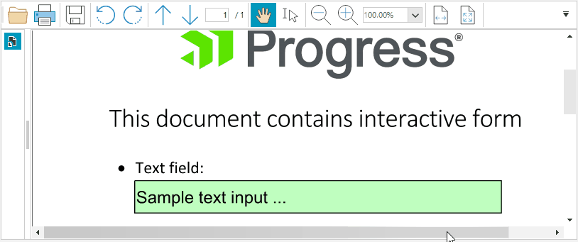
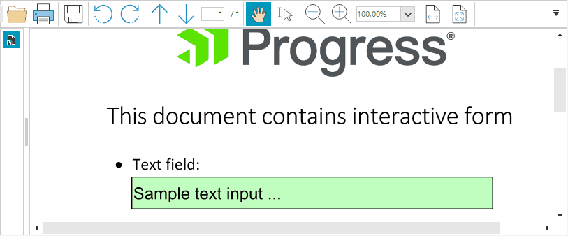

## Environment
 
|Product Version|Product|Author|
|----|----|----|
|2023.1.314|RadPdfViewer for WinForms|[Desislava Yordanova](https://www.telerik.com/blogs/author/desislava-yordanova)|
 

## Description

When a very long text is entered in a text field of a PDF form, the font size remains unchanged and the text is scrolled in the following way:

>caption Default Font Size



Abode offers in the PDF forms text auto-sizing/shrinking functionality so the text can fit in the available box and it is fully visible. This article demonstrates a sample approach how to simulate a similar behavior:

>caption Auto Font Size



## Solution 
 
It is possible to change the font size dynamically for the activated editor. For this purpose, it is necessary to [measure the text]() and determine the correct size.

````C#
      
        private void RadPdfViewer1_MouseUp(object sender, MouseEventArgs e)
        {
            foreach (RadFixedPageElement visualPage in this.radPdfViewer1.PdfViewerElement.ViewElement.Children)
            {
                foreach (RadElement editorElement in visualPage.Children)
                {
                    RadTextBoxControlElement tb = editorElement as RadTextBoxControlElement;
                    if (tb != null)
                    {
                        font = tb.Font;
                        tb.TextChanged -= tb_TextChanged;
                        tb.TextChanged += tb_TextChanged;
                    }
                }
            }
        }

        Font font;
        float width;
        float initialFontSize = -1;
        private void tb_TextChanged(object sender, System.EventArgs e)
        {
            RadTextBoxControlElement tb = sender as RadTextBoxControlElement;
            string textToMeasure = tb.Text;
            float fontSize = tb.Font.Size;
            if (initialFontSize == -1)
                initialFontSize = tb.Font.Size;
            SizeF measured = TextRenderer.MeasureText(textToMeasure, font);
            width = tb.Size.Width;

            if (measured.Width > width)
            {
                do
                {
                    fontSize = Math.Max(0, fontSize - 1);
                    font = new Font(tb.Font.FontFamily, fontSize, FontStyle.Regular);
                    measured = TextRenderer.MeasureText(textToMeasure, font);
                }
                while (!(measured.Width < width));
            }
            else
                do
                {
                    fontSize = Math.Min(fontSize + 1, initialFontSize);
                    font = new Font(tb.Font.FontFamily, fontSize, FontStyle.Regular);
                    measured = TextRenderer.MeasureText(textToMeasure, font);
                }
                while ((measured.Width < width) && fontSize < initialFontSize);
            tb.Font = font;
        }         
       
````
````VB.NET

    Private Sub RadPdfViewer1_MouseUp(sender As Object, e As MouseEventArgs)
        For Each visualPage As RadFixedPageElement In Me.RadPdfViewer1.PdfViewerElement.ViewElement.Children
            For Each editorElement As RadElement In visualPage.Children
                Dim tb As RadTextBoxControlElement = TryCast(editorElement, RadTextBoxControlElement)
                If tb IsNot Nothing Then
                    font = tb.Font
                    RemoveHandler tb.TextChanged, AddressOf tb_TextChanged
                    AddHandler tb.TextChanged, AddressOf tb_TextChanged
                End If
            Next
        Next
    End Sub

    Dim font As Font
    Dim width As Double
    Dim initialFontSize As Integer = -1
    Private Sub tb_TextChanged(sender As Object, e As System.EventArgs)
        Dim tb As RadTextBoxControlElement = TryCast(sender, RadTextBoxControlElement)
        Dim textToMeasure As String = tb.Text
        Dim fontSize As Single = tb.Font.Size
        If initialFontSize = -1 Then
            initialFontSize = tb.Font.Size
        End If 
        Dim measured As SizeF = TextRenderer.MeasureText(textToMeasure, font)
        width = tb.Size.Width 

        If measured.Width > width Then

            Do
                fontSize = Math.Max(0, fontSize - 1)
                font = New Font(tb.Font.FontFamily, fontSize, FontStyle.Regular)
                measured = TextRenderer.MeasureText(textToMeasure, font) 
            Loop Until measured.Width < width

        Else

            Do
                fontSize = Math.Min(fontSize + 1, initialFontSize)
                font = New Font(tb.Font.FontFamily, fontSize, FontStyle.Regular)
                measured = TextRenderer.MeasureText(textToMeasure, font)

            Loop Until measured.Width > width Or fontSize <= initialFontSize

        End If
        tb.Font = font 
    End Sub
   

````


 

 