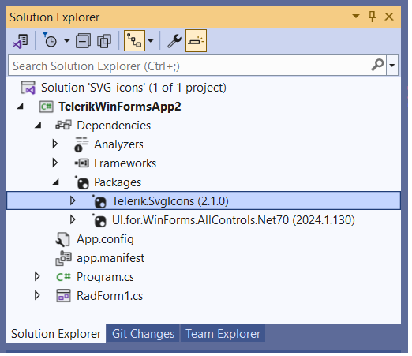

## Environment
 
|Product Version|Product|Author|
|----|----|----|
|2024.1.130|Telerik UI for WinForms|[Nadya Todorova](https://www.telerik.com/blogs/author/nadya-karaivanova)|
 
## Description

The Kendo UI for Angular delivers more than 500 Scalable Vector Graphics (SVG) icons. A list with all the SVG icons can be found [here](https://www.telerik.com/kendo-angular-ui/components/icons/svgicon/svgicon-list/#toc-svg-icons-list). 

Thanks to the [support for vector images]() that RadControls offers, one can easily use the SVG icons defined in this package together with **Telerik UI for WinForms** project. The following article will demonstrate how to achieve this. 
 
## Solution 

All that is necessary is to install the [Telerik.SvgIcons](https://www.nuget.org/packages/Telerik.SvgIcons) NuGet package. [Here](https://github.com/telerik/kendo-icons/tree/develop/packages/svg-icons/src-cs/Telerik.SvgIcons/Icons) is the GitHub repo for the referred NuGet. After the package is installed, **Telerik.SvgIcons** will appear in your Packages:




Then, you can use the **ISvgIcon** object. This object has information about the view box and the path, and they are environment and platform-agnostic. As we want to use it inside our controls, we need to create a valid XML document for the SVG. We can use a template with placeholders for the view box and path. For this example, I am using **RadButton** and its **SvgImageXml** property to assign the SVG. Note that in the string XML, there are placeholders for the SVG content - that is the path shape and also for the view box. Later, you can update the SVG size as well because it is too big by default:

````C#
public RadForm1()
{
    InitializeComponent();

    ISvgIcon svg = SvgIcon.Star;
    string svgXml = $@"<svg id=""svg"" version=""1.1"" xmlns=""http://www.w3.org/2000/svg"" xmlns:xlink=""http://www.w3.org/1999/xlink"" viewBox=""{svg.ViewBox}"">{svg.Content}</svg>";
    this.radButton1.TextImageRelation = System.Windows.Forms.TextImageRelation.ImageBeforeText;
    int size = Math.Min(this.radButton1.Size.Width, this.radButton1.Size.Height);
    this.radButton1.SvgImageXml = svgXml;
    this.radButton1.SvgImage.Size = new System.Drawing.Size(size, size);
}

````
````VB.NET
Public Sub New()
    InitializeComponent()
    Dim svg As ISvgIcon = SvgIcon.Star
    Dim svgXml As String = $"<svg id=""svg"" version=""1.1"" xmlns=""http://www.w3.org/2000/svg"" xmlns:xlink=""http://www.w3.org/1999/xlink"" viewBox=""{svg.ViewBox}"">{svg.Content}</svg>"
    Me.radButton1.TextImageRelation = System.Windows.Forms.TextImageRelation.ImageBeforeText
    Dim size As Integer = Math.Min(Me.radButton1.Size.Width, Me.radButton1.Size.Height)
    Me.radButton1.SvgImageXml = svgXml
    Me.radButton1.SvgImage.Size = New System.Drawing.Size(size, size)
End Sub

````

Here is the result:


>note Feel free to use any SVG Icon from this list to customize the look of your controls. 
