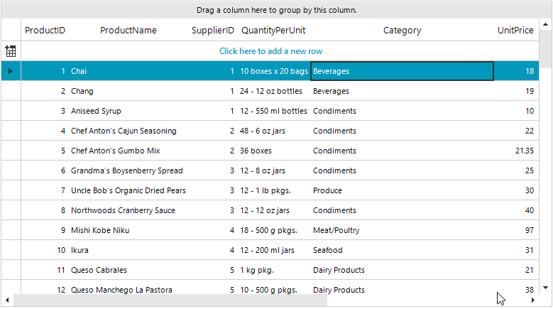

## Environment
 
|Product Version|Product|Author|
|----|----|----|
|2019.3.1022|RadGridView for WinForms|[Desislava Yordanova](https://www.telerik.com/blogs/author/desislava-yordanova)|
 
## Description

**GridViewMultiComboBoxColumn** has **RadMultiColumnComboBoxElement** as an editor. It covers the features that the **RadMultiColumnComboBox** control has. This column allows only valid values according to the specified **DataSource** collection. That is why if you enter some value that is not a part of the source collection, the value can't be preserved to the cell. 

This tutorial demonstrates how to achieve such functionality. 



## Solution 

The custom value needs to be added to the **DataSource** collection that is applied to the **GridViewMultiComboBoxColumn**. Please refer to the following code snippet:
 

````C#
 
public partial class RadForm1 : Telerik.WinControls.UI.RadForm
{
    public NwindDataSet DataSet
    {
        get
        {
            return this.nwindDataSet;
        }
    }

    public CategoriesTableAdapter CategoriesTA
    {
        get
        {
            return this.categoriesTableAdapter;
        }
    }

    public RadForm1()
    {
        InitializeComponent();
    }

    private void RadForm1_Load(object sender, EventArgs e)
    {
        this.productsTableAdapter.Fill(this.nwindDataSet.Products);
        this.categoriesTableAdapter.Fill(this.nwindDataSet.Categories);

        this.radGridView1.Columns.Remove("CategoryID");

        GridViewMultiComboBoxColumn categoriesColumn = new GridViewMultiComboBoxColumn("Category");
        categoriesColumn.DisplayMember = "CategoryName";
        categoriesColumn.ValueMember = "CategoryID";
        categoriesColumn.FieldName = "CategoryID";
        categoriesColumn.HeaderText = "Category";
        categoriesColumn.DataSource = this.categoriesBindingSource;
        categoriesColumn.DropDownStyle = Telerik.WinControls.RadDropDownStyle.DropDown;
        categoriesColumn.Width = 150;
        this.radGridView1.Columns.Insert(4, categoriesColumn);

        this.radGridView1.CellEndEdit += radGridView1_CellEndEdit;
        this.radGridView1.EditorRequired += radGridView1_EditorRequired;

        this.radGridView1.BestFitColumns();
    }

    private void radGridView1_EditorRequired(object sender, EditorRequiredEventArgs e)
    {
        if (e.EditorType == typeof(RadMultiColumnComboBoxElement))
        {
            e.Editor = new CustomRadMultiColumnComboBoxElement();
        }
    }

    private void radGridView1_CellEndEdit(object sender, GridViewCellEventArgs e)
    {
        if (this.radGridView1.CurrentCell.Tag != null)
        {
            this.radGridView1.CurrentCell.Value = this.radGridView1.CurrentCell.Tag;
            this.radGridView1.CurrentCell.Tag = null;
        }
    }

    public class CustomRadMultiColumnComboBoxElement : RadMultiColumnComboBoxElement
    {
        protected override Type ThemeEffectiveType     
        { 
            get    
            { 
                return typeof(RadMultiColumnComboBoxElement);     
            }
        }

        public override bool EndEdit()
        {
            GridComboBoxCellElement cellElement = this.Parent as GridComboBoxCellElement;
            RadGridView grid = cellElement.GridControl;
            RadForm1 f = (RadForm1)grid.FindForm();

            NwindDataSet.CategoriesDataTable dt = f.DataSet.Categories;
            for (int i = 0; i < dt.Rows.Count; i++)
            {
                if (dt.Rows[i]["CategoryName"].ToString() == this.Text)
                {
                    return base.EndEdit();
                }
            }

            NwindDataSet.CategoriesRow newCategoriesRow = dt.NewCategoriesRow();
            newCategoriesRow.CategoryName = this.Text;
            f.DataSet.Categories.Rows.Add(newCategoriesRow);

            f.CategoriesTA.Update(f.DataSet.Categories);
            cellElement.Tag = newCategoriesRow.CategoryID;
            return base.EndEdit();
        }
    }
}

        
````
````VB.NET

Public Class RadForm1
    Public ReadOnly Property DataSet As NwindDataSet
        Get
            Return Me.NwindDataSet
        End Get
    End Property

    Public ReadOnly Property CategoriesTA As CategoriesTableAdapter
        Get
            Return Me.CategoriesTableAdapter
        End Get
    End Property
    Private Sub RadForm1_Load(sender As Object, e As EventArgs) Handles MyBase.Load
        Me.ProductsTableAdapter.Fill(Me.NwindDataSet.Products)
        Me.CategoriesTableAdapter.Fill(Me.NwindDataSet.Categories)

        Me.RadGridView1.Columns.Remove("CategoryID")
        Dim categoriesColumn As GridViewMultiComboBoxColumn = New GridViewMultiComboBoxColumn("Category")
        categoriesColumn.DisplayMember = "CategoryName"
        categoriesColumn.ValueMember = "CategoryID"
        categoriesColumn.FieldName = "CategoryID"
        categoriesColumn.HeaderText = "Category"
        categoriesColumn.DataSource = Me.CategoriesBindingSource
        categoriesColumn.DropDownStyle = Telerik.WinControls.RadDropDownStyle.DropDown
        categoriesColumn.Width = 150
        Me.RadGridView1.Columns.Insert(4, categoriesColumn)
        AddHandler Me.RadGridView1.CellEndEdit, AddressOf radGridView1_CellEndEdit
        AddHandler Me.RadGridView1.EditorRequired, AddressOf radGridView1_EditorRequired
        Me.RadGridView1.BestFitColumns()
    End Sub
    Private Sub radGridView1_EditorRequired(ByVal sender As Object, ByVal e As EditorRequiredEventArgs)
        If e.EditorType = GetType(RadMultiColumnComboBoxElement) Then
            e.Editor = New CustomRadMultiColumnComboBoxElement()
        End If
    End Sub

    Private Sub radGridView1_CellEndEdit(ByVal sender As Object, ByVal e As GridViewCellEventArgs)
        If Me.RadGridView1.CurrentCell.Tag IsNot Nothing Then
            Me.RadGridView1.CurrentCell.Value = Me.RadGridView1.CurrentCell.Tag
            Me.RadGridView1.CurrentCell.Tag = Nothing
        End If
    End Sub

    Public Class CustomRadMultiColumnComboBoxElement
        Inherits RadMultiColumnComboBoxElement

        Protected Overrides ReadOnly Property ThemeEffectiveType As Type
            Get
                Return GetType(RadMultiColumnComboBoxElement)
            End Get
        End Property

        Public Overrides Function EndEdit() As Boolean
            Dim cellElement As GridComboBoxCellElement = TryCast(Me.Parent, GridComboBoxCellElement)
            Dim grid As RadGridView = cellElement.GridControl
            Dim f As RadForm1 = CType(grid.FindForm(), RadForm1)
            Dim dt As NwindDataSet.CategoriesDataTable = f.DataSet.Categories

            For i As Integer = 0 To dt.Rows.Count - 1

                If dt.Rows(i)("CategoryName").ToString() = Me.Text Then
                    Return MyBase.EndEdit()
                End If
            Next

            Dim newCategoriesRow As NwindDataSet.CategoriesRow = dt.NewCategoriesRow()
            newCategoriesRow.CategoryName = Me.Text
            f.DataSet.Categories.Rows.Add(newCategoriesRow)
            f.CategoriesTA.Update(f.DataSet.Categories)
            cellElement.Tag = newCategoriesRow.CategoryID
            Return MyBase.EndEdit()
        End Function
    End Class
End Class

```` 

>note **RadGridView** is bound to the Northwind.Products table. The **GridViewMultiComboBoxColumn** uses the Northwind.Categories table. 


# See Also

* [User-Defined Values in RadMultiColumnComboBox]()


    
   
  
    
 
