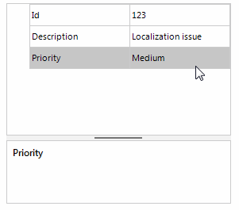

## Environment
 
|Product Version|Product|Author|
|----|----|----|
|2019.1.117|RadPropertyGrid for WinForms|[Desislava Yordanova](https://www.telerik.com/blogs/author/desislava-yordanova)|
 

## Description

**PropertyGridDropDownListEditor** accepts only valid values specified in the **DataSource** property. Any other user's input can't be set to the underlying data object since the **DataSource** of the editor restricts the input. In order to allow the user to enter custom values and these values to be stored and committed to the source object, they have to be added to the **DataSource** collection related to the editor. 

The purpose of this article is to demonstrate how you can implement a scenario in which the end-users are able not only to choose from a predefined list of values represented by **PropertyGridDropDownListEditor**, but to add their own values to that list.
 


## Solution 
 
It is necessary to create a derivative of **PropertyGridDropDownListEditor** and override the **EndEdit** method. In the **EndEdit** method, we first need to check whether the value typed by the user exists or not in the **DataSource** of the editor. If it exists, we should terminate the execution of the **EndEdit** method. However, if the typed value is not found in the **DataSource**, we continue with the execution of our code in the **EndEdit** method. Since the typed value does not exist, we should add it to the data source.

#### Allow custom values in PropertyGridDropDownListEditor

````C#
         public RadForm1()
        {
            InitializeComponent();

            this.radPropertyGrid1.SelectedObject = new Item(123, "Localization issue", "Medium");
            this.radPropertyGrid1.EditorRequired += radPropertyGrid1_EditorRequired;
            this.radPropertyGrid1.EditorInitialized += radPropertyGrid1_EditorInitialized;
            this.radPropertyGrid1.Edited += radPropertyGrid1_Edited;
        }

        private void radPropertyGrid1_Edited(object sender, PropertyGridItemEditedEventArgs e)
        {
            if (e.Item.Tag != null)
            {
                PropertyGridItem item = e.Item as PropertyGridItem;
                item.Value = item.Tag;
            }
        }

        private void radPropertyGrid1_EditorInitialized(object sender, PropertyGridItemEditorInitializedEventArgs e)
        {
            CustomPropertyGridDropDownListEditor editor = e.Editor as CustomPropertyGridDropDownListEditor;
            if (editor != null)
            {
                BaseDropDownListEditorElement element = editor.EditorElement as BaseDropDownListEditorElement;
                element.DropDownStyle = Telerik.WinControls.RadDropDownStyle.DropDown;
            }
        }

        BindingList<string> priorities = new BindingList<string>() { "Low", "Medium" };

        private void radPropertyGrid1_EditorRequired(object sender, Telerik.WinControls.UI.PropertyGridEditorRequiredEventArgs e)
        {
            if (e.Item.Label == "Priority")
            {
                CustomPropertyGridDropDownListEditor editor = new CustomPropertyGridDropDownListEditor();
                BaseDropDownListEditorElement element = editor.EditorElement as BaseDropDownListEditorElement;
                element.DataSource = priorities;

                e.Editor = editor;
            }
        }

        public class CustomPropertyGridDropDownListEditor : PropertyGridDropDownListEditor
        {
            public override bool EndEdit()
            {
                BaseDropDownListEditorElement element = this.EditorElement as BaseDropDownListEditorElement;
                BindingList<string> sourceCollection = element.DataSource as BindingList<string>;
                foreach (string priority in sourceCollection)
                {
                    if (priority.ToLower().Equals(element.Text.ToLower()))
                    {
                        return base.EndEdit();
                    }
                }
                sourceCollection.Add(element.Text);
                PropertyGridItemElement itemElement = this.OwnerElement as PropertyGridItemElement;
                itemElement.Data.Tag = this.Value;
                return base.EndEdit();
            }
        }

        public class Item
        {
            public int Id { get; set; }

            public string Description { get; set; }

            public string Priority { get; set; }

            public Item(int id, string description, string priority)
            {
                this.Id = id;
                this.Description = description;
                this.Priority = priority;
            }
        }   

       
````
````VB.NET
    Public Sub New()
        InitializeComponent()
        Me.RadPropertyGrid1.SelectedObject = New Item(123, "Localization issue", "Medium")
        AddHandler Me.RadPropertyGrid1.EditorRequired, AddressOf radPropertyGrid1_EditorRequired
        AddHandler Me.RadPropertyGrid1.EditorInitialized, AddressOf radPropertyGrid1_EditorInitialized
        AddHandler Me.RadPropertyGrid1.Edited, AddressOf radPropertyGrid1_Edited
    End Sub

    Private Sub radPropertyGrid1_Edited(ByVal sender As Object, ByVal e As PropertyGridItemEditedEventArgs)
        If e.Item.Tag IsNot Nothing Then
            Dim item As PropertyGridItem = TryCast(e.Item, PropertyGridItem)
            item.Value = item.Tag
        End If
    End Sub

    Private Sub radPropertyGrid1_EditorInitialized(ByVal sender As Object, ByVal e As PropertyGridItemEditorInitializedEventArgs)
        Dim editor As CustomPropertyGridDropDownListEditor = TryCast(e.Editor, CustomPropertyGridDropDownListEditor)

        If editor IsNot Nothing Then
            Dim element As BaseDropDownListEditorElement = TryCast(editor.EditorElement, BaseDropDownListEditorElement)
            element.DropDownStyle = Telerik.WinControls.RadDropDownStyle.DropDown
        End If
    End Sub

    Private priorities As BindingList(Of String) = New BindingList(Of String)() From {
        "Low",
        "Medium"
    }

    Private Sub radPropertyGrid1_EditorRequired(ByVal sender As Object, ByVal e As Telerik.WinControls.UI.PropertyGridEditorRequiredEventArgs)
        If e.Item.Label = "Priority" Then
            Dim editor As CustomPropertyGridDropDownListEditor = New CustomPropertyGridDropDownListEditor()
            Dim element As BaseDropDownListEditorElement = TryCast(editor.EditorElement, BaseDropDownListEditorElement)
            element.DataSource = priorities
            e.Editor = editor
        End If
    End Sub

    Public Class CustomPropertyGridDropDownListEditor
    Inherits PropertyGridDropDownListEditor

        Public Overrides Function EndEdit() As Boolean
            Dim element As BaseDropDownListEditorElement = TryCast(Me.EditorElement, BaseDropDownListEditorElement)
            Dim sourceCollection As BindingList(Of String) = TryCast(element.DataSource, BindingList(Of String))

            For Each priority As String In sourceCollection

                If priority.ToLower().Equals(element.Text.ToLower()) Then
                    Return MyBase.EndEdit()
                End If
            Next

            sourceCollection.Add(element.Text)
            Dim itemElement As PropertyGridItemElement = TryCast(Me.OwnerElement, PropertyGridItemElement)
            itemElement.Data.Tag = Me.Value
            Return MyBase.EndEdit()
        End Function
    End Class

    Public Class Item
        Public Property Id As Integer
        Public Property Description As String
        Public Property Priority As String

        Public Sub New(ByVal id As Integer, ByVal description As String, ByVal priority As String)
            Me.Id = id
            Me.Description = description
            Me.Priority = priority
        End Sub
    End Class	
      

````


 

 