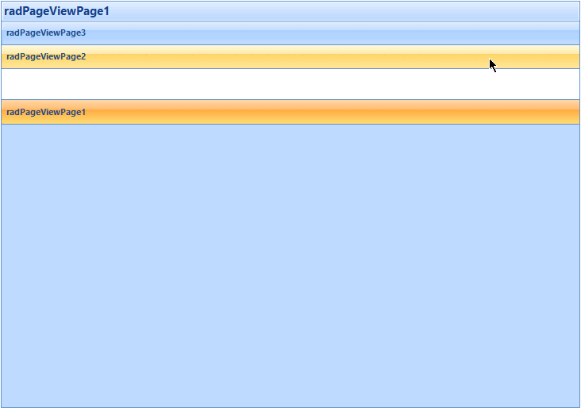
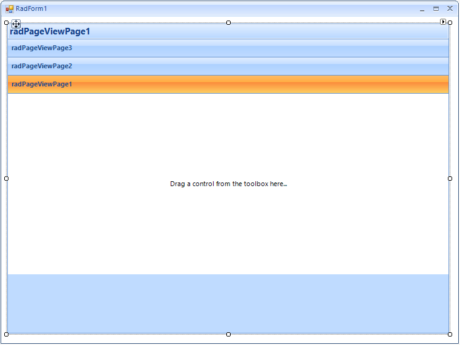

|Product Version|Product|Author|Last modified|
|----|----|----|----|
|2015.1.225|RadPageView for WinForms|Dimitar Karamfilov|March 19, 2015|

**Problem**  
This article demonstrates how you can change the current page when a page is hovered and how you can animate the page expanding.  
 
 
  
   
**Solution**  
Firstly, you should create a new project and add a **RadPageView** to the form. Additionally, set the view mode to **ExplorerBar** and add some pages. The form should look like this:  
 
 
  
   
The animation effect will be achieved by using a timer. On each timer tick the current page size should be increased until the page is fully expanded. This process can be started when a page is expanded – in the **PageExpanded** event handler.   
The expand on mouse hover functionality can be achieved by using the **MouseHover** event of the explorer bar items (the pages header). When a page header is hovered all pages should be collapsed and the current page expanded by using the timer.  
In addition, the **Bounds** property changing should be suspended. This can be done in the header items’ **RadPropertyChanging** event handler.  
The described approach can be implemented as follows:  
 
````C#
System.Windows.Forms.Timer timer;
RadPageViewPage currentPage;
 
public RadForm1()
{
    InitializeComponent();
 
    RadPageViewExplorerBarElement explorerBarElement = radPageView1.ViewElement as RadPageViewExplorerBarElement;
     
    foreach (RadPageViewExplorerBarItem item in explorerBarElement.Items)
    {
        item.MouseHover += item_MouseHover;
        item.AssociatedContentAreaElement.RadPropertyChanging += AssociatedContentAreaElement_RadPropertyChanging;
    }
 
    timer = new System.Windows.Forms.Timer();
    timer.Interval = 30;
    timer.Tick += timer_Tick;
    radPageView1.PageExpanded += radPageView1_PageExpanded;
}
 
void timer_Tick(object sender, EventArgs e)
{
    currentPage.PageLength += 20;
    if (currentPage.PageLength >= 300)
    {
        timer.Stop();
    }
}
 
void radPageView1_PageExpanded(object sender, RadPageViewEventArgs e)
{
    timer.Stop();
    currentPage = e.Page;
    currentPage.PageLength = 0;
    timer.Start();
}
 
void AssociatedContentAreaElement_RadPropertyChanging(object sender, RadPropertyChangingEventArgs args)
{
    if (args.Property.Name == "Bounds")
    {
        //suspend layout when animating
        args.Cancel = timer.Enabled;
    }
}
 
void item_MouseHover(object sender, EventArgs e)
{
    RadPageViewExplorerBarItem item = (RadPageViewExplorerBarItem)sender;
 
    RadPageViewExplorerBarElement explorerBarElement = radPageView1.ViewElement as RadPageViewExplorerBarElement;
    foreach (RadPageViewExplorerBarItem i in explorerBarElement.Items)
    {
        i.IsExpanded = false;
    }
 
    item.IsExpanded = true;
}

````
````VB.NET
Private timer As System.Windows.Forms.Timer
Private currentPage As RadPageViewPage
 
Public Sub New()
    InitializeComponent()
 
    Dim explorerBarElement As RadPageViewExplorerBarElement = TryCast(radPageView1.ViewElement, RadPageViewExplorerBarElement)
 
    For Each item As RadPageViewExplorerBarItem In explorerBarElement.Items
        AddHandler item.MouseHover, AddressOf item_MouseHover
        AddHandler item.AssociatedContentAreaElement.RadPropertyChanging, AddressOf AssociatedContentAreaElement_RadPropertyChangin
    Next item
 
    timer = New System.Windows.Forms.Timer()
    timer.Interval = 30
    AddHandler timer.Tick, AddressOf timer_Tick
    AddHandler radPageView1.PageExpanded, AddressOf radPageView1_PageExpanded
End Sub
 
Private Sub timer_Tick(ByVal sender As Object, ByVal e As EventArgs)
    currentPage.PageLength += 20
    If currentPage.PageLength >= 300 Then
        timer.Stop()
    End If
End Sub
 
Private Sub radPageView1_PageExpanded(ByVal sender As Object, ByVal e As RadPageViewEventArgs)
    timer.Stop()
    currentPage = e.Page
    currentPage.PageLength = 0
    timer.Start()
End Sub
 
Private Sub AssociatedContentAreaElement_RadPropertyChanging(ByVal sender As Object, ByVal args As RadPropertyChangingEventArgs)
    If args.Property.Name = "Bounds" Then
        'suspend layout when animating
        args.Cancel = timer.Enabled
    End If
End Sub
 
Private Sub item_MouseHover(ByVal sender As Object, ByVal e As EventArgs)
    Dim item As RadPageViewExplorerBarItem = DirectCast(sender, RadPageViewExplorerBarItem)
 
    Dim explorerBarElement As RadPageViewExplorerBarElement = TryCast(radPageView1.ViewElement, RadPageViewExplorerBarElement)
    For Each i As RadPageViewExplorerBarItem In explorerBarElement.Items
        i.IsExpanded = False
    Next i
 
    item.IsExpanded = True
End Sub

````
 
>note You can download a VB and C# project from the following [link](https://github.com/telerik/winforms-sdk/tree/master/PageView/PageViewAnimation).

