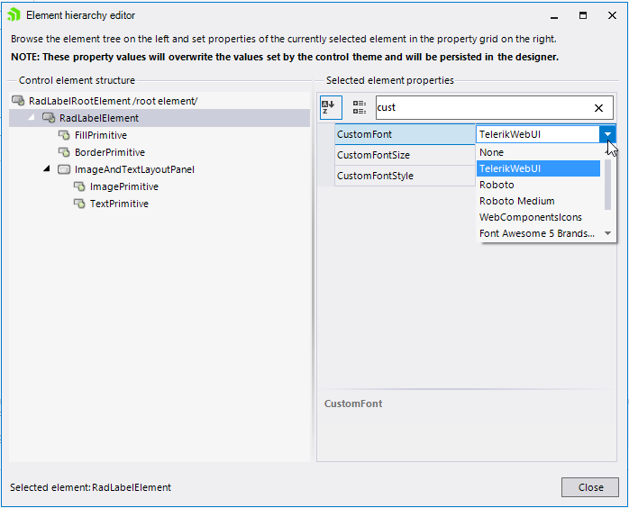
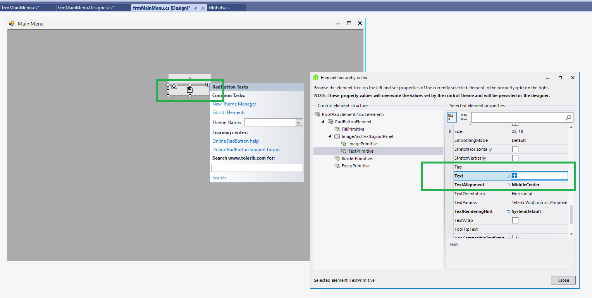
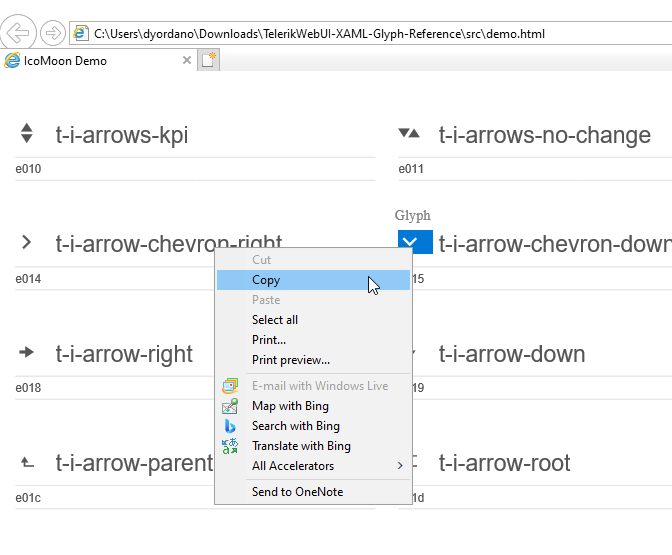

## Description

The **TelerikWebUI.ttf** file is a part of the Telerik.WinControls assembly. It is available in our source code which is accessible from your [Telerik account](https://www.telerik.com/account/). However, the correct way to use the font is by using our assemblies with the latest version, not by installing the font on other machines. Indeed, for development purposes you may need to copy the icon itself and this is possible via the Character Map once the font is installed:

However, this article shows how to apply a glyph at design time without installing the font.

## Solution 

At design time, you can set the font via the Edit UI elements: 
 
  

However, in the designer you need to set the copied icon itself, not the string code:

  

The [reference table](https://github.com/telerik/winforms-sdk/tree/master/Fonts) includes the symbol for copying. In the \TelerikWebUI-XAML-Glyph-Reference\src\demo.html file you can find the icon:

  

Then, when the project is opened on another machine, you are expected to see the icon at design time without installing the font.

# See Also

* [Custom Fonts]()
* [Glyphs]() 

