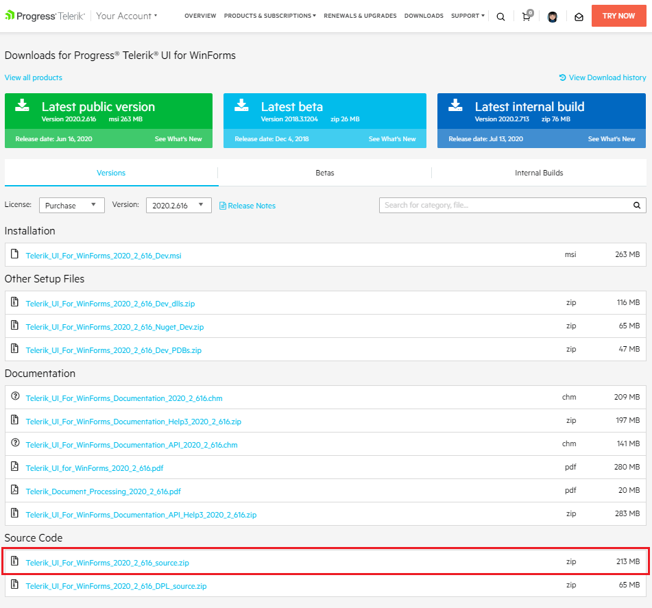
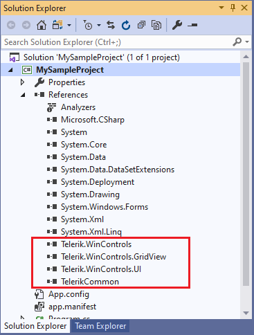
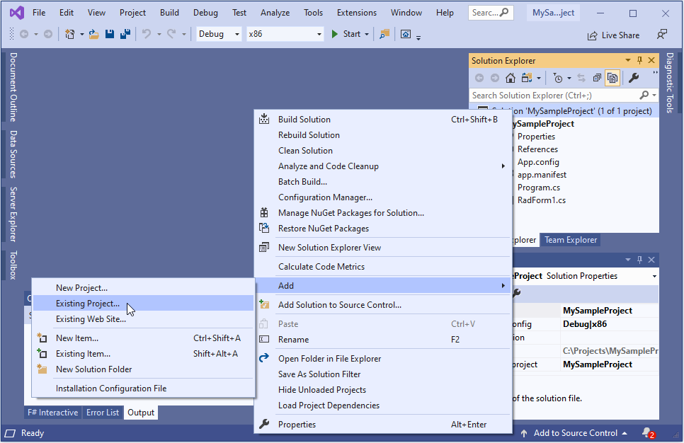
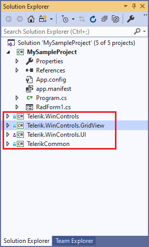
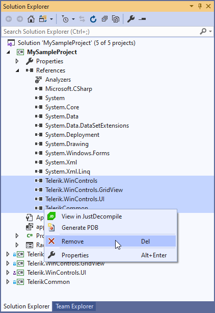
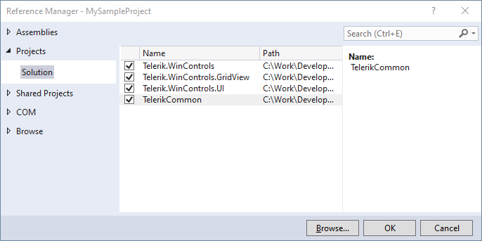

## Description

Sometimes our customers obtain errors that are not reproducible in a sample project. Due to the complexity of their project, connections to a local database etc., very often it is not possible for them to provide the exact application to the support engineers. Hence, it wouldn't be easy to determine what causes the unexpected behavior on their end.

The appropriate solution for investigating further the precise case is to download the Telerik source and attach it to the application that produces the error message. This would facilitate the investigation of the exact work flow of the project in this specific situation.
 
## Solution 

Please follow the steps described in the [Download Product Files]() help article in order to download the product files especially the source code:

Once you have the source code downloaded, let's continue with the following steps:

1. Unzip the file in C:\sampleFolder. 
2. In order to attach the source code to your project, you need to check what Telerik reference you have in your application:

	

3. Afterwards, it is necessary to add these Telerik projects from the source code that you have just downloaded to your application by right clicking over the solution >> Add >> Existing project:

	

	Navigate to the folder in which the extracted source code is located and select the necessary projects.

	

4. Delete the existing Telerik references:

	

5. Refer the added projects:

	

	

6. Rebuild the project. Now, you are ready to start debugging.

# See Also

* [Download Product Files]() 

