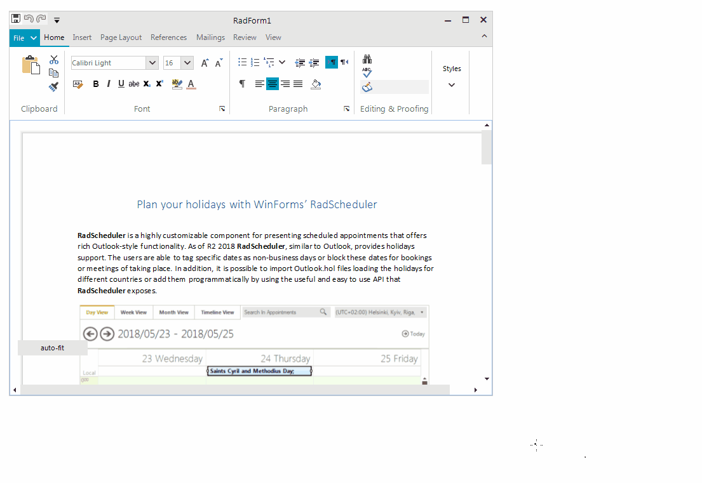

## Environment
 
|Product Version|Product|Author|
|----|----|----|
|2018.3.1016|RadRichTextEditor for WinForms|[Desislava Yordanova](https://www.telerik.com/blogs/author/desislava-yordanova)|
 

## Description

This article aims to demonstrate a sample approach how to auto-fit the document in **RadRichTextEditor** so that the editor shows always the whole page. 

## Solution 

It can be achieved by adjusting the scale factor programmatically in order to fit the page. Thus, by calculating a ratio between the size of the editor and the actual page size, you can use this ratio to set the **ScaleFactor** property:  

#### Auto-Fit RadRichTextEditor

````C#
        public RadForm1()
        {
            InitializeComponent(); 

            this.radRichTextEditor1.SizeChanged += radRichTextEditor1_SizeChanged;  
        }

        private void SacleEditor()
        {
            float ratio = (this.radRichTextEditor1.Size.Width - this.radRichTextEditor1.RichTextBoxElement.VerticalScrollBar.Size.Width - 5) 
                / (float)this.radRichTextEditor1.Document.SectionDefaultPageSize.Width;
            this.radRichTextEditor1.ScaleFactor = new System.Drawing.SizeF(ratio, ratio);
        }
 
        private void radRichTextEditor1_SizeChanged(object sender, EventArgs e)
        {
            SacleEditor();
        }

        private void radButton1_Click(object sender, EventArgs e)
        {
            Telerik.WinControls.RichTextEditor.UI.DocumentPrintLayoutPresenter presenter = 
                radRichTextEditor1.RichTextBoxElement.ActiveEditorPresenter as DocumentPrintLayoutPresenter;
            presenter.PagePresentersMargin = new Telerik.WinForms.Documents.Model.SizeF(0, 0);
 
            this.radRichTextEditor1.SizeChanged += radRichTextEditor1_SizeChanged;
            SacleEditor();
        }
 

````
````VB.NET

     Public Sub New()
        InitializeComponent()
        AddHandler Me.RadRichTextEditor1.SizeChanged, AddressOf radRichTextEditor1_SizeChanged
    End Sub

    Private Sub SacleEditor()
        Dim ratio As Single = (Me.RadRichTextEditor1.Size.Width - Me.RadRichTextEditor1.RichTextBoxElement.VerticalScrollBar.Size.Width - 5) _
                              / CSng(Me.RadRichTextEditor1.Document.SectionDefaultPageSize.Width)
        Me.RadRichTextEditor1.ScaleFactor = New System.Drawing.SizeF(ratio, ratio)
    End Sub

    Private Sub radRichTextEditor1_SizeChanged(ByVal sender As Object, ByVal e As EventArgs)
        SacleEditor()
    End Sub

    Private Sub radButton1_Click(ByVal sender As Object, ByVal e As EventArgs)
        Dim presenter As Telerik.WinControls.RichTextEditor.UI.DocumentPrintLayoutPresenter = _
            TryCast(RadRichTextEditor1.RichTextBoxElement.ActiveEditorPresenter, DocumentPrintLayoutPresenter)
        presenter.PagePresentersMargin = New Telerik.WinForms.Documents.Model.SizeF(0, 0)
        AddHandler Me.RadRichTextEditor1.SizeChanged, AddressOf radRichTextEditor1_SizeChanged
        SacleEditor()
    End Sub

````

 
Now, you can resize the form and the document will fit the width:


 

# See Also

* [RadRichTextEditor]() 

