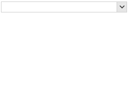
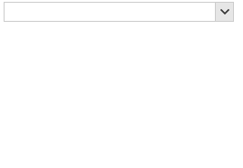

## Environment
 
|Product Version|Product|Author|
|----|----|----|
|2019.2.618|RadCheckedDropDownList for WinForms|[Desislava Yordanova](https://www.telerik.com/blogs/author/desislava-yordanova)|
 

## Description

**RadCheckedDropDownList** combines **RadDropDownList** and **RadAutoCompleteBox** in order to provide functionality to check multiple items in the drop down area and tokenize them in the text area. By design, the check boxes are shown only for the popup which is shown when the user clicks the arrow button.



A common requirement is to show check boxes in the auto-complete pop up as well.

## Solution 

It is necessary to create a derivative of **RadListVisualItem** and add a **RadCheckBoxElement** to its **Children** collection. Handle the RadCheckedAutoCompleteBoxListElement.**CreatingVisualItem** event to replace the default auto-complete items with the custom one. In order to keep the auto-complete pop up opened when an item is clicked in order to allow multiple items selection, it requires subscribing to the **PopupClosing** and **MouseDown** events of the **RadTextBoxAutoCompleteDropDown**. A sample approach is demonstrated in the following code snippet which result is illustrated in the following gif file:




````C#

        private void RadForm1_Load(object sender, EventArgs e)
        {
            this.productsTableAdapter.Fill(this.northwindDataSet.Products);
            this.radCheckedDropDownList1.DataSource = this.productsBindingSource;
            this.radCheckedDropDownList1.DisplayMember = "ProductName";
            this.radCheckedDropDownList1.AutoCompleteMode = AutoCompleteMode.Suggest;

            RadCheckedAutoCompleteBoxListElement list = this.radCheckedDropDownList1.CheckedDropDownListElement.AutoCompleteEditableAreaElement.AutoCompleteTextBox.ListElement as RadCheckedAutoCompleteBoxListElement;
            list.CreatingVisualItem += list_CreatingVisualItem;
            this.radCheckedDropDownList1.CheckedDropDownListElement.AutoCompleteEditableAreaElement.AutoCompleteTextBox.AutoCompleteDropDown.PopupClosing += AutoCompleteDropDown_PopupClosing;
            this.radCheckedDropDownList1.CheckedDropDownListElement.AutoCompleteEditableAreaElement.AutoCompleteTextBox.AutoCompleteDropDown.MouseDown += AutoCompleteDropDown_MouseDown;
            this.radCheckedDropDownList1.CheckedDropDownListElement.AutoCompleteEditableAreaElement.AutoCompleteTextBox.AutoCompleteDropDown.PopupClosed += AutoCompleteDropDown_PopupClosed;
        }

        private void AutoCompleteDropDown_PopupClosed(object sender, RadPopupClosedEventArgs args)
        {
            RadCheckedAutoCompleteBoxListElement list = this.radCheckedDropDownList1.CheckedDropDownListElement.AutoCompleteEditableAreaElement.AutoCompleteTextBox.ListElement as RadCheckedAutoCompleteBoxListElement;
            StringBuilder sb = new StringBuilder();
            foreach (RadListDataItem item in list.Items)
            {
                if (item.Tag != null && (bool)item.Tag == true)
                {
                    sb.AppendLine(item.Text + ";");
                }
            }
            this.radCheckedDropDownList1.Text = sb.ToString();
        }

        private void AutoCompleteDropDown_MouseDown(object sender, MouseEventArgs e)
        {
            RadTextBoxAutoCompleteDropDown dropdown = sender as RadTextBoxAutoCompleteDropDown;
            var elementUnderMouse = dropdown.ElementTree.GetElementAtPoint(e.Location);
            dropdown.Tag = "down";
        }

        private void AutoCompleteDropDown_PopupClosing(object sender, RadPopupClosingEventArgs args)
        {
            RadTextBoxAutoCompleteDropDown dropdown = sender as RadTextBoxAutoCompleteDropDown;
            if (dropdown.Tag != null && dropdown.Tag.ToString() == "down")
            {
                args.Cancel = true;
                dropdown.Tag = null;
            }
        }

        private void list_CreatingVisualItem(object sender, CreatingVisualListItemEventArgs args)
        {
            args.VisualItem = new CustomVisualItem();
        }

        public class CustomVisualItem : RadListVisualItem
        {
            RadCheckBoxElement checkbox = new RadCheckBoxElement();

            protected override void CreateChildElements()
            {
                base.CreateChildElements();
                this.Children.Add(checkbox);
                checkbox.CheckStateChanged += checkbox_CheckStateChanged;
            }

            private void checkbox_CheckStateChanged(object sender, EventArgs e)
            {
                this.Data.Tag = checkbox.IsChecked;
            }

            public override void Synchronize()
            {
                base.Synchronize();

                this.DrawText = false;
                this.checkbox.Text = this.Data.Text;
            }

            protected override Type ThemeEffectiveType
            {
                get
                {
                    return typeof(RadListVisualItem);
                }
            }
        }                
       
````
````VB.NET
    
     Private Sub RadForm1_Load(sender As Object, e As EventArgs) Handles MyBase.Load
        Me.ProductsTableAdapter.Fill(Me.NwindDataSet.Products)
        Me.RadCheckedDropDownList1.DataSource = Me.ProductsBindingSource
        Me.RadCheckedDropDownList1.DisplayMember = "ProductName"
        Me.RadCheckedDropDownList1.AutoCompleteMode = AutoCompleteMode.Suggest
        Dim list As RadCheckedAutoCompleteBoxListElement = TryCast(Me.RadCheckedDropDownList1.CheckedDropDownListElement.AutoCompleteEditableAreaElement.AutoCompleteTextBox.ListElement, RadCheckedAutoCompleteBoxListElement)
        AddHandler list.CreatingVisualItem, AddressOf list_CreatingVisualItem
        AddHandler Me.RadCheckedDropDownList1.CheckedDropDownListElement.AutoCompleteEditableAreaElement.AutoCompleteTextBox.AutoCompleteDropDown.PopupClosing, AddressOf AutoCompleteDropDown_PopupClosing
        AddHandler Me.RadCheckedDropDownList1.CheckedDropDownListElement.AutoCompleteEditableAreaElement.AutoCompleteTextBox.AutoCompleteDropDown.MouseDown, AddressOf AutoCompleteDropDown_MouseDown
        AddHandler Me.RadCheckedDropDownList1.CheckedDropDownListElement.AutoCompleteEditableAreaElement.AutoCompleteTextBox.AutoCompleteDropDown.PopupClosed, AddressOf AutoCompleteDropDown_PopupClosed
    End Sub

    Private Sub AutoCompleteDropDown_PopupClosed(ByVal sender As Object, ByVal args As RadPopupClosedEventArgs)
        Dim list As RadCheckedAutoCompleteBoxListElement = TryCast(Me.RadCheckedDropDownList1.CheckedDropDownListElement.AutoCompleteEditableAreaElement.AutoCompleteTextBox.ListElement, RadCheckedAutoCompleteBoxListElement)
        Dim sb As StringBuilder = New StringBuilder()

        For Each item As RadListDataItem In list.Items

            If item.Tag IsNot Nothing AndAlso CBool(item.Tag) = True Then
                sb.AppendLine(item.Text & ";")
            End If
        Next

        Me.RadCheckedDropDownList1.Text = sb.ToString()
    End Sub

    Private Sub AutoCompleteDropDown_MouseDown(ByVal sender As Object, ByVal e As MouseEventArgs)
        Dim dropdown As RadTextBoxAutoCompleteDropDown = TryCast(sender, RadTextBoxAutoCompleteDropDown)
        Dim elementUnderMouse = dropdown.ElementTree.GetElementAtPoint(e.Location)
        dropdown.Tag = "down"
    End Sub

    Private Sub AutoCompleteDropDown_PopupClosing(ByVal sender As Object, ByVal args As RadPopupClosingEventArgs)
        Dim dropdown As RadTextBoxAutoCompleteDropDown = TryCast(sender, RadTextBoxAutoCompleteDropDown)

        If dropdown.Tag IsNot Nothing AndAlso dropdown.Tag.ToString() = "down" Then
            args.Cancel = True
            dropdown.Tag = Nothing
        End If
    End Sub

    Private Sub list_CreatingVisualItem(ByVal sender As Object, ByVal args As CreatingVisualListItemEventArgs)
        args.VisualItem = New CustomVisualItem()
    End Sub

    Public Class CustomVisualItem
    Inherits RadListVisualItem

        Private checkbox As RadCheckBoxElement

        Protected Overrides Sub CreateChildElements()
            MyBase.CreateChildElements()
            checkbox = New RadCheckBoxElement()
            Me.Children.Add(checkbox)
            AddHandler checkbox.CheckStateChanged, AddressOf checkbox_CheckStateChanged
        End Sub

        Private Sub checkbox_CheckStateChanged(ByVal sender As Object, ByVal e As EventArgs)
            Me.Data.Tag = checkbox.IsChecked
        End Sub

        Public Overrides Sub Synchronize()
            MyBase.Synchronize()
            Me.DrawText = False
            Me.checkbox.Text = Me.Data.Text
        End Sub

        Protected Overrides ReadOnly Property ThemeEffectiveType As Type
            Get
                Return GetType(RadListVisualItem)
            End Get
        End Property
    End Class     
    
````

>note This is just a sample approach and it may not cover all possible cases. Feel free to extend this solution in a way which suits your custom requirements best.


# See Also

 * [CheckedDropDownList]()
 * [AutoComplete modes]() 


    
   
  
    
 
