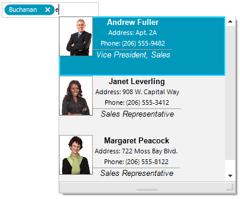

## Environment
 
|Product Version|Product|Author|
|----|----|----|
|2021.1.223|RadAutoCompleteBox for WinForms|[Desislava Yordanova](https://www.telerik.com/blogs/author/desislava-yordanova)|
 

## Description

[RadAutoCompleteBox]() allows the end-user to easily fill-in text thanks to the auto-complete functionality and tokens of text. This behavior is similar to the "To" field of Outlook and Facebook where you are filling-in the recipients to which you are going to send a message.

A common requirement is to add more details to each item in the autocomplete popup. 
 


The following solution will demonstrate how to use the Northwind.Employee table and construct a custom visual auto complete item to display more information for each suggested employee. 

## Solution 

Subscribe to the RadAutoCompleteBox.ListElement.**CreatingVisualItem** event before assigning the **AutoCompleteDataSource** collection. In the event handler, you can replace the default **RadListVisualItem** with a custom one according to specific design you may have. The following code snippet demonstrates a sample solution:
 

````C#
private void Form1_Load(object sender, EventArgs e)
{ 
    this.employeesTableAdapter.Fill(this.nwindDataSet.Employees);

    this.radAutoCompleteBox1.ListElement.CreatingVisualItem += ListElement_CreatingVisualItem;
    this.radAutoCompleteBox1.ListElement.ItemHeight = 100;
    this.radAutoCompleteBox1.DropDownMinSize = new Size(300,300);

    this.radAutoCompleteBox1.AutoCompleteDataSource = this.employeesBindingSource;
    this.radAutoCompleteBox1.AutoCompleteDisplayMember = "LastName";
    this.radAutoCompleteBox1.AutoCompleteValueMember = "EmployeeID";
}

private void ListElement_CreatingVisualItem(object sender, CreatingVisualListItemEventArgs args)
{
      args.VisualItem = new CustomVisualItem();
} 
public class CustomVisualItem : RadListVisualItem
{
    Font boldFont = new Font("Arial",10f, FontStyle.Bold);
    Font italicFont = new Font("Arial",10f, FontStyle.Italic);
    DockLayoutPanel mainContainer;
    StackLayoutElement leftColumn;
    StackLayoutElement rightColumn;
    LightVisualElement titleElement;
    LightVisualElement photoElement;
    LightVisualElement nameElement;
    LightVisualElement addressElement;
    LightVisualElement phoneElement;

    protected override Type ThemeEffectiveType     
    { 
        get    
        { 
            return typeof(RadListVisualItem);     
        }
    } 
    protected override void CreateChildElements()
    {
        base.CreateChildElements(); 

        mainContainer = new DockLayoutPanel();
        leftColumn = new StackLayoutElement();
        rightColumn = new StackLayoutElement();
        titleElement = new LightVisualElement();
        photoElement = new LightVisualElement();
        nameElement = new LightVisualElement();
        addressElement = new LightVisualElement();
        phoneElement = new LightVisualElement();

        this.Children.Add(mainContainer);
        mainContainer.LastChildFill = true;

        leftColumn.Orientation = Orientation.Vertical;
        leftColumn.Children.Add(photoElement);
        photoElement.DrawBorder = true;

        rightColumn.Orientation = Orientation.Vertical;
        rightColumn.Children.Add(nameElement);
        nameElement.Font = boldFont;
        rightColumn.Children.Add(addressElement);
        rightColumn.Children.Add(phoneElement);
        rightColumn.Children.Add(titleElement);
        titleElement.DrawBorder = true;
        titleElement.Font = italicFont;
        titleElement.BorderBoxStyle = Telerik.WinControls.BorderBoxStyle.FourBorders;
        titleElement.BorderLeftWidth = 0;
        titleElement.BorderTopWidth = 1;
        titleElement.BorderRightWidth = 0;
        titleElement.BorderBottomWidth = 0;

        mainContainer.Children.Add(leftColumn);
        mainContainer.Children.Add(rightColumn);  
        DockLayoutPanel.SetDock(leftColumn, Telerik.WinControls.Layouts.Dock.Left);
        DockLayoutPanel.SetDock(rightColumn, Telerik.WinControls.Layouts.Dock.Right);
        leftColumn.NotifyParentOnMouseInput = true;
        rightColumn.NotifyParentOnMouseInput = true;
        titleElement.NotifyParentOnMouseInput = true;
        photoElement.NotifyParentOnMouseInput = true;
        nameElement.NotifyParentOnMouseInput = true;
        addressElement.NotifyParentOnMouseInput = true;
        phoneElement.NotifyParentOnMouseInput = true;
    }

    public override void Synchronize()
    {
        base.Synchronize();
        this.Text = string.Empty;
        DataRowView rowView = this.Data.DataBoundItem as DataRowView;
        if (rowView != null)
        {
            this.photoElement.Image = GetImageFromData(rowView.Row["Photo"] as byte[]);
            this.titleElement.Text = rowView.Row["Title"].ToString();
            this.nameElement.Text = rowView.Row["FirstName"].ToString() + " " + rowView.Row["LastName"].ToString();
            this.addressElement.Text = "Address: " + rowView.Row["Address"].ToString().Replace(System.Environment.NewLine, " ");
            this.phoneElement.Text = "Phone: " + rowView.Row["HomePhone"].ToString();
        }
    }

    private Image GetImageFromData(byte[] imageData)
    {
        const int OleHeaderLength = 78;
        MemoryStream memoryStream = new MemoryStream();
        if (HasOleContainerHeader(imageData))
        {
            memoryStream.Write(imageData, OleHeaderLength, imageData.Length - OleHeaderLength);
        }
        else
        {
            memoryStream.Write(imageData, 0, imageData.Length);
        }
        Bitmap bitmap = new Bitmap(memoryStream);
        return bitmap.GetThumbnailImage(55, 65, null, new IntPtr());
    }

    private bool HasOleContainerHeader(byte[] imageByteArray)
    {
        const byte OleByte0 = 21;
        const byte OleByte1 = 28;
        return (imageByteArray[0] == OleByte0) && (imageByteArray[1] == OleByte1);
    }
}
        
       
````
````VB.NET
Private Sub RadForm1_Load(sender As Object, e As EventArgs) Handles MyBase.Load
    Me.EmployeesTableAdapter.Fill(Me.NwindDataSet.Employees)

    AddHandler Me.RadAutoCompleteBox1.ListElement.CreatingVisualItem, AddressOf ListElement_CreatingVisualItem
    Me.RadAutoCompleteBox1.ListElement.ItemHeight = 100
    Me.RadAutoCompleteBox1.DropDownMinSize = New Size(300, 300)
    Me.RadAutoCompleteBox1.AutoCompleteDataSource = Me.EmployeesBindingSource
    Me.RadAutoCompleteBox1.AutoCompleteDisplayMember = "LastName"
    Me.RadAutoCompleteBox1.AutoCompleteValueMember = "EmployeeID"
End Sub

Private Sub ListElement_CreatingVisualItem(sender As Object, args As CreatingVisualListItemEventArgs)
    args.VisualItem = New CustomVisualItem()
End Sub

Public Class CustomVisualItem
    Inherits RadListVisualItem

    Private boldFont As Font = New Font("Arial", 10.0F, FontStyle.Bold)
    Private italicFont As Font = New Font("Arial", 10.0F, FontStyle.Italic)
    Private mainContainer As DockLayoutPanel
    Private leftColumn As StackLayoutElement
    Private rightColumn As StackLayoutElement
    Private titleElement As LightVisualElement
    Private photoElement As LightVisualElement
    Private nameElement As LightVisualElement
    Private addressElement As LightVisualElement
    Private phoneElement As LightVisualElement

    Protected Overrides ReadOnly Property ThemeEffectiveType As Type
        Get
            Return GetType(RadListVisualItem)
        End Get
    End Property

    Protected Overrides Sub CreateChildElements()
        MyBase.CreateChildElements()
        mainContainer = New DockLayoutPanel()
        leftColumn = New StackLayoutElement()
        rightColumn = New StackLayoutElement()
        titleElement = New LightVisualElement()
        photoElement = New LightVisualElement()
        nameElement = New LightVisualElement()
        addressElement = New LightVisualElement()
        phoneElement = New LightVisualElement()
        Me.Children.Add(mainContainer)
        mainContainer.LastChildFill = True
        leftColumn.Orientation = Orientation.Vertical
        leftColumn.Children.Add(photoElement)
        photoElement.DrawBorder = True
        rightColumn.Orientation = Orientation.Vertical
        rightColumn.Children.Add(nameElement)
        nameElement.Font = boldFont
        rightColumn.Children.Add(addressElement)
        rightColumn.Children.Add(phoneElement)
        rightColumn.Children.Add(titleElement)
        titleElement.DrawBorder = True
        titleElement.Font = italicFont
        titleElement.BorderBoxStyle = Telerik.WinControls.BorderBoxStyle.FourBorders
        titleElement.BorderLeftWidth = 0
        titleElement.BorderTopWidth = 1
        titleElement.BorderRightWidth = 0
        titleElement.BorderBottomWidth = 0
        mainContainer.Children.Add(leftColumn)
        mainContainer.Children.Add(rightColumn)
        DockLayoutPanel.SetDock(leftColumn, Telerik.WinControls.Layouts.Dock.Left)
        DockLayoutPanel.SetDock(rightColumn, Telerik.WinControls.Layouts.Dock.Right)
        leftColumn.NotifyParentOnMouseInput = True
        rightColumn.NotifyParentOnMouseInput = True
        titleElement.NotifyParentOnMouseInput = True
        photoElement.NotifyParentOnMouseInput = True
        nameElement.NotifyParentOnMouseInput = True
        addressElement.NotifyParentOnMouseInput = True
        phoneElement.NotifyParentOnMouseInput = True
    End Sub

    Public Overrides Sub Synchronize()
        MyBase.Synchronize()
        Me.Text = String.Empty
        Dim rowView As DataRowView = TryCast(Me.Data.DataBoundItem, DataRowView)

        If rowView IsNot Nothing Then
            Me.photoElement.Image = GetImageFromData(TryCast(rowView.Row("Photo"), Byte()))
            Me.titleElement.Text = rowView.Row("Title").ToString()
            Me.nameElement.Text = rowView.Row("FirstName").ToString() & " " + rowView.Row("LastName").ToString()
            Me.addressElement.Text = "Address: " & rowView.Row("Address").ToString().Replace(System.Environment.NewLine, " ")
            Me.phoneElement.Text = "Phone: " & rowView.Row("HomePhone").ToString()
        End If
    End Sub

    Private Function GetImageFromData(ByVal imageData As Byte()) As Image
        Const OleHeaderLength As Integer = 78
        Dim memoryStream As MemoryStream = New MemoryStream()

        If HasOleContainerHeader(imageData) Then
            memoryStream.Write(imageData, OleHeaderLength, imageData.Length - OleHeaderLength)
        Else
            memoryStream.Write(imageData, 0, imageData.Length)
        End If

        Dim bitmap As Bitmap = New Bitmap(memoryStream)
        Return bitmap.GetThumbnailImage(55, 65, Nothing, New IntPtr())
    End Function

    Private Function HasOleContainerHeader(ByVal imageByteArray As Byte()) As Boolean
        Const OleByte0 As Byte = 21
        Const OleByte1 As Byte = 28
        Return (imageByteArray(0) = OleByte0) AndAlso (imageByteArray(1) = OleByte1)
    End Function
End Class 	
     

````


    	
      


 

 