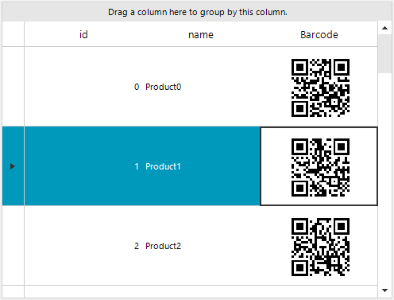

## Environment
|Product Version|Product|Author|
|----|----|----|
|2021.2.511|RadGridView|[Desislava Yordanova](https://www.telerik.com/blogs/author/desislava-yordanova)|

## Description

Learn how to create a Barcode column in RadGridView:
 


## Solution

It is necessary to create a custom **GridViewDataColumn** which uses a custom **GridDataCellElement** for the data rows (**GridViewDataRowInfo**). In the custom cell, override the **CreateChildElements** method where you can host the **RadBarcodeElement** with the symbology you need.

````C#
public RadForm1()
{
    InitializeComponent();

    DataTable dt = new DataTable();
    dt.Columns.Add("id", typeof(int));
    dt.Columns.Add("name", typeof(string));
    dt.Columns.Add("barcode", typeof(string));

    for (int i = 0; i < 20; i++)
    {
        dt.Rows.Add(i, "Product" + i, Guid.NewGuid());
    }

    this.radGridView1.DataSource = dt;

    this.radGridView1.Columns.Remove("Barcode");

    BarcodeColumn barcodeColumn = new BarcodeColumn("Barcode"); 
    this.radGridView1.Columns.Add(barcodeColumn);

    this.radGridView1.AllowAddNewRow = false;
    this.radGridView1.AutoSizeColumnsMode = GridViewAutoSizeColumnsMode.Fill;
    this.radGridView1.TableElement.RowHeight = 100;
}

public class BarcodeColumn : GridViewDataColumn
{
    public BarcodeColumn(string fieldName) : base(fieldName)
    {
    }

    public override Type GetCellType(GridViewRowInfo row)
    {
        if (row is GridViewDataRowInfo)
        {
            return typeof(BarcodeGridDataCellElement);
        }
        return base.GetCellType(row);
    }
}

public class BarcodeGridDataCellElement : GridDataCellElement
{ 
    public BarcodeGridDataCellElement(GridViewColumn column, GridRowElement row) : base(column, row)
    { 
    }
    
    protected override Type ThemeEffectiveType
    {
        get
        {
            return typeof(GridDataCellElement);
        }
    }

    public override bool IsCompatible(GridViewColumn data, object context)
    {
        return data is BarcodeColumn && context is GridDataRowElement;
    }

    RadBarcodeElement barcode; 

    protected override void CreateChildElements()
    {
        base.CreateChildElements();
         
        barcode = new RadBarcodeElement();
        barcode.StretchHorizontally = true;
        barcode.StretchVertically = true;
         
        Telerik.WinControls.UI.Barcode.Symbology.QRCode encoder = new Telerik.WinControls.UI.Barcode.Symbology.QRCode();
        encoder.Version = 0;
        encoder.ErrorCorrectionLevel = Telerik.WinControls.UI.Barcode.Symbology.ErrorCorrectionLevel.M;
        encoder.ECIMode = Telerik.WinControls.UI.Barcode.Symbology.ECIMode.CP437;
        encoder.CodeMode = Telerik.WinControls.UI.Barcode.Symbology.CodeMode.Alphanumeric;
        encoder.FNC1Mode = Telerik.WinControls.UI.Barcode.Symbology.FNC1Mode.SecondPosition;
        encoder.ApplicationIndicator = "00";
        barcode.Symbology = encoder;

        this.Children.Add(barcode);
    }

    protected override void SetContentCore(object value)
    {
        base.SetContentCore(value);
        
        this.ToolTipText = value + "";
        barcode.Value = value + "";
    }
}


````
````VB.NET
Public Sub New()
    InitializeComponent()
    Dim dt As DataTable = New DataTable()
    dt.Columns.Add("id", GetType(Integer))
    dt.Columns.Add("name", GetType(String))
    dt.Columns.Add("barcode", GetType(String))

    For i As Integer = 0 To 20 - 1
        dt.Rows.Add(i, "Product" & i, Guid.NewGuid())
    Next

    Me.RadGridView1.DataSource = dt
    Me.RadGridView1.Columns.Remove("Barcode")
    Dim barcodeColumn As BarcodeColumn = New BarcodeColumn("Barcode")
    Me.RadGridView1.Columns.Add(barcodeColumn)
    Me.RadGridView1.AllowAddNewRow = False
    Me.RadGridView1.AutoSizeColumnsMode = GridViewAutoSizeColumnsMode.Fill
    Me.RadGridView1.TableElement.RowHeight = 100
End Sub

Public Class BarcodeColumn
    Inherits GridViewDataColumn

    Public Sub New(ByVal fieldName As String)
        MyBase.New(fieldName)
    End Sub

    Public Overrides Function GetCellType(ByVal row As GridViewRowInfo) As Type
        If TypeOf row Is GridViewDataRowInfo Then
            Return GetType(BarcodeGridDataCellElement)
        End If

        Return MyBase.GetCellType(row)
    End Function
End Class

Public Class BarcodeGridDataCellElement
    Inherits GridDataCellElement

    Public Sub New(ByVal column As GridViewColumn, ByVal row As GridRowElement)
        MyBase.New(column, row)
    End Sub

    Protected Overrides ReadOnly Property ThemeEffectiveType As Type
        Get
            Return GetType(GridDataCellElement)
        End Get
    End Property

    Public Overrides Function IsCompatible(ByVal data As GridViewColumn, ByVal context As Object) As Boolean
        Return TypeOf data Is BarcodeColumn AndAlso TypeOf context Is GridDataRowElement
    End Function

    Private barcode As RadBarcodeElement

    Protected Overrides Sub CreateChildElements()
        MyBase.CreateChildElements()
        barcode = New RadBarcodeElement()
        barcode.StretchHorizontally = True
        barcode.StretchVertically = True
        Dim encoder As Telerik.WinControls.UI.Barcode.Symbology.QRCode = New Telerik.WinControls.UI.Barcode.Symbology.QRCode()
        encoder.Version = 0
        encoder.ErrorCorrectionLevel = Telerik.WinControls.UI.Barcode.Symbology.ErrorCorrectionLevel.M
        encoder.ECIMode = Telerik.WinControls.UI.Barcode.Symbology.ECIMode.CP437
        encoder.CodeMode = Telerik.WinControls.UI.Barcode.Symbology.CodeMode.Alphanumeric
        encoder.FNC1Mode = Telerik.WinControls.UI.Barcode.Symbology.FNC1Mode.SecondPosition
        encoder.ApplicationIndicator = "00"
        barcode.Symbology = encoder
        Me.Children.Add(barcode)
    End Sub

    Protected Overrides Sub SetContentCore(ByVal value As Object)
        MyBase.SetContentCore(value)
        Me.ToolTipText = value & ""
        barcode.Value = value & ""
    End Sub
End Class


````

>important The example shows the [QRCode](https://docs.telerik.com/devtools/winforms/controls/barcode/barcode-types/2d-barcodes/qrcode/overview). This approach can be followed for the rest of the barcode [types](https://docs.telerik.com/devtools/winforms/controls/barcode/barcode-types/supported-types) as well.

# See Also

* [Barcode]()
* [Creating Custom Cells]()

