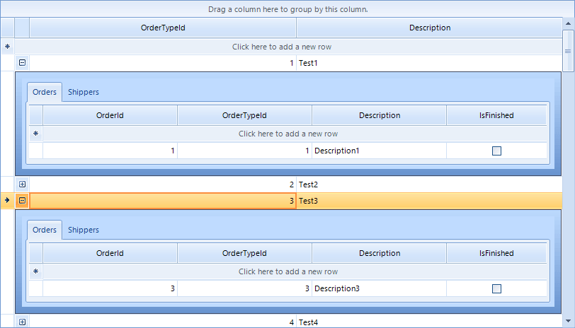

|Product Version|Product|Author|Last modified|
|----|----|----|----|
|2015.3.930|RadGridView for WinForms|Hristo Merdjanov|October 30, 2015|

## Problem

Entity Framework`s Database First approach provides very little control over the models used in the application. It automatically generates a lot of files which should not be altered and at times versioning of the database becomes very difficult.

## Solution

The Code First approach, on the other hand, delivers exactly the opposite. That is why, especially in recent times and for new projects, the developer community chooses this way to interact with SQL Server. Another great advantage is that the database can be entirely managed by the application. Changes in the models are also automatically reflected by the ORM engine at the end migrated to the database itself.

We are going to take this example project even further by implementing [Repository Pattern](https://msdn.microsoft.com/en-us/library/ff649690.aspx) and [Unit of Work](http://martinfowler.com/eaaCatalog/unitOfWork.html). Our implementation consists of three projects each defining a separate layer of the application.

- **RadGridViewEFCodeFirst.Models** – responsible for the business objects
- **RadGridViewEFCodeFirst.Data** – data layer for connecting to SQL Server
- **RadGridViewEFCodeFirst.WinFormsClient** – client demo application


Our **RadGridView**control will be setup in hierarchy and the screenshot below shows the result at the end:


1.In our Models project, let`s first define several business objects:

````C#
public class OrderType
{
    private ICollection<Order> orders;
    private ICollection<Shipper> shippers;
 
    public OrderType()
    {
        this.orders = new HashSet<Order>();
        this.shippers = new HashSet<Shipper>();
    }
 
    public int OrderTypeId { get; set; }
 
    public virtual ICollection<Order> Orders
    {
        get
        {
            return this.orders;
        }
        set
        {
            this.orders = value;
        }
    }
 
    public virtual ICollection<Shipper> Shippers
    {
        get
        {
            return this.shippers;
        }
        set
        {
            this.shippers = value;
        }
    }
 
    public string  Description { get; set; }
}

````
````VB.NET
Public Class OrderType
    Private m_orders As ICollection(Of Order)
    Private m_shippers As ICollection(Of Shipper)
 
    Public Sub New()
        Me.m_orders = New HashSet(Of Order)()
        Me.m_shippers = New HashSet(Of Shipper)()
    End Sub
 
    Public Property OrderTypeId() As Integer
        Get
            Return m_OrderTypeId
        End Get
        Set(value As Integer)
            m_OrderTypeId = Value
        End Set
    End Property
    Private m_OrderTypeId As Integer
 
    Public Overridable Property Orders() As ICollection(Of Order)
        Get
            Return Me.m_orders
        End Get
        Set(value As ICollection(Of Order))
            Me.m_orders = value
        End Set
    End Property
 
    Public Overridable Property Shippers() As ICollection(Of Shipper)
        Get
            Return Me.m_shippers
        End Get
        Set(value As ICollection(Of Shipper))
            Me.m_shippers = value
        End Set
    End Property
 
    Public Property Description() As String
        Get
            Return m_Description
        End Get
        Set(value As String)
            m_Description = Value
        End Set
    End Property
    Private m_Description As String
End Class

````


````C#
public class Order
{
    public int OrderId { get; set; }
 
    public int OrderTypeId { get; set; }
 
    public virtual OrderType OrderType { get; set; }
 
    public string Description  { get; set; }
 
    public bool IsFinished { get; set; }
}

````
````VB.NET
Public Class Order
    Public Property OrderId() As Integer
        Get
            Return m_OrderId
        End Get
        Set(value As Integer)
            m_OrderId = Value
        End Set
    End Property
    Private m_OrderId As Integer
 
    Public Property OrderTypeId() As Integer
        Get
            Return m_OrderTypeId
        End Get
        Set(value As Integer)
            m_OrderTypeId = Value
        End Set
    End Property
    Private m_OrderTypeId As Integer
 
    Public Overridable Property OrderType() As OrderType
        Get
            Return m_OrderType
        End Get
        Set(value As OrderType)
            m_OrderType = Value
        End Set
    End Property
    Private m_OrderType As OrderType
 
    Public Property Description() As String
        Get
            Return m_Description
        End Get
        Set(value As String)​
            m_Description = Value
        End Set
    End Property
    Private m_Description As String
 
    Public Property IsFinished() As Boolean
        Get
            Return m_IsFinished
        End Get
        Set(value As Boolean)
            m_IsFinished = Value
        End Set
    End Property
    Private m_IsFinished As Boolean
End Class

````


````C#
public class Shipper
{
    public int ShipperId { get; set; }
 
    public int OrderTypeId { get; set; }
 
    public virtual OrderType OrderType { get; set; }
 
    public string Name { get; set; }
 
    public string Address { get; set; }
}

````
````VB.NET
Public Class Shipper
    Public Property ShipperId() As Integer
        Get
            Return m_ShipperId
        End Get
        Set(value As Integer)
            m_ShipperId = Value
        End Set
    End Property
    Private m_ShipperId As Integer
 
    Public Property OrderTypeId() As Integer
        Get
            Return m_OrderTypeId
        End Get
        Set(value As Integer)
            m_OrderTypeId = Value
        End Set
    End Property
    Private m_OrderTypeId As Integer
 
    Public Overridable Property OrderType() As OrderType
        Get
            Return m_OrderType
        End Get
        Set(value As OrderType)
            m_OrderType = Value
        End Set
    End Property
    Private m_OrderType As OrderType
 
    Public Property Name() As String
        Get
            Return m_Name
        End Get
        Set(value As String)
            m_Name = Value
        End Set
    End Property
    Private m_Name As String
 
    Public Property Address() As String
        Get
            Return m_Address
        End Get
        Set(value As String)
            m_Address = Value
        End Set
    End Property
    Private m_Address As String
End Class

````

2.Now, in our Data project we have to define the interfaces needed by the Repository Pattern and define the common functionality:

````C#
public interface IGenericRepository<T> where T : class
{
    IQueryable<T> All();
 
    IQueryable<T> SearchFor(Expression<Func<T, bool>> conditions);
 
    void Add(T entity);
 
    void Update(T entity);
 
    void Delete(T entity);
 
    void Detach(T entity);
}

````
````VB.NET
Public Interface IGenericRepository(Of T As Class)
    Function All() As IQueryable(Of T)
 
    Function SearchFor(conditions As Expression(Of Func(Of T, Boolean))) As IQueryable(Of T)
 
    Sub Add(entity As T)
 
    Sub Update(entity As T)
 
    Sub Delete(entity As T)
 
    Sub Detach(entity As T)
End Interface

````


````C#
public interface IRadGridViewEFCodeFirstContext
{
    IDbSet<Order> Orders { get; set; }
 
    IDbSet<OrderType> OrderTypes { get; set; }
 
    IDbSet<Shipper> Shippers { get; set; }
 
    IDbSet<T> Set<T>() where T : class;
 
    DbEntityEntry<T> Entry<T>(T entity) where T : class;
 
    void SaveChanges();
}

````
````VB.NET
Public Interface IRadGridViewEFCodeFirstContext
    Property Orders() As IDbSet(Of Order)
 
    Property OrderTypes() As IDbSet(Of OrderType)
 
    Property Shippers() As IDbSet(Of Shipper)
 
    Function [Set](Of T As Class)() As IDbSet(Of T)
 
    Function Entry(Of T As Class)(entity As T) As DbEntityEntry(Of T)
 
    Sub SaveChanges()
End Interface

````


````C#
public interface IRadGridViewEFCodeFirstData
{
    IGenericRepository<Order> Orders { get; }
 
    IGenericRepository<OrderType> OrderTypes { get; }
 
    IGenericRepository<Shipper> Shippers { get; }
 
    void SaveChanges();
}

````
````VB.NET
Public Interface IRadGridViewEFCodeFirstData
    ReadOnly Property Orders() As IGenericRepository(Of Order)
 
    ReadOnly Property OrderTypes() As IGenericRepository(Of OrderType)
 
    ReadOnly Property Shippers() As IGenericRepository(Of Shipper)
 
    Sub SaveChanges()
End Interface

````

3.Let us now implement our repositories and data layer:

````C#
public class RadGridViewEFCodeFirstContext : DbContext, IRadGridViewEFCodeFirstContext
{
    public RadGridViewEFCodeFirstContext()
        : base("RadGridViewEFCodeFirstConnection")
    {
        Database.SetInitializer(new MigrateDatabaseToLatestVersion<RadGridViewEFCodeFirstContext, Configuration>());
    }
 
    public IDbSet<Order> Orders { get; set; }
 
    public IDbSet<OrderType> OrderTypes  { get; set; }
 
    public IDbSet<Shipper> Shippers { get; set; }
 
    public new IDbSet<T> Set<T>() where T : class
    {
        return base.Set<T>();
    }
 
    public new void SaveChanges()
    {
        base.SaveChanges();
    }
}

````
````VB.NET
Public Class RadGridViewEFCodeFirstContext
    Inherits DbContext
    Implements IRadGridViewEFCodeFirstContext
 
    Public Sub New()
        MyBase.New("RadGridViewEFCodeFirstConnection")
        Database.SetInitializer(New MigrateDatabaseToLatestVersion(Of RadGridViewEFCodeFirstContext, Migrations.Configuration)())
    End Sub
 
    Public Property Orders() As IDbSet(Of Order) Implements IRadGridViewEFCodeFirstContext.Orders
        Get
            Return m_Orders
        End Get
        Set(value As IDbSet(Of Order))
            m_Orders = value
        End Set
    End Property
    Private m_Orders As IDbSet(Of Order)
 
    Public Property OrderTypes() As IDbSet(Of OrderType) Implements IRadGridViewEFCodeFirstContext.OrderTypes
        Get
            Return m_OrderTypes
        End Get
        Set(value As IDbSet(Of OrderType))
            m_OrderTypes = value
        End Set
    End Property
    Private m_OrderTypes As IDbSet(Of OrderType)
 
    Public Property Shippers() As IDbSet(Of Shipper) Implements IRadGridViewEFCodeFirstContext.Shippers
        Get
            Return m_Shippers
        End Get
        Set(value As IDbSet(Of Shipper))
            m_Shippers = value
        End Set
    End Property
    Private m_Shippers As IDbSet(Of Shipper)
 
    Public Shadows Function [Set](Of T As Class)() As IDbSet(Of T) Implements IRadGridViewEFCodeFirstContext.Set
        Return MyBase.[Set](Of T)()
    End Function
 
    Public Shadows Sub SaveChanges() Implements IRadGridViewEFCodeFirstContext.SaveChanges
        MyBase.SaveChanges()
    End Sub
 
    Public Overloads Function Entry(Of T As Class)(entity As T) As Infrastructure.DbEntityEntry(Of T) Implements IRadGridViewEFCodeFirstContext.Entry
        Return MyBase.[Entry](Of T)(entity)
    End Function
 
End Class

````


````C#
public class RadGridViewEFCodeFirstRepository<T> : IGenericRepository<T> where T : class
{
    private IRadGridViewEFCodeFirstContext context;
    private IDbSet<T> set;
 
    public RadGridViewEFCodeFirstRepository(IRadGridViewEFCodeFirstContext context)
    {
        this.context = context;
        this.set = context.Set<T>();
    }
 
    public IQueryable<T> All()
    {
        return this.set.AsQueryable();
    }
 
    public IQueryable<T> SearchFor(Expression<Func<T, bool>> conditions)
    {
        return this.All().Where(conditions);
    }
 
    public void Add(T entity)
    {
        this.set.Add(entity);
    }
 
    public void Update(T entity)
    {
        var entry = AttachIfDetached(entity);
        entry.State = EntityState.Modified;
    }
 
    public void Delete(T entity)
    {
        var entry = AttachIfDetached(entity);
        entry.State = EntityState.Deleted;
    }
 
    public void Detach(T entity)
    {
        var entry = this.context.Entry(entity);
        entry.State = EntityState.Detached;
    }
 
    private DbEntityEntry AttachIfDetached(T entity)
    {
        var entry = this.context.Entry(entity);
        if (entry.State == EntityState.Detached)
        {
            this.set.Attach(entity);
        }
 
        return entry;
    }
}

````
````VB.NET
Public Class RadGridViewEFCodeFirstRepository(Of T As Class)
    Implements IGenericRepository(Of T)
 
    Private context As IRadGridViewEFCodeFirstContext
    Private [set] As IDbSet(Of T)
 
    Public Sub New(context As IRadGridViewEFCodeFirstContext)
        Me.context = context
        Me.[set] = context.[Set](Of T)()
    End Sub
 
    Public Function All() As IQueryable(Of T) Implements IGenericRepository(Of T).All
        Return Me.[set].AsQueryable()
    End Function
 
    Public Function SearchFor(conditions As Expression(Of Func(Of T, Boolean))) As IQueryable(Of T) Implements IGenericRepository(Of T).SearchFor
        Return Me.All().Where(conditions)
    End Function
 
    Public Sub Add(entity As T) Implements IGenericRepository(Of T).Add
        Me.[set].Add(entity)
    End Sub
 
    Public Sub Update(entity As T) Implements IGenericRepository(Of T).Update
        Dim entry = AttachIfDetached(entity)
        entry.State = EntityState.Modified
    End Sub
 
    Public Sub Delete(entity As T) Implements IGenericRepository(Of T).Delete
        Dim entry = AttachIfDetached(entity)
        entry.State = EntityState.Deleted
    End Sub
 
    Public Sub Detach(entity As T) Implements IGenericRepository(Of T).Detach
        Dim entry = Me.context.Entry(entity)
        entry.State = EntityState.Detached
    End Sub
 
    Private Function AttachIfDetached(entity As T) As DbEntityEntry
        Dim entry = Me.context.Entry(entity)
        If entry.State = EntityState.Detached Then
            Me.[set].Attach(entity)
        End If
 
        Return entry
    End Function
 
End Class

````


````C#
public class RadGridViewEFCodeFirstData : IRadGridViewEFCodeFirstData
{
    private IRadGridViewEFCodeFirstContext context;
    private IDictionary<Type, object> repositories;
 
    public RadGridViewEFCodeFirstData()
        : this(new RadGridViewEFCodeFirstContext())
    {
    }
 
    public RadGridViewEFCodeFirstData(IRadGridViewEFCodeFirstContext context)
    {
        this.context = context;
        this.repositories = new Dictionary<Type, object>();
    }
 
    public IGenericRepository<Order> Orders
    {
        get
        {
            return this.GetRepository<Order>();
        }
    }
 
    public IGenericRepository<OrderType> OrderTypes
    {
        get
        {
            return this.GetRepository<OrderType>();
        }
    }
 
    public IGenericRepository<Shipper> Shippers
    {
        get
        {
            return this.GetRepository<Shipper>();
        }
    }
 
    public void SaveChanges()
    {
        this.context.SaveChanges();
    }
 
    private IGenericRepository<T> GetRepository<T>() where T : class
    {
        var typeOfModel = typeof(T);
        if (!this.repositories.ContainsKey(typeOfModel))
        {
            Type type = typeof(RadGridViewEFCodeFirstRepository<T>);
            this.repositories.Add(typeOfModel, Activator.CreateInstance(type, this.context));
        }
 
        return (IGenericRepository<T>)this.repositories[typeOfModel];
    }
}

````
````VB.NET
Public Class RadGridViewEFCodeFirstData
    Implements IRadGridViewEFCodeFirstData
 
    Private context As IRadGridViewEFCodeFirstContext
    Private repositories As IDictionary(Of Type, Object)
 
    Public Sub New()
        Me.New(New RadGridViewEFCodeFirstContext())
    End Sub
 
    Public Sub New(context As IRadGridViewEFCodeFirstContext)
        Me.context = context
        Me.repositories = New Dictionary(Of Type, Object)()
    End Sub
 
    Public ReadOnly Property Orders() As IGenericRepository(Of Order) Implements IRadGridViewEFCodeFirstData.Orders
        Get
            Return Me.GetRepository(Of Order)()
        End Get
    End Property
 
    Public ReadOnly Property OrderTypes() As IGenericRepository(Of OrderType) Implements IRadGridViewEFCodeFirstData.OrderTypes
        Get
            Return Me.GetRepository(Of OrderType)()
        End Get
    End Property
 
    Public ReadOnly Property Shippers() As IGenericRepository(Of Shipper) Implements IRadGridViewEFCodeFirstData.Shippers
        Get
            Return Me.GetRepository(Of Shipper)()
        End Get
    End Property
 
    Public Sub SaveChanges() Implements IRadGridViewEFCodeFirstData.SaveChanges
        Me.context.SaveChanges()
    End Sub
 
    Private Function GetRepository(Of T As Class)() As IGenericRepository(Of T)
        Dim typeOfModel = GetType(T)
        If Not Me.repositories.ContainsKey(typeOfModel) Then
            Dim type = GetType(RadGridViewEFCodeFirstRepository(Of T))
 
            Me.repositories.Add(typeOfModel, Activator.CreateInstance(type, Me.context))
        End If
 
        Return DirectCast(Me.repositories(typeOfModel), IGenericRepository(Of T))
    End Function
End Class

````

4.We also need to define a static class which will generate our sample data:

````C#
public class DataGenerator
{
    public static void PopulateData(IRadGridViewEFCodeFirstData data)
    {
        for (int i = 1; i <= 100; i++)
        {
            OrderType orderType = new OrderType()
            {
                OrderTypeId = i,
                Description = "Test" + i
            };
 
            Order order = new Order()
            {
                OrderId = i,
                Description = "Description" + i,
                OrderTypeId = orderType.OrderTypeId
            };
 
            Shipper shipper = new Shipper()
            {
                ShipperId = i,
                Name = "Name " + i,
                OrderTypeId = orderType.OrderTypeId,
                Address = "Address " + i,
            };
 
            data.OrderTypes.Add(orderType);
            data.Orders.Add(order);
            data.Shippers.Add(shipper);
 
            if (i % 100 == 0)
            {
                data.SaveChanges();
            }
        }
 
        data.SaveChanges();
    }
}

````
````VB.NET
Public Class DataGenerator
    Public Shared Sub PopulateData(data As IRadGridViewEFCodeFirstData)
        For i As Integer = 1 To 100
            Dim orderType As New OrderType() With {
                 .OrderTypeId = i,
                 .Description = "Test" & i
            }
 
            Dim order As New Order() With {
                 .OrderId = i, _
                 .Description = "Description" & i,
                 .OrderTypeId = orderType.OrderTypeId
            }
 
            Dim shipper As New Shipper() With {
                 .ShipperId = i,
                 .Name = "Name" & i,
                 .OrderTypeId = orderType.OrderTypeId,
                 .Address = "Address" & i
            }
 
            data.OrderTypes.Add(orderType)
            data.Orders.Add(order)
            data.Shippers.Add(shipper)
 
            If i Mod 10 = 0 Then
                data.SaveChanges()
            End If
        Next
 
        data.SaveChanges()
    End Sub
End Class

````

5.In our client application we will setup the **RadGridView** control in hierarchy feeding the templates with data coming from different repositories:

````C#
public partial class Form1 : Form
{
    private IRadGridViewEFCodeFirstData data;
 
    public Form1()
    {
        InitializeComponent();
 
        this.data = new RadGridViewEFCodeFirstData();
        if (!data.OrderTypes.All().Any() || !data.Orders.All().Any() || !data.Shippers.All().Any())
        {
            DataGenerator.PopulateData(this.data);
        }
 
        this.SetUpGrid();
        this.FormClosing += Form1_FormClosing;
    }
 
    private void Form1_FormClosing(object sender, FormClosingEventArgs e)
    {
        this.data.SaveChanges();
    }
 
    private void SetUpGrid()
    {
        ((IDbSet<OrderType>)this.data.OrderTypes.All()).Load();
        this.radGridView1.DataSource = ((IDbSet<OrderType>)this.data.OrderTypes.All()).Local.ToBindingList();
        this.radGridView1.Columns["Orders"].IsVisible = false;
        this.radGridView1.Columns["Shippers"].IsVisible = false;
        this.radGridView1.AutoSizeColumnsMode = GridViewAutoSizeColumnsMode.Fill;
 
        GridViewTemplate ordersTemplate = new GridViewTemplate();
        ordersTemplate.Caption = "Orders";
        radGridView1.MasterTemplate.Templates.Add(ordersTemplate);
        ((IDbSet<Order>)this.data.Orders.All()).Load();
        ordersTemplate.DataSource = ((IDbSet<Order>)this.data.Orders.All()).Local.ToBindingList();
        ordersTemplate.Columns["OrderType"].IsVisible = false;
        ordersTemplate.AutoSizeColumnsMode = GridViewAutoSizeColumnsMode.Fill;
 
        GridViewRelation relation = new GridViewRelation(radGridView1.MasterTemplate);
        relation.ChildTemplate = ordersTemplate;
        relation.RelationName = "OrderTypesOrders";
        relation.ParentColumnNames.Add("OrderTypeId");
        relation.ChildColumnNames.Add("OrderTypeId");
        radGridView1.Relations.Add(relation);
 
        GridViewTemplate shippersTemplate = new GridViewTemplate();
        shippersTemplate.Caption = "Shippers";
        radGridView1.MasterTemplate.Templates.Add(shippersTemplate);
        ((IDbSet<Shipper>)this.data.Shippers.All()).Load();
        shippersTemplate.DataSource = ((IDbSet<Shipper>)this.data.Shippers.All()).Local.ToBindingList();
        shippersTemplate.Columns["OrderType"].IsVisible = false;
        shippersTemplate.AutoSizeColumnsMode = GridViewAutoSizeColumnsMode.Fill;
 
        GridViewRelation relation2 = new GridViewRelation(radGridView1.MasterTemplate);
        relation2.ChildTemplate = shippersTemplate;
        relation2.RelationName = "OrderTypesShippers";
        relation2.ParentColumnNames.Add("OrderTypeId");
        relation2.ChildColumnNames.Add("OrderTypeId");
        radGridView1.Relations.Add(relation2);
    }
}

````
````VB.NET
Public Class Form1
    Inherits Form
 
    Private data As IRadGridViewEFCodeFirstData
 
    Public Sub New()
        InitializeComponent()
 
        Me.data = New RadGridViewEFCodeFirstData()
        If Not data.OrderTypes.All().Any() OrElse Not data.Orders.All().Any() OrElse Not data.Shippers.All().Any() The
            DataGenerator.PopulateData(Me.data)
        End If
        Me.SetUpGrid()
 
        AddHandler Me.FormClosing, AddressOf Form1_FormClosing
    End Sub
 
    Private Sub Form1_FormClosing(sender As Object, e As FormClosingEventArgs)
        Me.data.SaveChanges()
    End Sub
 
    Private Sub SetUpGrid()
        DirectCast(Me.data.OrderTypes.All(), IDbSet(Of OrderType)).Load()
        Me.RadGridView1.DataSource = DirectCast(Me.data.OrderTypes.All(), IDbSet(Of OrderType)).Local.ToBindingList()
        Me.RadGridView1.Columns("Orders").IsVisible = False
        Me.RadGridView1.Columns("Shippers").IsVisible = False
        Me.RadGridView1.AutoSizeColumnsMode = GridViewAutoSizeColumnsMode.Fill
 
        Dim ordersTemplate As New GridViewTemplate()
        ordersTemplate.Caption = "Orders"
        Me.RadGridView1.MasterTemplate.Templates.Add(ordersTemplate)
        DirectCast(Me.data.Orders.All(), IDbSet(Of Order)).Load()
        ordersTemplate.DataSource = DirectCast(Me.data.Orders.All(), IDbSet(Of Order)).Local.ToBindingList()
        ordersTemplate.Columns("OrderType").IsVisible = False
        ordersTemplate.AutoSizeColumnsMode = GridViewAutoSizeColumnsMode.Fill
 
        Dim relation As New GridViewRelation(RadGridView1.MasterTemplate)
        relation.ChildTemplate = ordersTemplate
        relation.RelationName = "OrderTypesOrders"
        relation.ParentColumnNames.Add("OrderTypeId")
        relation.ChildColumnNames.Add("OrderTypeId")
        RadGridView1.Relations.Add(relation)
 
        Dim shippersTemplate As New GridViewTemplate()
        shippersTemplate.Caption = "Shippers"
        Me.RadGridView1.MasterTemplate.Templates.Add(shippersTemplate)
        DirectCast(Me.data.Shippers.All(), IDbSet(Of Shipper)).Load()
        shippersTemplate.DataSource = DirectCast(Me.data.Shippers.All(), IDbSet(Of Shipper)).Local.ToBindingList()
        shippersTemplate.Columns("OrderType").IsVisible = False
        shippersTemplate.AutoSizeColumnsMode = GridViewAutoSizeColumnsMode.Fill
 
        Dim relation2 As New GridViewRelation(RadGridView1.MasterTemplate)
        relation2.ChildTemplate = shippersTemplate
        relation2.RelationName = "OrderTypesShippers"
        relation2.ParentColumnNames.Add("OrderTypeId")
        relation2.ChildColumnNames.Add("OrderTypeId")
        Me.RadGridView1.Relations.Add(relation2)
    End Sub
End Class

````

>note You can download a complete VB and C# project from the following [link](https://github.com/telerik/winforms-sdk/tree/master/GridView/EFCodeFirstInHierarchy).

