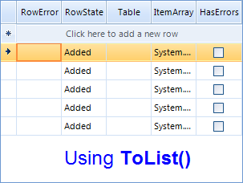
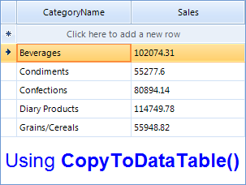

|Product Version|Product|Author|Last modified|
|----|----|----|----|
|Q3 2012 SP1|RadControls for WinForms|Stefan Stefanov|26 Dec 2012|


**PROBLEM**  
   

How to bind a control (RadGridView, RadListView, RadChartView, RadListControl, etc) to a result of a query of a DataTable  
   
**SOLUTION**  
   
The correct way to bind a control to a result of a query of a DataTable is to use the result's **CopyToDataTable()** method, which will copy the result in a DataTable and will return it. If you attempt to use the **ToList()** method, you will end up with undesired behavior where the control will display the row properties, instead of the rows data. This is caused by the fact that bind mechanism cannot reflect the DataRows information, and the DataTable is the one that handles this kind of objects.  
   
   
 
Here is a sample:  

````C#
DataTable table = new DataTable();
table.Columns.Add("CategoryName");
table.Columns.Add("Sales");
table.Rows.Add("Beverages", 102074.31);
table.Rows.Add("Condiments", 55277.6);
table.Rows.Add("Confections", 80894.14);
table.Rows.Add("Diary Products", 114749.78);
table.Rows.Add("Grains/Cereals", 55948.82);
table.Rows.Add("Meat/Poultry", 81338.06);
table.Rows.Add("Produce", 53019.98);
table.Rows.Add("Seafood", 65544.18);
 
var result = table.AsEnumerable().Take(5);
radGridView1.DataSource = result.CopyToDataTable();

````
````VB.NET
Dim table As New DataTable()
table.Columns.Add("CategoryName")
table.Columns.Add("Sales")
table.Rows.Add("Beverages", 102074.31)
table.Rows.Add("Condiments", 55277.6)
table.Rows.Add("Confections", 80894.14)
table.Rows.Add("Diary Products", 114749.78)
table.Rows.Add("Grains/Cereals", 55948.82)
table.Rows.Add("Meat/Poultry", 81338.06)
table.Rows.Add("Produce", 53019.98)
table.Rows.Add("Seafood", 65544.18)
 
Dim result = table.AsEnumerable().Take(5)
radGridView1.DataSource = result.CopyToDataTable()

````

