## Description

In certain scenarios it may be required to modify the source code of the Telerik UI for WinForms suite and use this custom version for the development process. However, it is important to keep the [design time]() experience working. When using .NET Framework, it is enough to build the Telerik.WinControls.UI.Design.csproj and use the produced custom dll. But with the introduction of .NET Core, the [Toolbox Version]() depends on the installed NuGet package.

This tutorial demonstrates a sample approach how to replace the Telerik assemblies coming from the installed NuGet package with the custom built ones from the source code.
 
## Solution 

Please follow the steps described in the [Download Product Files]() help article in order to download the product files especially the source code:

Once you have the source code downloaded, let's continue with the following steps:

1\. Unzip the file in C:\\"your folder", e.g. C:\Telerik_UI_For_WinForms_2023_2_718_source. 

>caution As of R3 2022 the zip contains not only the .NET Framework projects of the Telerik source code, but .NETCore projects as well. Make sure that you don't mix projects of different target framework when building the source code.
>

 2\. Open WinForms.NetCore.sln.

 >caution When the Telerik WinForms source code is downloaded in some situations '.resx' files may be blocked with an error and the projects cannot be built. To unblock those files there is a simple solution for multiple-recursive unblocking: [Unblock .resx Files Downloaded in Telerik WinForms Source Code]()

 3\. Build the project before you apply any modifications to the source code:

 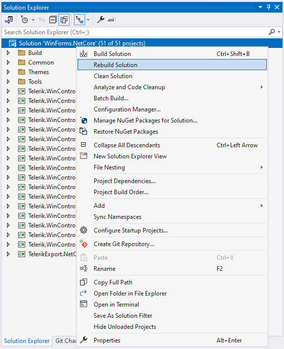
 
 Make sure that no errors occur and the application is built successfully:

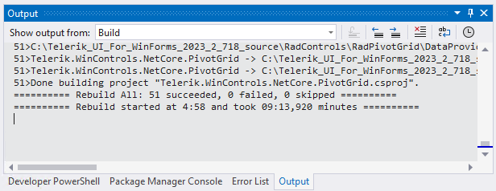 

4\. Modify these parts of the code you want to customize. For the example here, I will modify the RadForm.cs file and change the Text property in the constructor as follows:

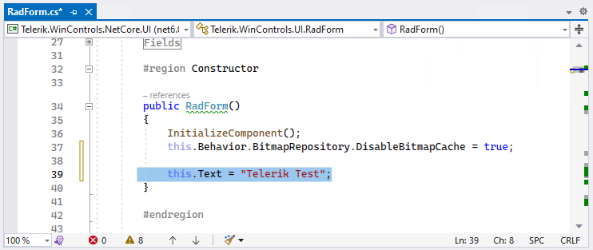 

5\. Save the changes and Rebuild the application.

6\. Open the C:\\"your folder"\bin\Debug folder and you will find the produced custom dlls after building the application, e.g. C:\Telerik_UI_For_WinForms_2023_2_718_source\bin\Debug

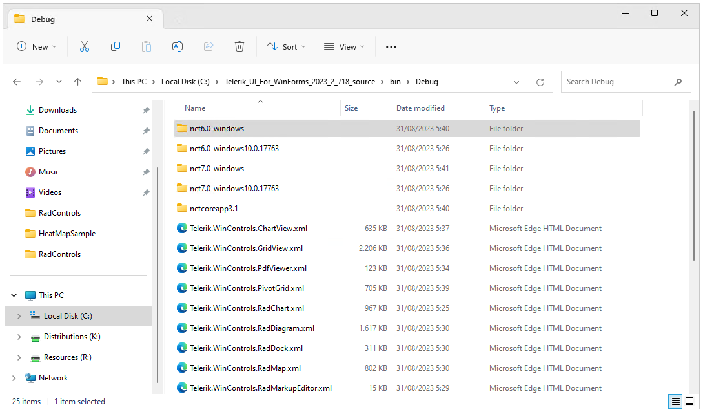  

These are the custom built assemblies that should be used in your project considering the .NET version in the project. 

7\. Let's consider that you have an existing sample project that uses .NET 7. This means that you have the respective [NuGet package]() installed, e.g. UI.for.WinForms.AllControls.Net70 (version 2023.2.718):

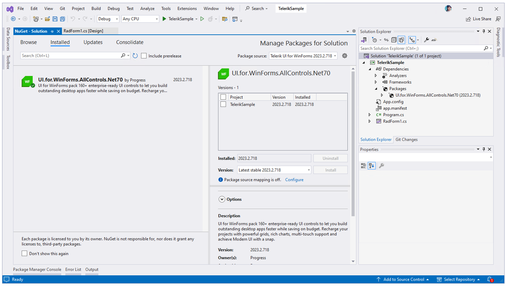  

Once the project is built, the Toolbox is populated with the respective installed version of the NuGet package:

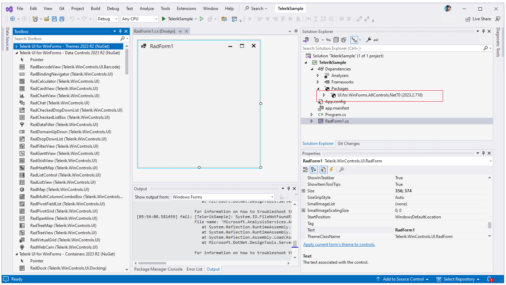  

8\. Expand the package to see all included assemblies along with the full **path** to the respective dll:

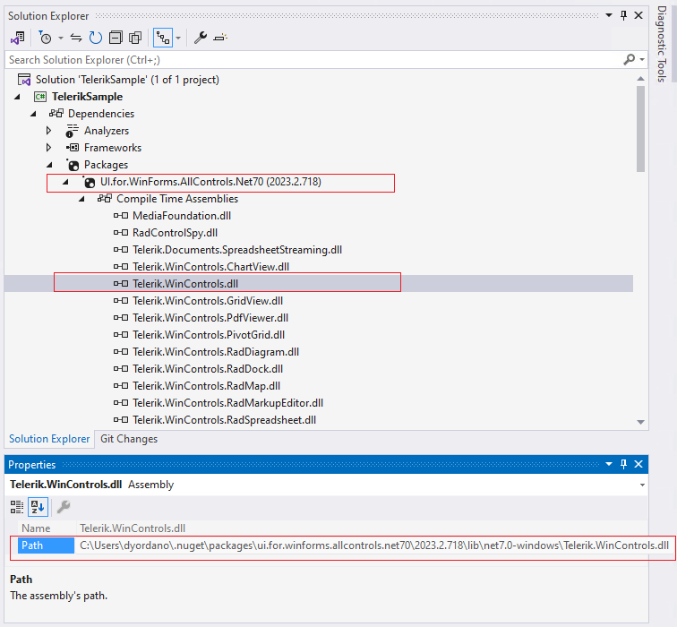

9\. Close the sample project you have in order to ensure that the DesignToolsServer doesn't use the assemblies.

10\. Navigate to the **path** and replace the dlls with the ones we built in step 6\.

>caption Before

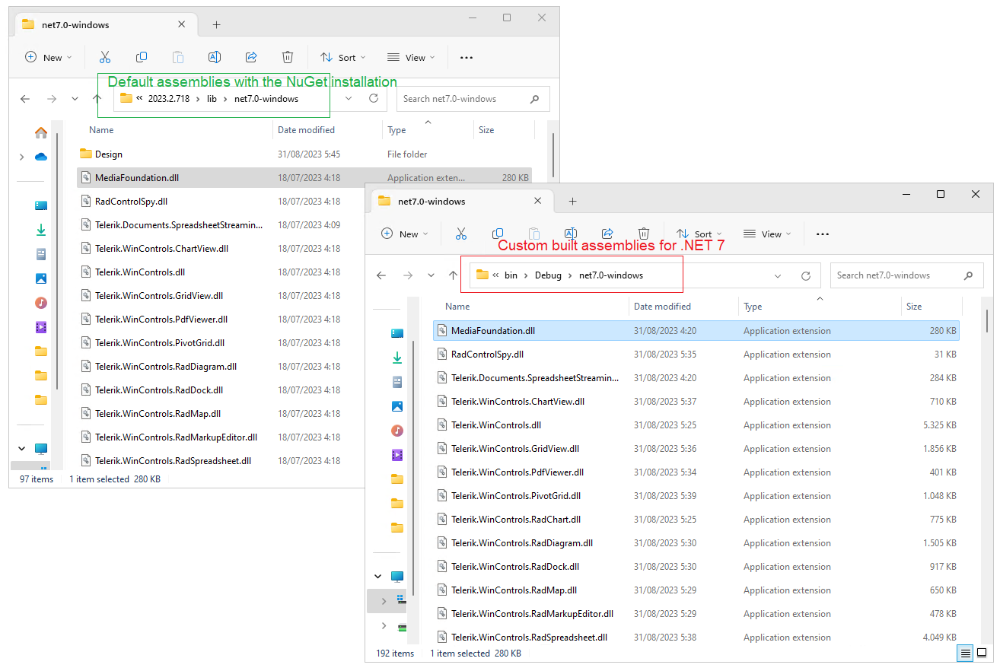

>caption After

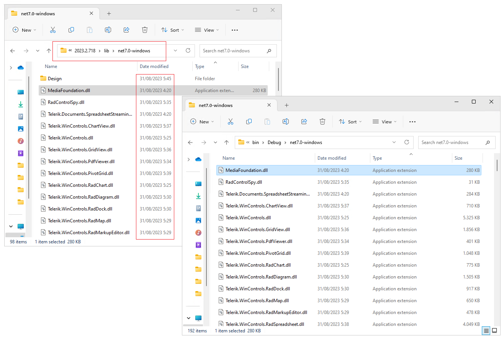
 
 Pay attention to the **Date modified** column to ensure that the desired assemblies are at the proper place.

 >note All Document processing Assemblies are available in the unzipped source code in the folder for the respective .NET version - e.g. C:\Telerik_UI_For_WinForms_2023_2_718_source\RadControls\Dependencies\DocumentsProcessing\net7.0-windows

11\. Reopen the sample project, Clean and Rebuild it.

12\. Since the RadForm.**Text** property is serialized in the **Designer.cs** file, we will comment it to see what text will be displayed. If "Telerik Test" is shown, it means that the custom modification in step 4\. is successfully applied which proves that the custom assemblies are used.

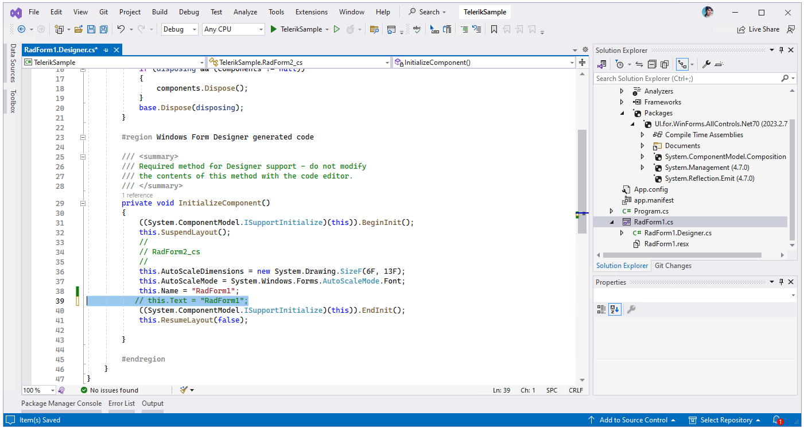

12\. Open the designer, e.g. for RadForm1.cs. 

 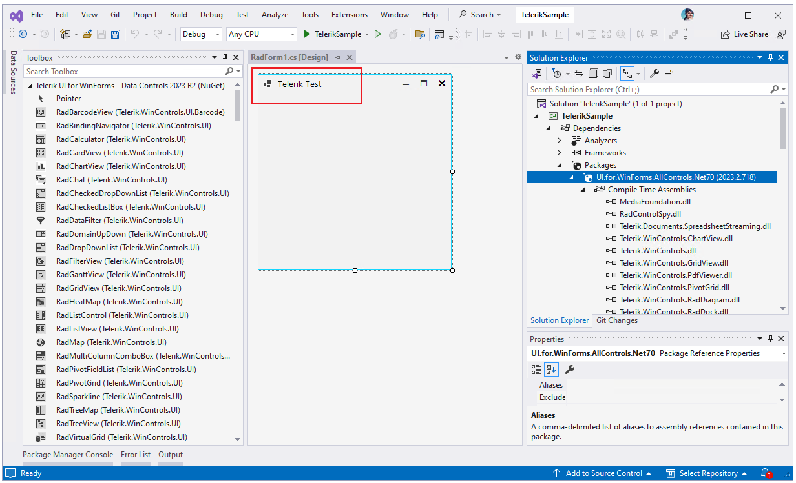 
 
>caution Note that if you clear the NuGet cache, the folder in which we replaced the custom assemblies will be deleted. Hence, it will be necessary to install the default NuGet package again and replace its assemblies with the custom ones one more time.

# See Also

* [Download Product Files]() 
* [Design Time Experience]()
* [Toolbox Version]()
* [How to Attach Telerik Source Code to Your Project]()

