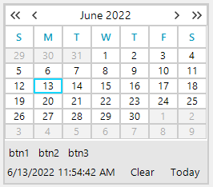

## Environment

|Product Version|Product|Author|
|----|----|----|
|2025.3.812|RadCalendar for WinForms|[Dinko Krastev](https://www.telerik.com/blogs/author/dinko-krastev)|

## Description

In this tutorial, we will demonstrate how to add a custom panel above the elements inside the footer (where the `<Today>` button resides) in the [UI for WinForms Calendar](https://docs.telerik.com/devtools/winforms/controls/calendar/calendar). This panel can be populated with additional buttons that, when clicked, can select a specific date in the calendar.



## Solution

To create a custom space above the footer, use a `StackLayoutElement` and add it to the `CalendarStatusElement.Children` collection. Follow these steps:

Here is an example:

````C#

public Form1()
{
    InitializeComponent();
    this.radCalendar1.ShowFooter = true; // Enable the footer

    // Create a panel and set its orientation
    StackLayoutElement panel = new StackLayoutElement();
    panel.Orientation = Orientation.Horizontal;

    // Add child elements to the panel
    RadButtonElement btn1 = new RadButtonElement() { Text = "btn1" };
    RadButtonElement btn2 = new RadButtonElement() { Text = "btn2" };
    RadButtonElement btn3 = new RadButtonElement() { Text = "btn3" };
    panel.Children.Add(btn1);
    panel.Children.Add(btn2);
    panel.Children.Add(btn3);

    // Dock the panel at the top of the footer area
    DockLayoutPanel.SetDock(panel, Telerik.WinControls.Layouts.Dock.Top);

    // Insert the panel into the footer's children collection
    this.radCalendar1.CalendarElement.CalendarStatusElement.Children[0].Children.Insert(0, panel);
}

````

You can subscribe to the Click event on each button and add your custom logic in the event handlers, then further manipulate the RadCalendar dates. Customize the `StackLayoutElement` further to match your requirements.

## See Also

* [UI for WinForms Calendar Overview](https://docs.telerik.com/devtools/winforms/controls/calendar/calendar)
* [Calendar Footer](https://docs.telerik.com/devtools/winforms/controls/calendar/features/footer)
