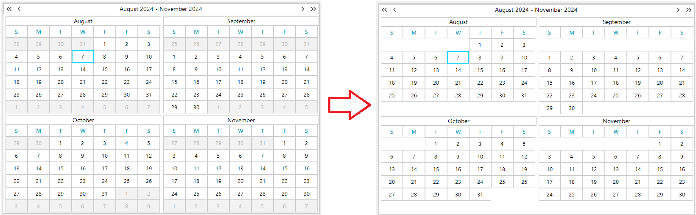

## Environment

|Product Version|Product|Author|
|----|----|----|
|2024.3.806|RadCalendar for WinForms|[Dinko Krastev](https://www.telerik.com/blogs/author/dinko-krastev)|

## Description

In certain scenarios, you might want to enhance the visual clarity of the RadCalendar by hiding days that do not belong to the current month. This article guides you through the process of achieving such customization, particularly when the `AllowMultipleView` property is set to `true`.



## Solution

To hide days that are not part of the current month in RadCalendar, handle the `ElementRender` event. Within this event handler, use the `OtherMonth` property of `CalendarCellElement` to determine if a day belongs to the current month. If `OtherMonth` returns `true`, set the cell's visibility to `Hidden`.

Here's a code snippet demonstrating how to implement this solution:

````C#
private void RadCalendar1_ElementRender(object sender, RenderElementEventArgs e)
{
    var cell = e.Element as CalendarCellElement;    
    if (cell.OtherMonth)
    {
        cell.Visibility = ElementVisibility.Hidden;
    }    
}
````

To apply this approach, first, ensure the `AllowMultipleView` property of your RadCalendar is set according to your requirements. Next, subscribe to the `ElementRender` event of RadCalendar and include the code above in your event handler. This customization will hide all days that do not belong to the current month, providing a cleaner and more focused calendar view.

## Notes

- The `ElementRender` event is a key point for customizing the appearance of calendar cells.
- The `OtherMonth` property is crucial for identifying days that belong to months other than the current one.

## See Also
* [RadCalendar Documentation](https://docs.telerik.com/devtools/winforms/controls/calendar/overview)
